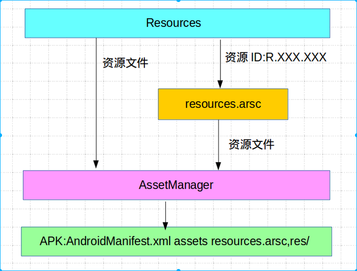
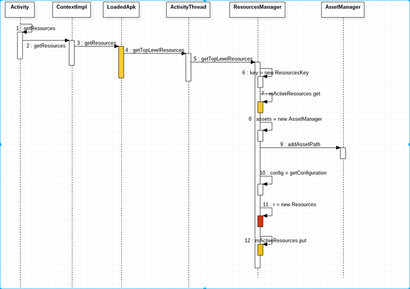
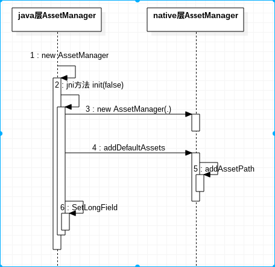
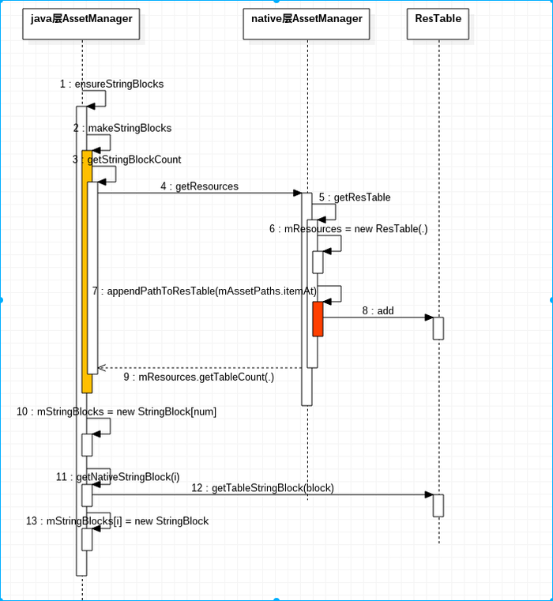

#APP资源管理
资源查找与加载主要是靠Android资源管理框架来完成的，而Android资源管理框架实际是由Resources和AssetManager两个类来实现的。

其中，Resources类可以根据ID来查找资源，而AssetManager类根据文件名来查找资源。

事实上，从资源查找的过程来看，它们可以归结为两大类。第一类资源是不对应有文件的，而第二类资源是对应有文件的，例如，字符串资源是直接编译在resources.arsc文件中的，而界面布局资源是在APK包里面是对应的单独的文件的。

如果一个资源ID对应的是一个文件，那么Resources类是先根据ID来找到资源文件名称，然后再将该文件名称交给AssetManager类来打开对应的文件的。基本流程如下图：



而且这两个类中都有相应的缓存机制，用来缓存资源，以便下次在使用的时候，不需要在查找与加载。

####现在我们从实际代码出发：
```
  String appName = getResources().getString(R.string.app_name);
```
R.string.app_name是一个资源ID。那资源ID格式是怎么样的呢？

资源ID是一个32位四字节数字，格式：PPTTNNNN。

其中PP代表package id.系统资源的package id为0x1,而app自己的资源包package id为0x7f。0x1与0x7f之间的package id都合法。

TT代表资源的类型(type)；

NNNN代表这个类型下面的资源项的名称（entry）；

TT 和NNNN 的取值是由aapt工具随意指定的——基本上每一种新的资源类型的数字都是从上一个数字累加的（从1开始）；而每一个新的资源entry条目也是从数字1开始向上累加的。

假设3个资源文件按照下面的顺序排列：

```
layout/main.xml

drawable/icon.xml

layout/listitem.xml
```
aapt会依次处理：

按照顺序，第一个资源的类型是”layout” 所以指定TT=1， 这个类型下面的第一个资源是”main” ，所以指定NNNN=1 ，最后这个资源就是0x7f010001。

第二个资源类型是”drawable”，所以指定TT=2，这个类型下的”icon” 指定NNNN =1，所以最终的资源ID 是 0x7f020001。

第三个资源类型是”layout”，而这个资源类型在前面已经有定义了，所以TT仍然是1，但是”listitem”这个名字是新出现的，所以指定NNNN=2，因此最终的资源ID 就是 0x7f010002。

也就是说NNNN是可以重复的，因为可以结合TT来区分。

###现在我们来看看Resources对象的创建过程
既然这两个类负责管理Android的资源，那么接下就要搞清楚这两个类的对象在app中的创建过程以及何时创建。

Resources中会包含一个AssetManager对象，先重点关注Resources对象的创建过程，先看一张整体时序图：



其中在LoadedApk中会缓存创建好的resources对象。而创建context时，LoadedApk是同一个，所以在同一应用中不同的ContextImpl获取到的是同一套资源。

ActivityThread类的成员变量ResourcesManager中存在一个mActivityResourceReferences指向的是一个HashMap。这个HashMap用来维护在当前应用程序进程中加载的每一个Apk文件及其对应的Resources对象的对应关系。

也就是说，给定一个Apk文件路径，ActivityThread类的成员函数getTopLevelResources可以在成员变量ResourcesManager中的mActivityResourceReferences获取一个对应的Resources对象。如果不存在，那么就会新建一个，并且保存在mActivityResourceReferences中。

Context中提供了getResources()方法用来获取resources对象，所以在Activity中可以方便的获取该对象：

```
Resources res =  getResources();
```
Activity中的context实际是对ComtextImpl的封装，所以最终是通过ContextImpl.getResources()获取resources对象的：

```
public Resources getResources() {
      return mResources;
}
```

而mResources是ContextImpl的一个属性成员。且mResources是在ContextImpl的构造方法中被初始化的。

看看ContextImpl的构造方法：

```
private ContextImpl(ContextImpl container, ActivityThread mainThread,
            LoadedApk packageInfo, IBinder activityToken, UserHandle user, boolean restricted,
            Display display, Configuration overrideConfiguration, int createDisplayWithId) {
..............
      Resources resources = packageInfo.getResources(mainThread);
if (resources != null) {
    if (displayId != Display.DEFAULT_DISPLAY
            || overrideConfiguration != null
            || (compatInfo != null && compatInfo.applicationScale
                    != resources.getCompatibilityInfo().applicationScale)) {
      ......
    }
}
mResources = resources;
..........
```

从ContextImpl构造方法中发现，通过传入的LoadedApk对象的getResources()方法获取Resources对象：

```
public Resources getResources(ActivityThread mainThread) {
        // 缓存机制，如果LoadedApk中的mResources已经初始化则直接返回，
        // 否则通过ActivityThread创建resources对象
       if (mResources == null) {
           mResources = mainThread.getTopLevelResources(mResDir, mSplitResDirs, mOverlayDirs,
                   mApplicationInfo.sharedLibraryFiles, Display.DEFAULT_DISPLAY, this);
       }
       return mResources;
   }
```
LoadedApk.getResources()方法中首先判断其mResources是否为null，为null时又是调用ActivityThread.getTopLevelResources()方法来获取Resources对象的。

**这里要说明一下，LoadedApk类有两个构造方法：一个是给 system app使用的，一个是给普通app使用的。对于给普通app使用的构造方法中并没有初始化mResources的值，在给system app的LoadedApk使用的构造方法中是初始化mResources值为Resources.getSystem()。**

这里我们只关心普通app的LoadedApk对象创建时时没有初始化mResources对象的。然后当第一次调用LoadedApk对象的getResources()方法时，便会通过调用下面的方法创建一个Resources对象，并缓存起来，以后再通过LoadedApk.getResources()获取时，不需要重新创建Resources对象了，直接返回之前创建的即可。

```
   /**
     * Creates the top level resources for the given package. Will return an existing
     * Resources if one has already been created.
     */
   Resources getTopLevelResources(
           String resDir,//app资源文件夹路径,实际上是apk文件的路径,如/data/app/包名/base.apk
           String[] splitResDirs, //针对一个app由多个apk组成（将原本一个apk切片为若干apk）时，每个子apk中的资源文件夹
           String[] overlayDirs,
           String[] libDirs, //app依赖的共享jar/apk路径
           int displayId,
           LoadedApk pkgInfo //代表运行的app
           ) {
       return mResourcesManager.getResources(null, resDir, splitResDirs, overlayDirs, libDirs,
               displayId, null, pkgInfo.getCompatibilityInfo(), pkgInfo.getClassLoader());
   }
```
ActivityThread.getTopLevelResources()方法又是通过ResourcesManager类的getResources()方法获取esources对象的：

```
 private @Nullable Resources getOrCreateResources(@Nullable IBinder activityToken,
            @NonNull ResourcesKey key, @NonNull ClassLoader classLoader) {
            ......
           // If we're here, we didn't find a suitable ResourcesImpl to use, so create one now.
        ResourcesImpl resourcesImpl = createResourcesImpl(key);
        if (resourcesImpl == null) {
            return null;
        }

        synchronized (this) {
            ResourcesImpl existingResourcesImpl = findResourcesImplForKeyLocked(key);
            if (existingResourcesImpl != null) {
                if (DEBUG) {
                    Slog.d(TAG, "- got beat! existing impl=" + existingResourcesImpl
                            + " new impl=" + resourcesImpl);
                }
                resourcesImpl.getAssets().close();
                resourcesImpl = existingResourcesImpl;
            } else {
                // Add this ResourcesImpl to the cache.
                mResourceImpls.put(key, new WeakReference<>(resourcesImpl));
            }

            final Resources resources;
            if (activityToken != null) {
                resources = getOrCreateResourcesForActivityLocked(activityToken, classLoader,
                        resourcesImpl);
            } else {
                resources = getOrCreateResourcesLocked(classLoader, resourcesImpl);
            }
            return resources;
        }
    }
```

```
  private @Nullable ResourcesImpl createResourcesImpl(@NonNull ResourcesKey key) {
        final DisplayAdjustments daj = new DisplayAdjustments(key.mOverrideConfiguration);
        daj.setCompatibilityInfo(key.mCompatInfo);

        final AssetManager assets = createAssetManager(key);
        if (assets == null) {
            return null;
        }

        final DisplayMetrics dm = getDisplayMetrics(key.mDisplayId, daj);
        final Configuration config = generateConfig(key, dm);
        final ResourcesImpl impl = new ResourcesImpl(assets, dm, config, daj);
        if (DEBUG) {
            Slog.d(TAG, "- creating impl=" + impl + " with key: " + key);
        }
        return impl;
    }
```
创建Resources对象时，会创建AssetManager对象并向其添加app资源路径的过程。

现在可以回答何时创建Resources对象了：

当普通app对应的LoadedApk对象第一次调用LoadedApk.getResources()方法时，由于LoadedApk中还没有缓存，会创建这个对象并缓存。后续再次调用LoadedApk.getResources()方法时，因为缓存了，不会再创建Resources对象。

创建ContextImpl对象时，并不一定会新创建Resources对象，通常一个运行着的app的Resources对象是只会创建一次的。并且缓存到LoadedApk对象中。一个运行着的app可以有多个Context，但是每个Context中都包含了同一个LoadedApk对象。


###AssetManager对象的创建过程
每个Resources对象都会关联一个AssetManager对象，Resources将对资源的操作大多数委托给了AssetManager。

另外还会存在一个native层的AssetManager对象与java层的这个AssetManager对象相对应，而这个native层AssetManager对象在内存的地址存储在java层的AssetManager.mObject中。所以在java层AssetManager的jni方法中可以快速找到它对应的native层的AssetManager对象。

创建普通app的AssetManager对象的过程如下所示：


创建AssetManager对象时，默认会把system/framework/framework-res.apk通过addAssetPath()方法加入到native层的AssetManager对象中。

AssetManager类有两个构造方法:

一个是App创建Resources对象时,用到的public类型的构造方法:

```
public AssetManager() {
        synchronized (this) {
            if (DEBUG_REFS) {
                mNumRefs = 0;
                incRefsLocked(this.hashCode());
            }
            init(false);
            if (localLOGV) Log.v(TAG, "New asset manager: " + this);
            ensureSystemAssets();
        }
    }
```
一个是创建管理预加载的系统资源的Resources对象时,用到的private类型的构造方法:

```
private AssetManager(boolean isSystem) {
   if (DEBUG_REFS) {
       synchronized (this) {
           mNumRefs = 0;
           incRefsLocked(this.hashCode());
       }
   }
   init(true);
   if (localLOGV) Log.v(TAG, "New asset manager: " + this);
}
```
构造方法中都会调用init()方法,这是一个native方法。

在init()方法中创建一个native层中的AssetManager对象.

其中addDefaultAssets()方法将system/framework/framework-res.apk通过addAssetPath()方法加入到native层的AssetManager对象中.

addAssetPath()方法其实很简单主要是将要加入的资源路径加入到 AssetManager类的成员mAssetPaths中，当mAssetPaths中包含这个资源路径时，不会再次加入。也就是说同一种资源是不会被重复加载的。

但是到这里为止，却还没有发现android对resources.arsc(***资源包***)有任何操作，不要着急，继续往下看。

在看Resources实现类的构造方法：

```
 public ResourcesImpl(@NonNull AssetManager assets, @Nullable DisplayMetrics metrics,
            @Nullable Configuration config, @NonNull DisplayAdjustments displayAdjustments) {
        mAssets = assets;
        mMetrics.setToDefaults();
        mDisplayAdjustments = displayAdjustments;
        updateConfiguration(config, metrics, displayAdjustments.getCompatibilityInfo());
        mAssets.ensureStringBlocks();
    }
```

Resources实现类的构造函数首先将参数assets所指向的一个AssetManager对象保存在成员变量mAssets中，以便以后可以通过它来访问应用程序的资源，接下来调用另外一个成员函数updateConfiguration来设置设备配置信息，最后调用参数assets所指向的一个AssetManager对象的成员函数ensureStringBlocks来创建字符串资源池。

AssetManager类的成员函数ensureStringBlocks首先检查成员变量mStringBlocks的值是否等于null。如果等于null的话，那么就说明当前应用程序使用的资源表中的资源项值字符串资源池还没有读取出来，这时候就会调用另外一个成员函数makeStringBlocks来进行读取。

整个过程大致过程如下所示：


在上图中第九步中就会处理mAssetPaths路径（**APK路径**）中apk内的resources.arsc，并把结果缓存起来。其中ResTable类负责资源管理框架中加载resources.arsc，一个ResTable可以管理app中所有的resources.arsc。

**先来看AssetManager中的ensureStringBlocks()方法：**

```
 @NonNull
    final StringBlock[] ensureStringBlocks() {
        synchronized (this) {
            if (mStringBlocks == null) {
                makeStringBlocks(sSystem.mStringBlocks);
            }
            return mStringBlocks;
        }
    }
```

其中sSystem是AssetManager中的一个静态属性成员：

```
 /*package*/ static AssetManager sSystem = null;
 private StringBlock mStringBlocks[] = null;
```
zygote（**是android系统应用中一个相当重要的进程，其主要功能是执行Android应用程序**）启动的时候，会初始化该变量，该变量指向的AssetManager对象是用来管理系统资源的。而且mStringBlocks会被初始化为系统资源中字符串值池的个数。因为系统资源为framework-res.apk，其内部只有一个resources.arsc，所以只有一个字符串资源值池。StringBlocks个数也可以理解为加载的resources.arsc的个数。

```
final void makeStringBlocks(StringBlock[] seed) {
       // 系统预加载的resources.arsc的数量
       final int seedNum = (seed != null) ? seed.length : 0;
       // 这是个jni方法，该方法很重要
       // 该方法中回去打开前面加入到native层AssetManager.mAssetPaths中的apk中的resources.arsc
       // 至少返回2，系统资源+app自己的资源 的resources.arsc
       // 返回的个数包含了seedNum
       final int num = getStringBlockCount();
       mStringBlocks = new StringBlock[num];
       if (localLOGV) Log.v(TAG, "Making string blocks for " + this
               + ": " + num);
       for (int i=0; i<num; i++) {
           if (i < seedNum) {
                // 系统预加载资源时，已经解析过framework-res.apk中的resources.arsc，并且存储在AssetManager类中静态变量sSystem中的mStringBlocks
                // 所以直接 赋值
               mStringBlocks[i] = seed[i];
           } else {
                // 除了系统预加载的之外，剩下的都是没加载的，
                // 所以 getNativeStringBlock
               mStringBlocks[i] = new StringBlock(getNativeStringBlock(i), true);
           }
       }
   }
```

这里要重点分析getStringBlockCount()和getNativeStringBlock()这两个jni方法。

首先分析getStringBlockCount():

```
static jint android_content_AssetManager_getStringBlockCount(JNIEnv* env, jobject clazz)
{
    // 得到与java层AssetManager对象对应的natvie层AssetManager对象
    AssetManager* am = assetManagerForJavaObject(env, clazz);
    if (am == NULL) {
        return 0;
    }
    return am->getResources().getTableCount();
}
```
代码很简单，调用natvie层AssetManager的getResources()方法：

```
const ResTable& AssetManager::getResources(bool required) const
{
    const ResTable* rt = getResTable(required);
    return *rt;
}
```

先看看这个ResTable类中的属性成员：

```
class ResTable
{
  mutable Mutex               mLock;

  status_t                    mError;、
  // 配置相关
  ResTable_config             mParams;

  // 这个Header可以理解为resources.arsc中的资源索引表头部+字符串值池
  // 也就是resources.arsc中package之前的数据
  // 那么这里的mHeaders是一个数组，也就是ResTable是可以包含多个resources.arsc.(至少两个嘛)
  // 所有的resources.arsc的package之前的数据都存储在这数组里
  Vector<Header*>             mHeaders;

  // 每一个resources.arsc里面的所有Pacakge形成一个PackageGroup
  // 这个数组中存储ResTable中加载的所有的resources.arsc中的PackageGroup
  Vector<PackageGroup*>       mPackageGroups;

  // package  ID 对应的pacakage所在的PackageGroup 在mPackageGroups数组中的索引
  uint8_t                     mPackageMap[256];

  uint8_t                     mNextPackageId;
}
```
再来看看Header:

```
struct ResTable::Header
{
    Header(ResTable* _owner) : owner(_owner), ownedData(NULL), header(NULL),
        resourceIDMap(NULL), resourceIDMapSize(0) { }

    ~Header()
    {
        free(resourceIDMap);
    }

    // 所在的ResTable对象
    const ResTable* const           owner;
    void*                           ownedData;
    // 资源索引表头部
    const ResTable_header*          header;
    size_t                          size;
    const uint8_t*                  dataEnd;
    size_t                          index;
    int32_t                         cookie;
    // 用来操作字符串值池
    ResStringPool                   values;
    uint32_t*                       resourceIDMap;
    size_t                          resourceIDMapSize;
};
```

再看PackageGroup：

```
struct ResTable::PackageGroup{

      // 所在的Restable对象
      const ResTable* const           owner;
      String16 const                  name;
      uint32_t const                  id;

      // 这个resources.arsc中包含的package，一般来说只有一个
      Vector<Package*>                packages;

      ........
}
struct ResTable::Package
{
    // 所在ResTable对象
    const ResTable* const           owner;
    // 他的header
    const Header* const             header;
    // resources.arsc中的数据块起始处
    const ResTable_package* const   package;

    // 类型字符串池
    ResStringPool                   typeStrings;
    // 资源项名称字符串池
    ResStringPool                   keyStrings;

    size_t                          typeIdOffset;

```
也就是说Restable类负责管理app要使用的所有的resouces.arsc.后续的操作都是对Restable的mHeades和mPackageGroups的操作，将解析的resoiurces.arsc相应数据分别存储在mHeades和mPackageGroups。

那么接下来看getResTable()方法，其传入的参数为true：

```
const ResTable* AssetManager::getResTable(bool required) const
{
    // 一个native层的AssetManager对象只包含一个ResTable对象，保存在mResources中
    // 如果已经创建，那么直接返回
    ResTable* rt = mResources;
    if (rt) {
        return rt;
    }

    ............
    // 创建ResTable对象
    mResources = new ResTable();
    updateResourceParamsLocked();
    bool onlyEmptyResources = true;
    const size_t N = mAssetPaths.size();
    for (size_t i=0; i<N; i++) {
        // mAssetPaths中存储了此app中用到的资源包路径，包括系统资源包路径
        // 现在开始打开这些资源包，也就是apk中的resources.arsc
        // 与resources.arsc关联的是Asset对象，会将Asset对象加入到mResources中，
        // 加入的过程中会解析resources.arsc
        bool empty = appendPathToResTable(mAssetPaths.itemAt(i));
        onlyEmptyResources = onlyEmptyResources && empty;
    }

    if (required && onlyEmptyResources) {
        ALOGW("Unable to find resources file resources.arsc");
        delete mResources;
        mResources = NULL;
    }

    return mResources;
}
```
核心逻辑在appendPathToResTable()方法中，不过这里要注意一点，因为mAssetPaths包括系统资源包路径，而系统资源包已经在zygote启动时加载了，所以其reources.arsc不需要再此被加载了。

appendPathToResTable()肯定会对系统资源包做特殊处理，参数是资源包路径。

```
bool AssetManager::appendPathToResTable(const asset_path& ap) const {
    // skip those ap's that correspond to system overlays
    if (ap.isSystemOverlay) {
        return true;
    }

    Asset* ass = NULL;
    ResTable* sharedRes = NULL;
    bool shared = true;
    bool onlyEmptyResources = true;
    MY_TRACE_BEGIN(ap.path.string());
    // 资源覆盖机制，暂不考虑
    Asset* idmap = openIdmapLocked(ap);
    size_t nextEntryIdx = mResources->getTableCount();
    ALOGV("Looking for resource asset in '%s'\n", ap.path.string());
    // 资源包路径不是一个文件夹，那就是一个apk文件了
    if (ap.type != kFileTypeDirectory) {
        // 对于app来说，第一次执行时，肯定为0，因为mResources刚创建，还没对其操作
        // 下面的分支 指挥在参数是系统资源包路径时，才执行，
        // 而且系统资源包路径是首次被解析的
        // 第二次执行appendPathToResTable，nextEntryIdx就不会为0了
        if (nextEntryIdx == 0) {
            // mAssetPaths中存储的第一个资源包路径是系统资源的路径，
            // 即framework-res.apk的路径，它在zygote启动时已经加载了
            // 可以通过mZipSet.getZipResourceTable获得其ResTable对象
            sharedRes = const_cast<AssetManager*>(this)->
                mZipSet.getZipResourceTable(ap.path);
            // 对于APP来说，肯定不为NULL
            if (sharedRes != NULL) {
                // 得到系统资源包路径中resources.arsc个数
                nextEntryIdx = sharedRes->getTableCount();
            }
        }
        // 当参数是mAssetPaths中除第一个以外的其他资源资源包路径，
        // 比如app自己的资源包路径时，走下面的逻辑
        if (sharedRes == NULL) {
            // 检查该资源包是否被其他进程加载了
            ass = const_cast<AssetManager*>(this)->
                mZipSet.getZipResourceTableAsset(ap.path);
            // 对于app自己的资源包来说，一般都会都下面的逻辑
            if (ass == NULL) {
                ALOGV("loading resource table %s\n", ap.path.string());
                // 创建Asset对象，就是打开resources.arsc
                ass = const_cast<AssetManager*>(this)->
                    openNonAssetInPathLocked("resources.arsc",
                                             Asset::ACCESS_BUFFER,
                                             ap);
                if (ass != NULL && ass != kExcludedAsset) {
                    ass = const_cast<AssetManager*>(this)->
                        mZipSet.setZipResourceTableAsset(ap.path, ass);
                }
            }
            // 只有在zygote启动时，才会执行下面的逻辑
            // 为系统资源创建 ResTable，并加入到mZipSet里。
            if (nextEntryIdx == 0 && ass != NULL) {
                // If this is the first resource table in the asset
                // manager, then we are going to cache it so that we
                // can quickly copy it out for others.
                ALOGV("Creating shared resources for %s", ap.path.string());
                // 创建ResTable对象，并把前面与resources.arsc关联的Asset对象，加入到这个ResTabl中
                sharedRes = new ResTable();
                sharedRes->add(ass, idmap, nextEntryIdx + 1, false);
#ifdef HAVE_ANDROID_OS
                const char* data = getenv("ANDROID_DATA");
                LOG_ALWAYS_FATAL_IF(data == NULL, "ANDROID_DATA not set");
                String8 overlaysListPath(data);
                overlaysListPath.appendPath(kResourceCache);
                overlaysListPath.appendPath("overlays.list");
                addSystemOverlays(overlaysListPath.string(), ap.path, sharedRes, nextEntryIdx);
#endif
                sharedRes = const_cast<AssetManager*>(this)->
                    mZipSet.setZipResourceTable(ap.path, sharedRes);
            }
        }
    } else {
        ALOGV("loading resource table %s\n", ap.path.string());
        ass = const_cast<AssetManager*>(this)->
            openNonAssetInPathLocked("resources.arsc",
                                     Asset::ACCESS_BUFFER,
                                     ap);
        shared = false;
    }

    if ((ass != NULL || sharedRes != NULL) && ass != kExcludedAsset) {
        ALOGV("Installing resource asset %p in to table %p\n", ass, mResources);
        // 系统资源包时
        if (sharedRes != NULL) {
            ALOGV("Copying existing resources for %s", ap.path.string());
            mResources->add(sharedRes);
        } else {
          // 非系统资源包时，将与resources.arsc关联的Asset对象加入到Restable中
          // 此过程会解析resources.arsc文件。
            ALOGV("Parsing resources for %s", ap.path.string());
            mResources->add(ass, idmap, nextEntryIdx + 1, !shared);
        }
        onlyEmptyResources = false;

        if (!shared) {
            delete ass;
        }
    } else {
        ALOGV("Installing empty resources in to table %p\n", mResources);
        mResources->addEmpty(nextEntryIdx + 1);
    }

    if (idmap != NULL) {
        delete idmap;
    }
    MY_TRACE_END();

    return onlyEmptyResources;
}
```

从上述代码可以看出，实际解析resources.arsc文件的是ResTable的add()方法。

```
status_t ResTable::add(Asset* asset, Asset* idmapAsset, const int32_t cookie, bool copyData) {
   // 得到resources.arsc在mmap之后内存中的地址
    const void* data = asset->getBuffer(true);
    ...........
    return addInternal(data, static_cast<size_t>(asset->getLength()),
            idmapData, idmapSize, cookie, copyData);
}
```

ResTable类的成员函数add在增加一个Asset对象（非系统资源包）时，会对该Asset对象所描述的resources.arsc文件的内容进行解析，结果就是得到一个系列的Package信息。每一个Package又包含了一个资源类型字符串资源池和一个资源项名称字符串资源池，以及一系列的资源类型规范数据块和一系列的资源项数据块。

还要注意的是，每一个资源包里面的所有Pacakge形成一个PackageGroup，保存ResTable对象的成员变量mPackageGroups中。

那么现在再次来分析getStringBlockCount()就很简单了：

```
static jint android_content_AssetManager_getStringBlockCount(JNIEnv* env, jobject clazz)
{
    // 得到与java层AssetManager对象对应的natvie层AssetManager对象
    AssetManager* am = assetManagerForJavaObject(env, clazz);
    if (am == NULL) {
        return 0;
    }
    // 获得ResTable对象
    // 然后调用ResTable的getTableCount()
    // 返回 mHeaders.size()，也就是resources.arsc的个数
    // 包括系统资源对应的resources.arsc
    return am->getResources().getTableCount();
}
```

**我们再来看看getNativeStringBlock()方法：**

```
static jlong android_content_AssetManager_getNativeStringBlock(JNIEnv* env, jobject clazz,
                                                           jint block)
{
    AssetManager* am = assetManagerForJavaObject(env, clazz);
    if (am == NULL) {
        return 0;
    }
    return reinterpret_cast<jlong>(am->getResources().getTableStringBlock(block));
}

const ResStringPool* ResTable::getTableStringBlock(size_t index) const
{
    return &mHeaders[index]->values;
}
```
getTableStringBlock很简单就是获得reouces.arsc的字符串池。然后用来构造StringBlock对象。


**最后总结下，当Resources对象创建后，就解析好了其所需要的所有的资源包的resources.arsc,并且这些resources.arsc的所有字符串池已经被保存在了与Resources对象关联的 java层AssetManager对象的mStringBlocks数组中。**

**到现在为止已经搞清楚Resources和AssetManager对象的创建过程，何时解析resouces.arsc，以及解析后的数据存放在哪里了。**