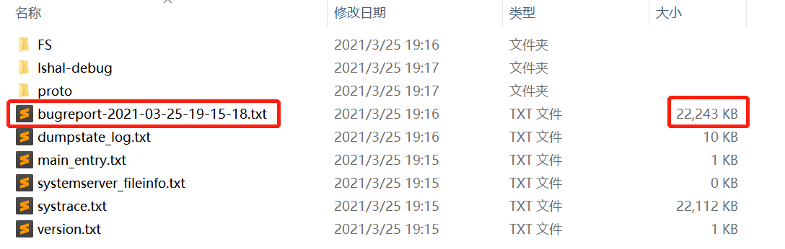
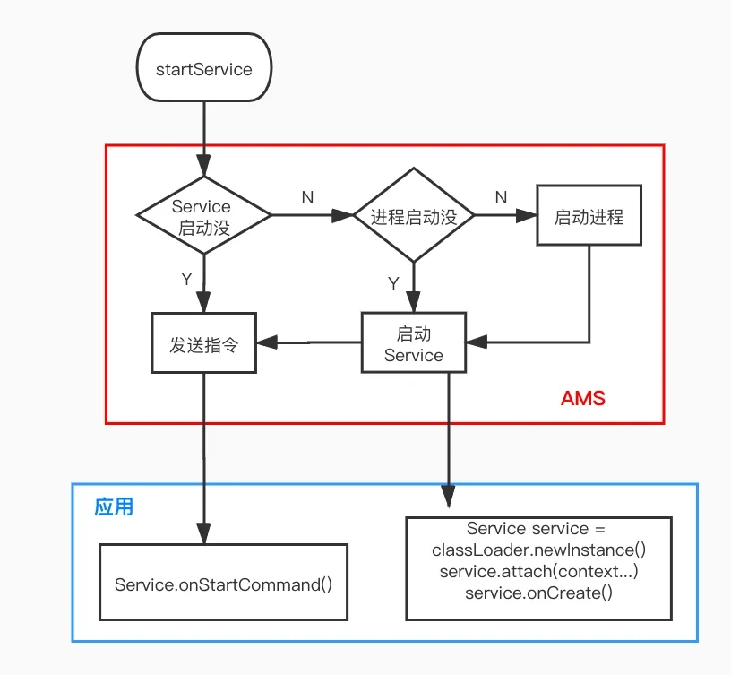

思考这样一个问题，一个Service运行在独立的进程里，在这个Service的onCreate()方法里执行耗时操作，会造成ANR吗？

答案是：会，但是不会有ANR的弹窗。

## ANR的四种场景

1.Service TimeOut：service未在规定时间执行完成；前台服务20s，后台服务200s；这两个超时时间定义在`ActiveServices.java`中：

```java
// How long we wait for a service to finish executing.
static final int SERVICE_TIMEOUT = 20*1000;

// How long we wait for a service to finish executing.
static final int SERVICE_BACKGROUND_TIMEOUT = SERVICE_TIMEOUT * 10;
```

2.BroadCastQueue TimeOut：未在规定时间内处理完广播；前台广播10s，后台广播60s；这两个超时时间定义在`ActivityManagerService.java`中：

```java
// How long we allow a receiver to run before giving up on it.
static final int BROADCAST_FG_TIMEOUT = 10*1000;
static final int BROADCAST_BG_TIMEOUT = 60*1000;
```

3.ContentProvider TimeOut：publish在10s内没有完成；该超时时间定义在`ActivityManagerService.java`中：

```java
// How long we wait for an attached process to publish its content providers
// before we decide it must be hung.
static final int CONTENT_PROVIDER_PUBLISH_TIMEOUT = 10*1000;
```

4.Input Dispatching TimeOut：5s内未响应键盘输入、触摸屏幕等事件。该超时时间定义在`ActivityManagerService.java`中：

```java
// How long we wait until we timeout on key dispatching.
static final int KEY_DISPATCHING_TIMEOUT = 5*1000;
```

ANR的根本原因是：应用未在规定的时间内处理AMS指定的任务才会ANR。

所以，Service未在指定的时间内执行完成，而且非主进程的Service仍然需要通过AMS进行通信。这也能说明一定会产生ANR。

## 验证

我们写个demo来测试一下。

先写一个Service：

```kotlin
class ANRService : Service() {

    override fun onBind(intent: Intent?): IBinder? {
        return null
    }

    override fun onCreate() {
        super.onCreate()

        Log.i("ANRService", "ANRService正在创建中...")
        // 模拟耗时30秒。在三星P200平板上发现，睡眠25秒都不行，到30秒时才触发anr异常，不确定是不是三星		   // 有修改
        Thread.sleep(30000)
        Log.i("ANRService", "ANRService从睡眠中醒来...")
    }
}
```

然后在AndroidManifest里声明在独立进程：

```java
	<service
            android:name=".ANRService"
            android:process=":whatever" />
```

最后我们启动这个Service：

```kotlin
startService(Intent(this, ANRService::class.java))
```

应用并没有ANR弹窗，logcat也没有发现相关的日志信息。

由于测试平板没有root，没有办法进入/data/anr目录直接读取trace文件。

我们使用adb命令bugreport来获取ANR的trace信息。

- 将发生ANR的手机打开"开发者选项"并启动"调试模式"；

- 将手机连接到电脑上；

- 在电脑的命令行里面执行命令 "adb bugreport anrlog.zip" (anrlog.zip是生成文件的名字，自己可以随便写)，这里有个前提是你的电脑装了adb，没装的自行百度如何安装。

- 解压生成好的anrlog.zip文件，大概是下图的结构，打开第一个文件，也就是体积最大的那个文件。



文件打开一看，乱七八糟的啥都有，其实这就对了，那么我们开始分析这个文件，找出trace信息。

我们可以搜索关键字：“VM TRACES AT LAST ANR”，一般就能定位到下图的位置，你看看进程名和时间跟你的进程能对上不，如果能对上，那就是我们要找的，顺着往下翻，就是这次ANR的trace信息了。

```java
------ 0.013s was the duration of 'VM TRACES JUST NOW' ------
------ VM TRACES AT LAST ANR (/data/anr/anr_2021-03-25-19-14-13-382: 2021-03-25 19:14:13) ------

----- pid 12242 at 2021-03-25 19:14:13 -----
Cmd line: com.xh.anrservicetest:whatever
... 省略无关信息
"main" prio=5 tid=1 Sleeping
  | group="main" sCount=1 dsCount=0 flags=1 obj=0x758569d8 self=0x756c414c00
  | sysTid=12242 nice=0 cgrp=default sched=0/0 handle=0x75f2d54560
  | state=S schedstat=( 306743693 1667653 74 ) utm=27 stm=3 core=6 HZ=100
  | stack=0x7fbf81b000-0x7fbf81d000 stackSize=8MB
  | held mutexes=
  at java.lang.Thread.sleep(Native method)
  - sleeping on <0x02334d94> (a java.lang.Object)
  at java.lang.Thread.sleep(Thread.java:373)
  - locked <0x02334d94> (a java.lang.Object)
  at java.lang.Thread.sleep(Thread.java:314)
  at com.xh.anrservicetest.ANRService.onCreate(ANRService.kt:33)
  at android.app.ActivityThread.handleCreateService(ActivityThread.java:3759)
  at android.app.ActivityThread.access$1400(ActivityThread.java:239)
  at android.app.ActivityThread$H.handleMessage(ActivityThread.java:1810)
  at android.os.Handler.dispatchMessage(Handler.java:106)
  at android.os.Looper.loop(Looper.java:214)
  at android.app.ActivityThread.main(ActivityThread.java:7072)
  at java.lang.reflect.Method.invoke(Native method)
  at com.android.internal.os.RuntimeInit$MethodAndArgsCaller.run(RuntimeInit.java:493)
  at com.android.internal.os.ZygoteInit.main(ZygoteInit.java:964)
```

## ANR弹窗的显示原理

我们来看一下这个没有弹窗的ANR是怎么发生的。

首先来复习一下，[Service的启动流程](https://mp.weixin.qq.com/s?__biz=MzIzOTkwMDY5Nw==&mid=2247485220&idx=1&sn=f6d4ceab9069ced7bc823218e80a03bd&chksm=e9224652de55cf4429a69ff5d05b8b5f38675099e3fe9a1146f96212ac56418fcbb3d3659947&scene=21#wechat_redirect)：



AMS真正去启动Service调用的是ActiveServices.realStartServiceLocked方法：

```java
// API 29 com.android.server.am.ActiveServices 
private final void realStartServiceLocked(ServiceRecord r,
            ProcessRecord app, boolean execInFg) throws RemoteException {
  ...
  bumpServiceExecutingLocked(r, execInFg, "create");
}

private final void bumpServiceExecutingLocked(ServiceRecord r, boolean fg, String why) {
  ...
  scheduleServiceTimeoutLocked(r.app);  
}

// 通过 Handler 延时发一条消息，延时时间则为 Service 触发的 ANR 时长
// SERVICE_TIMEOUT = 20*1000
// SERVICE_BACKGROUND_TIMEOUT = SERVICE_TIMEOUT * 10;
void scheduleServiceTimeoutLocked(ProcessRecord proc) {
    if (proc.executingServices.size() == 0 || proc.thread == null) {
        return;
    }
    Message msg = mAm.mHandler.obtainMessage(
            ActivityManagerService.SERVICE_TIMEOUT_MSG);
    msg.obj = proc;
    mAm.mHandler.sendMessageDelayed(msg,
            proc.execServicesFg ? SERVICE_TIMEOUT : SERVICE_BACKGROUND_TIMEOUT);
}
```

如果 Service 在规定时间内启动完成，则这个消息会被 remove 掉，我们今天要看一下超时之后，收到这个消息是怎么处理的。

```java
// com.android.server.am.ActivityManagerService.MainHandler
final class MainHandler extends Handler {
  @Override
  public void handleMessage(Message msg) {
       switch (msg.what) {
           case SERVICE_TIMEOUT_MSG: {
                mServices.serviceTimeout((ProcessRecord)msg.obj);
            } break;
       }
}
```

其中，mServices 是 ActiveServices：

```java
// com.android.server.am.ActiveServices#serviceTimeout
void serviceTimeout(ProcessRecord proc) {
  ...
  if (timeout != null && mAm.mProcessList.mLruProcesses.contains(proc)) {
    Slog.w(TAG, "Timeout executing service: " + timeout);
    ...
    mAm.mHandler.removeCallbacks(mLastAnrDumpClearer);
    mAm.mHandler.postDelayed(mLastAnrDumpClearer, LAST_ANR_LIFETIME_DURATION_MSECS);
    anrMessage = "executing service " + timeout.shortInstanceName;
  }   
  ...
  if (anrMessage != null) {
    proc.appNotResponding(null, null, null, null, false, anrMessage);
  }
}
```

appNotResponding 就是最终处理 ANR 逻辑的代码了。

```java
// com.android.server.am.ProcessRecord
void appNotResponding(String activityShortComponentName,
                      ApplicationInfo aInfo,
                      ...) {
 ...
  if (isMonitorCpuUsage()) {
   mService.updateCpuStatsNow();
 }
  ...
  if (isSilentAnr() && !isDebugging()) {
      kill("bg anr", true);
      return;
  }   
  
   // Bring up the infamous App Not Responding dialog
   Message msg = Message.obtain();
   msg.what = ActivityManagerService.SHOW_NOT_RESPONDING_UI_MSG;
   msg.obj = new AppNotRespondingDialog.Data(this, aInfo, aboveSystem);

   mService.mUiHandler.sendMessage(msg);
}
```

如果 isSilentAnr() 为 true，则直接杀死所在进程，不会发送显示 ANR 弹窗的消息。来看下相关方法

```java
boolean isSilentAnr() {
    return !getShowBackground() && !isInterestingForBackgroundTraces();
}
private boolean getShowBackground() {
    return Settings.Secure.getInt(mService.mContext.getContentResolver(),
            Settings.Secure.ANR_SHOW_BACKGROUND, 0) != 0;
}
private boolean isInterestingForBackgroundTraces() {
    // The system_server is always considered interesting.
    if (pid == MY_PID) {
        return true;
    }

    // A package is considered interesting if any of the following is true :
    //
    // - It's displaying an activity.
    // - It's the SystemUI.
    // - It has an overlay or a top UI visible.
    //
    // NOTE: The check whether a given ProcessRecord belongs to the systemui
    // process is a bit of a kludge, but the same pattern seems repeated at
    // several places in the system server.
    return isInterestingToUserLocked() ||
            (info != null && "com.android.systemui".equals(info.packageName))
            || (hasTopUi() || hasOverlayUi());
}
```

### 结论

我们得到两个结论：

- ANR_SHOW_BACKGROUND可以在【开发者选项】里配置显示所有“应用程序无响应”，开启后，即使是该场景也会有ANR弹窗；
- 未开启上述配置情况下，如果是后台进程，则不显示ANR弹窗。

所以，我们不能想当然的认为，当前是非主进程就可以胡作非为。


> 参考链接：
>
> [Android手机在没有/data/anr目录权限的情况下如何分析ANR](https://blog.csdn.net/xjz696/article/details/97958441)
>
> [ANR 弹窗的显示原理](https://mp.weixin.qq.com/s/mFR7TV69LLQxsg40N_25ZQ)
>
> [理解Android ANR的触发原理](http://gityuan.com/2016/07/02/android-anr/)