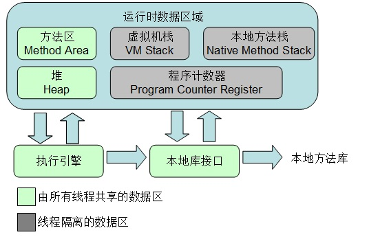
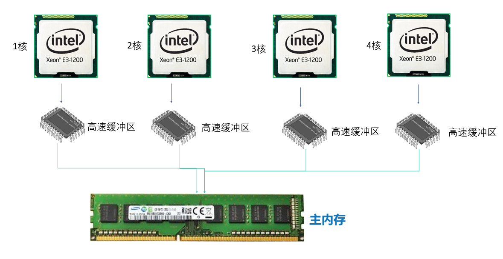
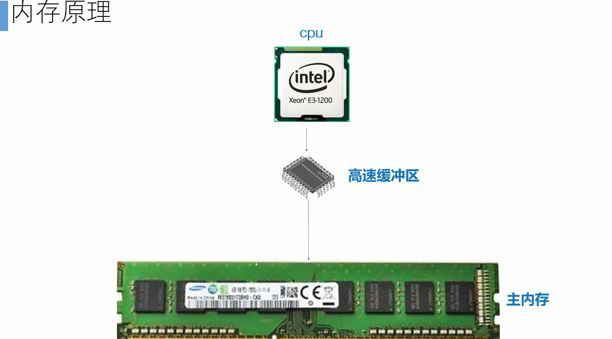
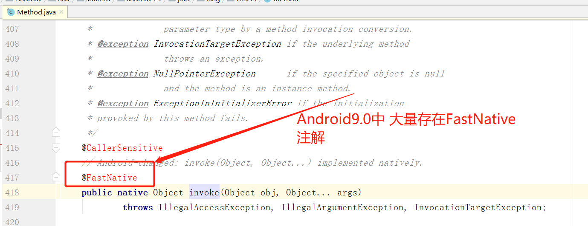
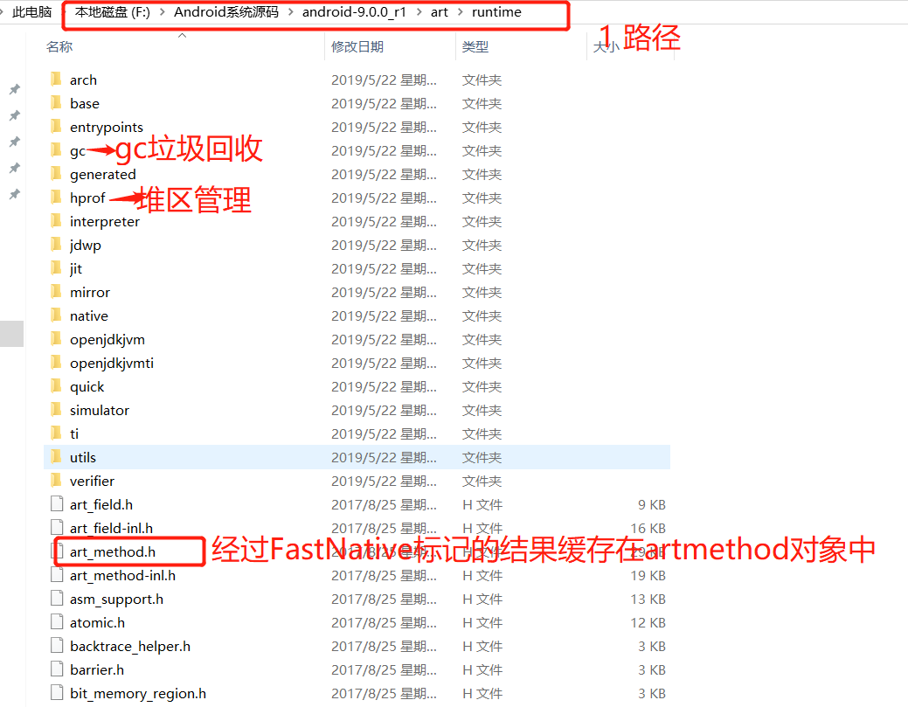

Android系统9.0为什么比8.0要快50%，深入虚拟机源码发现答案


​		目前，  Google公司的 AndroidP  ，已经正式全面推出有将近1年多。众多手机品牌厂商也都在已经更新适配 Android 9.0 系统 。 AndroidP 在上一个版本基础上优化了30%的速度，有没有小伙伴想知道这30%是怎么来的呢?

> 目前Android9.0的源码已经开源，并提供给广大开发者下载，接下来的内容  我们就一起围绕这30%的提升率，从Android9.0找到答案吧!

#####  1.1 **我们先回顾下Android虚拟机的构造图**



> **堆区：** 只存放类对象，实例化的数据放在堆区；**堆区的数据放在主内存**
>
> **方法区：**又叫静态存储区，存放class文件和静态数据，全局变量;**方法区的数据主内存**
>
> **栈区：**存放方法局部变量，方法，线程不共享; **栈区的数据高速缓冲区**
>
> **执行引擎:**将方法区中 对应方法的arm指令集 加载到栈区，而栈区存在于高速缓冲区中，cpu是直接
>
> 从高速缓冲区取arm指令，一条一条执行。执行引擎就像一个**中介**，方法对应的arm指令 相当于**交易的物品** 

##### 1.2 什么是主内存，什么是高速缓冲区呢?

​		我们都知道  cpu执行是非常快的，而主内存执行起来会慢很多，这会影响cpu的执行效率。在Android手机cpu中加了一个**高速缓冲区**(在pc上叫三级缓存)，协调cpu与主内存之间的存取数据速度。高速缓冲区容量比较小，一般只有8M，12M，而栈溢出 指的 就是**超过了高速缓冲区的容量**



##### 1.3 我们一起来看看Android 方法执行的原理

有这样一段方法  方法很简单，只是做了new  Singleton()对象操作，并将对象返回出去

````
    public  Singleton getInstance() {
        Singleton instance = new Singleton();
        return instance;
    }
````

> 一个java方法 被翻译成arm指令 

````
  0000: new-instance v0, Singleton // type@0000
  0002: invoke-direct {v0}, Singleton.<init>:()V // method@0000
  0005: return-object v0
````

> 我们不用去管arm指令 是怎么来的，每一句代码起什么作用
>
> **我们重点是 观察 方法对应的arm指令 在主内存到cpu的发生了什么**



> 备注:方法是属于class类的，class类存在于方法区中，所以方法对应的 arm指令集也是在方法区中，

##### **1.4 执行过程:**

1. 第一步 执行引擎将 方法对应的arm指令集 加载到执行引擎
2. 执行引擎将arm指令集，封装好后进行压栈操作，压栈到高速缓冲区中
3. cpu从高速缓冲区中取到一条一条指令，进行执行

##### 1.6 为什么Android9.0能比8.0快30%呢? 就在执行引擎上!!!!

​		 Google工程师对执行引擎进行了大范围修改，这些修改内容，对Android开发者来说式不可见的。但是能大大加快程序运行速度，**如9.0中的热放方法缓存**，**Framework层大量的 系统函数被标记了@FastNative注解**

​		**Fastnative注解意义:** 经过FastNative标记的方法，系统会自动将方法执行的结果缓存到内存中，下次调用时，**执行引擎**不在对方法对应的arm指令进行**压栈操作**。这样提升了 系统运行的效率！！！



##### 1.7 揭秘 执行引擎源码

小伙伴们先要下载Android系统源码 ，如果没有Android系统源码 可以加微信：mm14525201314

执行引擎系统源码路径

> android-9.0.0_r1\art\runtime

**1.7.1 runtime文件夹下就是我们Android执行引擎**



**1.7.2 Android9.0中 执行引擎中如何处理经过FastNative修饰的热方法**

​		在artmethod.h头文件中 有这样一段声明 小伙伴可以亲自打开看一看，这样就能理解为什么Android9.0要比上一个版本块这么多原因了!

```
 
class ArtMethod   {
  // The hotness we measure for this method. Managed by the interpreter. Not atomic, as we allow
  // 通过注释可以知道  该变量时标记经过 java方法运行的频率，
  uint16_t hotness_count_;

  struct PtrSizedFields {
    // Short cuts to declaring_class_->dex_cache_ member for fast compiled code access.
    //通过google给我们的注释 可以知道，缓存一个方法对应的arm指令，快速的得到结果
    ArtMethod** dex_cache_resolved_methods_;
    //上面方法执行的结果 数据缓存在data_ 变量中，下次执行经过@FastNative修饰的java方法时，直接取出数据
    void* data_;
	//arm指令在内存中的地址，快速的定位到arm指令
    void* entry_point_from_quick_compiled_code_;
  } ptr_sized_fields_;
```

总结: 

1. 在Android9.0中   改动了虚拟机中程序执行引擎的源码！  将频率高的方法执行的结果提前**缓存在内存**中，

2. 以空间换时间的方式，提升Android执行速度，以前一个java方法执行 需要加载指令，压栈指令，cpu逐行读取指令，在9.0中 ，都不需要了，直接从上一次执行的结果中取。减少cpu执行的时间

   