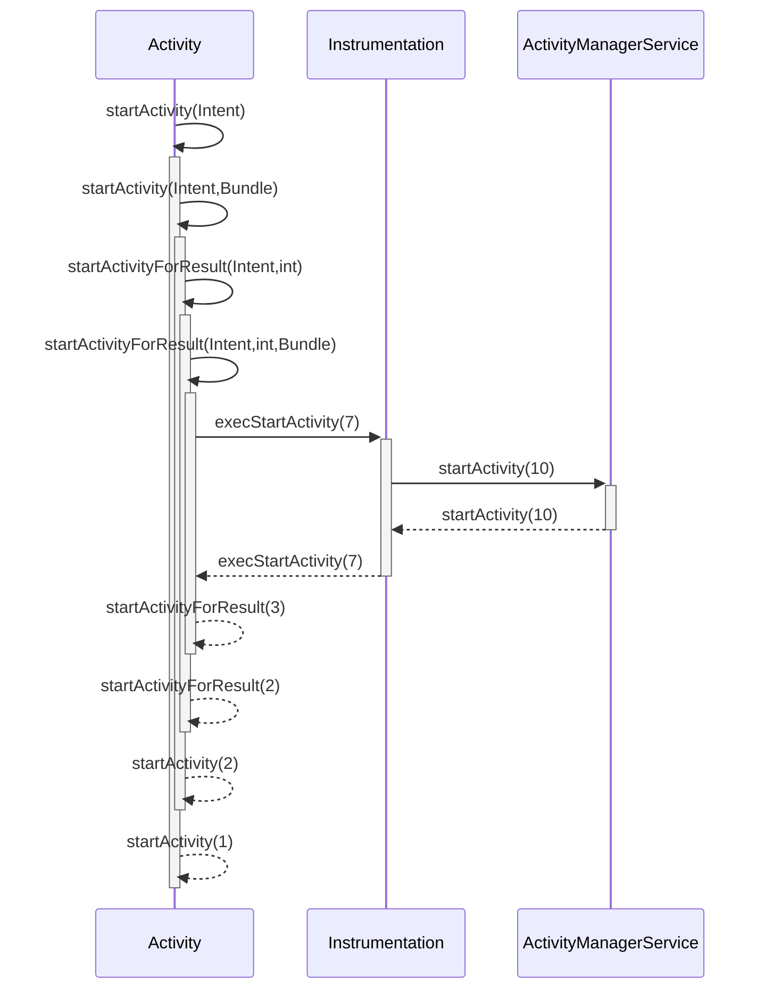
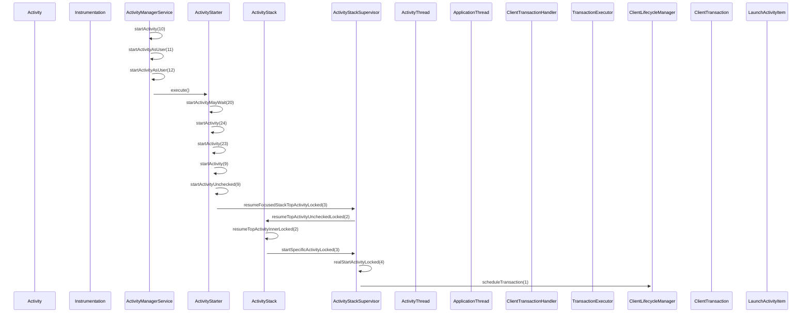
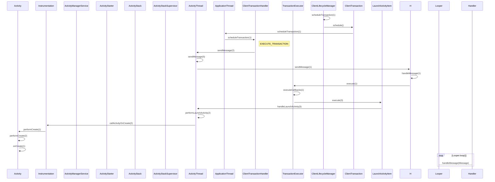

调用startActivity(Intent)所在进程时序图。

```mermaid
sequenceDiagram
	participant A as Activity
	participant I as Instrumentation
	participant AMS as ActivityManagerService

	A->>+A:startActivity(Intent)
	A->>+A:startActivity(Intent,Bundle)
	A->>+A:startActivityForResult(Intent,int)
	A->>+A:startActivityForResult(Intent,int,Bundle)
	A->>+I:execStartActivity(7)

	I->>+AMS:startActivity(10)
	AMS-->>-I:startActivity(10)

	I-->>-A:execStartActivity(7)
	A-->>-A:startActivityForResult(3)
	A-->>-A:startActivityForResult(2)
	A-->>-A:startActivity(2)
	A-->>-A:startActivity(1)
```

```mermaid
sequenceDiagram
	participant A as Activity
	participant I as Instrumentation
	participant AMS as ActivityManagerService
	participant AStarter as ActivityStarter
	participant AStack as ActivityStack
	participant ASS as ActivityStackSupervisor
	participant AT as ActivityThread
	participant AppT as ApplicationThread
	participant CTH as ClientTransactionHandler
	participant TE as TransactionExecutor
	participant CLM as ClientLifecycleManager
	participant CT as ClientTransaction
	participant LAI as LaunchActivityItem

	AMS->>+AMS:startActivity(10)
	AMS->>+AMS:startActivityAsUser(11)
	AMS->>+AMS:startActivityAsUser(12)
	AMS->>+AStarter:execute()

	AStarter->>+AStarter:startActivityMayWait(20)
	AStarter->>+AStarter:startActivity(24)
	AStarter->>+AStarter:startActivity(23)
	AStarter->>+AStarter:startActivity(9)
	AStarter->>+AStarter:startActivityUnchecked(9)
	AStarter->>+ASS:resumeFocusedStackTopActivityLocked(3)

	ASS->>+AStack:resumeTopActivityUncheckedLocked(2)

	AStack->>+AStack:resumeTopActivityInnerLocked(2)
	AStack->>+ASS:startSpecificActivityLocked(3)

	ASS->>+ASS:realStartActivityLocked(4)
	ASS->>+CLM:scheduleTransaction(1)

```

```mermaid
sequenceDiagram
	participant A as Activity
	participant I as Instrumentation
	participant AMS as ActivityManagerService
	participant AStarter as ActivityStarter
	participant AStack as ActivityStack
	participant ASS as ActivityStackSupervisor
	participant AT as ActivityThread
	participant AppT as ApplicationThread
	participant CTH as ClientTransactionHandler
	participant TE as TransactionExecutor
	participant CLM as ClientLifecycleManager
	participant CT as ClientTransaction
	participant LAI as LaunchActivityItem

	CLM->>+CLM:scheduleTransaction(1)
	CLM->>+CT:schedule()

	CT->>+AppT:scheduleTransaction(1)

	AppT->>+CTH:scheduleTransaction(1)
	Note right of CTH: EXECUTE_TRANSACTION

	CTH->>+AT:sendMessage(2)

	AT->>+AT:sendMessage(5)
	AT->>+H:sendMessage(1)
	
	H->>+H:handleMessage(1)
	H->>+TE:execute(1)

	TE->>+TE:executeCallbacks(1)
	TE->>+LAI:execute(3)

	LAI->>+AT:handleLaunchActivity(3)

	AT->>+AT:performLaunchActivity(2)
	AT->>+I:callActivityOnCreate(2)

	I->>+A:performCreate(1)

	A->>+A:performCreate(2)
	A->>+A:onCreate(1)


	loop Looper.loop()
        Looper-->Handler:handleMessage(Message)
    end

```

