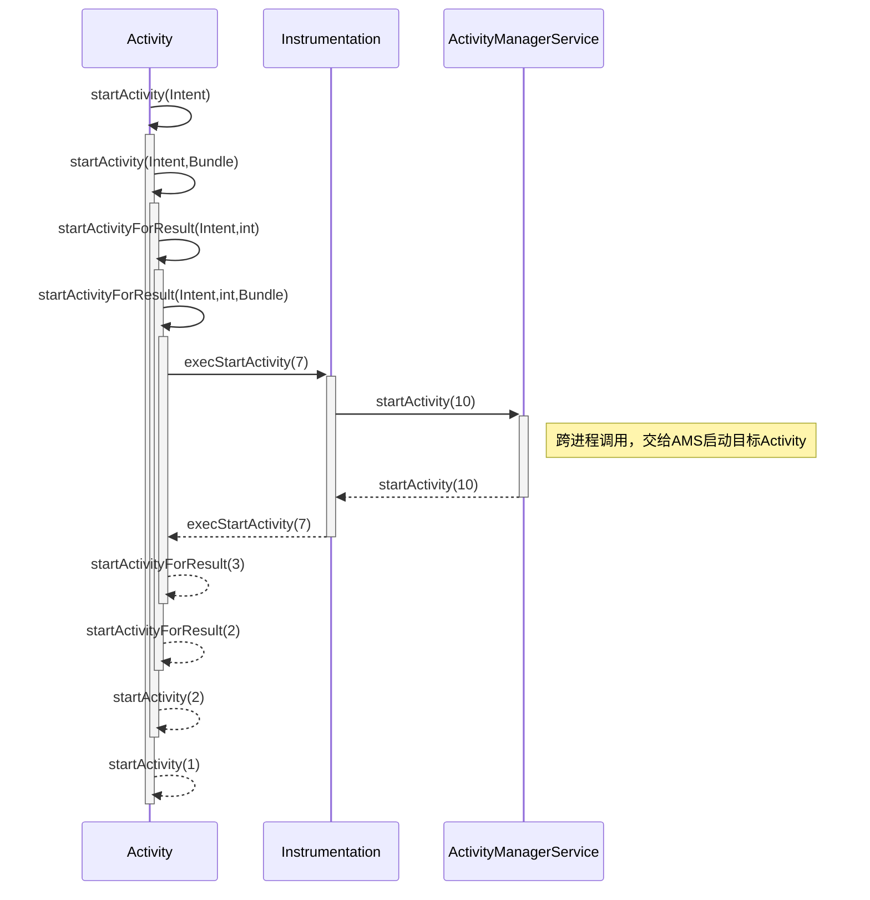
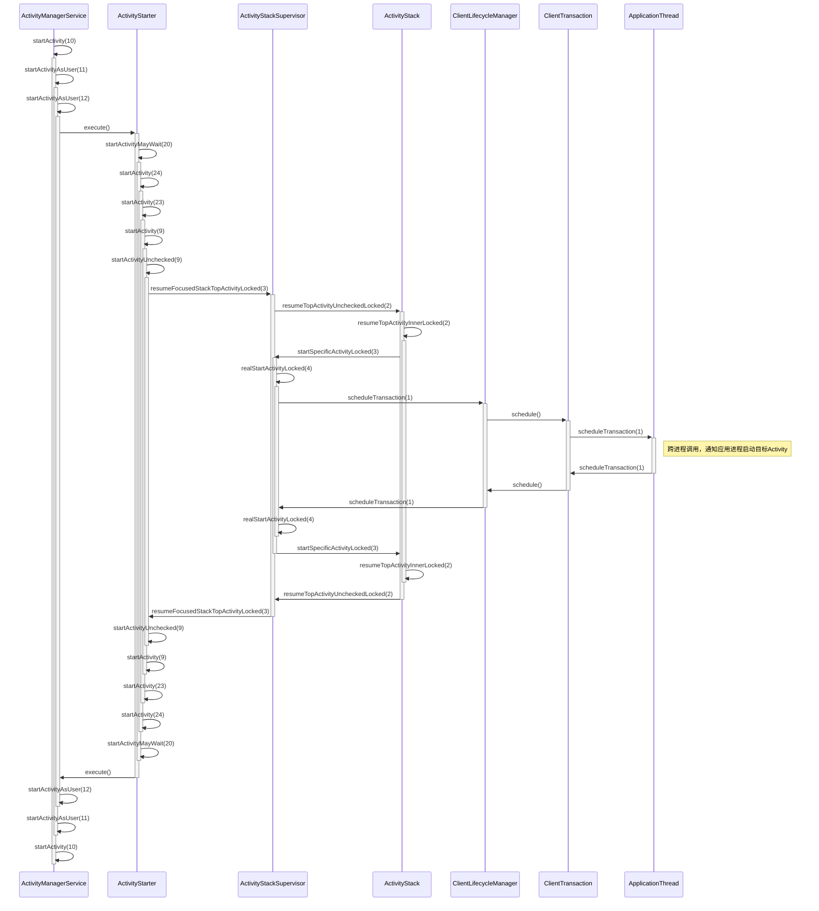
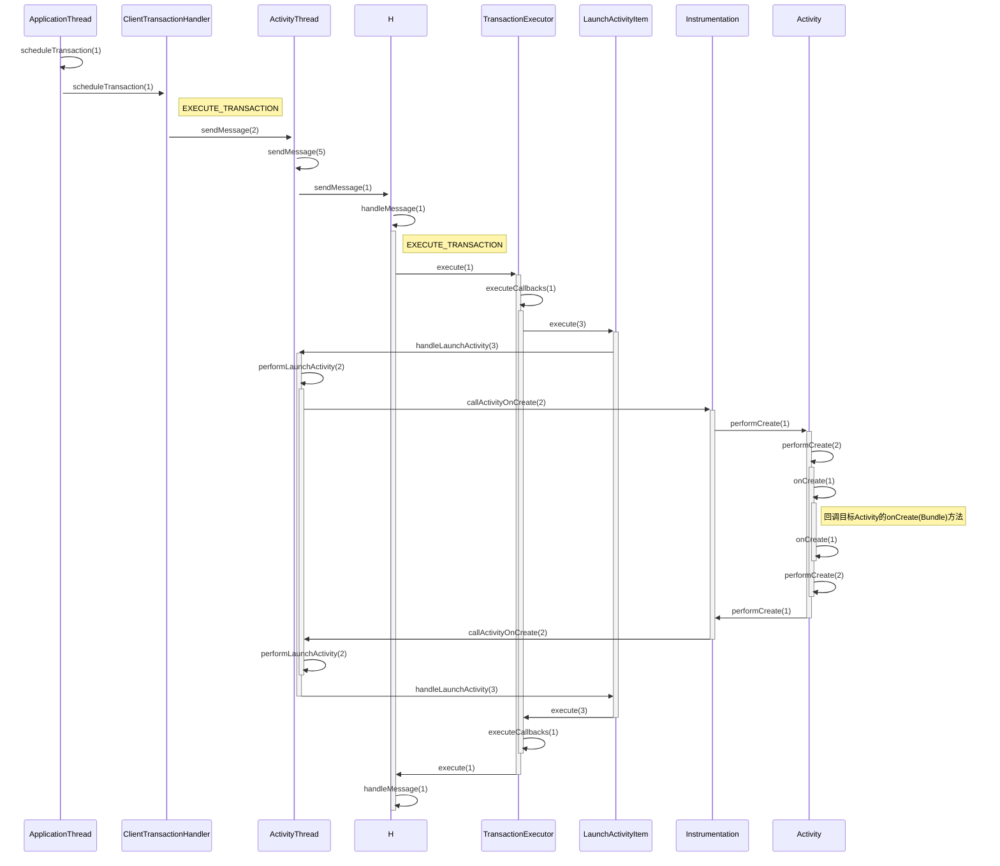

调用startActivity(Intent)所在进程时序图。

```mermaid
sequenceDiagram
	participant A as Activity
	participant I as Instrumentation
	participant AMS as ActivityManagerService
	
	%% 注释信息
	A->>+A:startActivity(Intent)
	A->>+A:startActivity(Intent,Bundle)
	A->>+A:startActivityForResult(Intent,int)
	A->>+A:startActivityForResult(Intent,int,Bundle)
	A->>+I:execStartActivity(7)

	I->>+AMS:startActivity(10)
	Note right of AMS: 跨进程调用，交给AMS启动目标Activity

	AMS-->>-I:startActivity(10)

	I-->>-A:execStartActivity(7)
	A-->>-A:startActivityForResult(3)
	A-->>-A:startActivityForResult(2)
	A-->>-A:startActivity(2)
	A-->>-A:startActivity(1)
```

AMS进程启动Activity时序图。

```mermaid
sequenceDiagram
	participant AMS as ActivityManagerService
	participant AStarter as ActivityStarter
	participant ASS as ActivityStackSupervisor
	participant AStack as ActivityStack
	participant CLM as ClientLifecycleManager
	participant CT as ClientTransaction
	participant AppT as ApplicationThread

	AMS->>+AMS:startActivity(10)
	AMS->>+AMS:startActivityAsUser(11)
	AMS->>+AMS:startActivityAsUser(12)
	AMS->>+AStarter:execute()

	AStarter->>+AStarter:startActivityMayWait(20)
	AStarter->>+AStarter:startActivity(24)
	AStarter->>+AStarter:startActivity(23)
	AStarter->>+AStarter:startActivity(9)
	AStarter->>+AStarter:startActivityUnchecked(9)
	AStarter->>+ASS:resumeFocusedStackTopActivityLocked(3)

	ASS->>+AStack:resumeTopActivityUncheckedLocked(2)

	AStack->>+AStack:resumeTopActivityInnerLocked(2)
	AStack->>+ASS:startSpecificActivityLocked(3)
	%% 在startSpecificActivityLocked(3)方法内部会判断是否需要启动新的进程。
	%% 如果当前是应用进程内Activity跳转，
	%% 则app!=null，执行realStartActivityLocked()；

	%% 如果是跨进程Activity跳转（桌面点击应用图标进入应用），
	%% 执行mService.startProcessLocked()启动新的应用进程。

	ASS->>+ASS:realStartActivityLocked(4)
	ASS->>+CLM:scheduleTransaction(1)

	CLM->>+CT:schedule()

	CT->>+AppT:scheduleTransaction(1)
	Note right of AppT: 跨进程调用，通知应用进程启动目标Activity
	AppT->>-CT:scheduleTransaction(1)
	
	CT->>-CLM:schedule()

	CLM->>-ASS:scheduleTransaction(1)
	ASS->>-ASS:realStartActivityLocked(4)

	ASS->>-AStack:startSpecificActivityLocked(3)
	AStack->>-AStack:resumeTopActivityInnerLocked(2)
	
	AStack->>-ASS:resumeTopActivityUncheckedLocked(2)

	ASS->>-AStarter:resumeFocusedStackTopActivityLocked(3)
	AStarter->>-AStarter:startActivityUnchecked(9)
	AStarter->>-AStarter:startActivity(9)
	AStarter->>-AStarter:startActivity(23)
	AStarter->>-AStarter:startActivity(24)
	AStarter->>-AStarter:startActivityMayWait(20)

	AStarter->>-AMS:execute()
	AMS->>-AMS:startActivityAsUser(12)
	AMS->>-AMS:startActivityAsUser(11)
	AMS->>-AMS:startActivity(10)
```
在目标进程，启动目标Activity时序图。

```mermaid
sequenceDiagram
	participant AppT as ApplicationThread
	participant CTH as ClientTransactionHandler
	participant AT as ActivityThread
	participant H as H
	participant TE as TransactionExecutor
	participant LAI as LaunchActivityItem
	participant I as Instrumentation
	participant A as Activity

	AppT->>+AppT:scheduleTransaction(1)

	AppT->>+CTH:scheduleTransaction(1)
	Note right of CTH: EXECUTE_TRANSACTION

	CTH->>+AT:sendMessage(2)

	AT->>+AT:sendMessage(5)
	AT->>+H:sendMessage(1)
	
	H->>+H:handleMessage(1)
	Note right of H: EXECUTE_TRANSACTION
	H->>+TE:execute(1)

	TE->>+TE:executeCallbacks(1)
	TE->>+LAI:execute(3)

	LAI->>+AT:handleLaunchActivity(3)

	AT->>+AT:performLaunchActivity(2)
	AT->>+I:callActivityOnCreate(2)

	I->>+A:performCreate(1)

	A->>+A:performCreate(2)
	A->>+A:onCreate(1)
	Note right of A: 回调目标Activity的onCreate(Bundle)方法

	A->>-A:onCreate(1)
	A->>-A:performCreate(2)

	A->>-I:performCreate(1)

	I->>-AT:callActivityOnCreate(2)
	AT->>-AT:performLaunchActivity(2)

	AT->>-LAI:handleLaunchActivity(3)

	LAI->>-TE:execute(3)	
	TE->>-TE:executeCallbacks(1)

	TE->>-H:execute(1)
	H->>-H:handleMessage(1)
```

