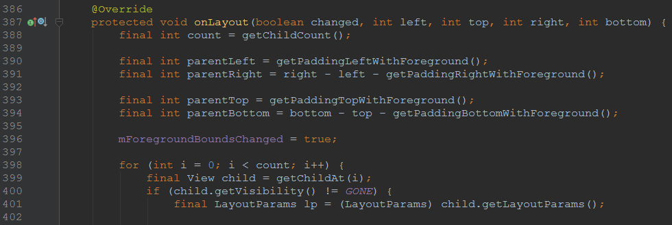

问题描述：在开发手写几何图形控件时，发生了一个非常怪异的bug......当在三星GT-5100平板（API版本16）在手写控件底部插入几何图形时，会出现Crash现象；但是在5.0和6.0的平板之上是没有问题的；可是在美帝良心型号为TB-8604F的平板（API版本24）上又出现了该问题。

Crash信息如下：

```
packageName=com.xh.acldstu
versionName=V3.0.5.20180614
versionCode=146
BOARD=smdk4x12
BOOTLOADER=N5100ZCBML1
BRAND=samsung
CPU_ABI=armeabi-v7a
CPU_ABI2=armeabi
DEVICE=kona3g
DISPLAY=JZO54K.N5100ZCBMH1.ZHITONGYUN_V1.0
FINGERPRINT=samsung/kona3gzc/kona3g:4.1.2/JZO54K/N5100ZCBMH1:user/release-keys
HARDWARE=smdk4x12
HOST=SEP-77
ID=JZO54K
IS_DEBUGGABLE=false
IS_SECURE=false
IS_SYSTEM_SECURE=false
IS_TRANSLATION_ASSISTANT_ENABLED=false
MANUFACTURER=samsung
MODEL=GT-N5100
PRODUCT=kona3gzc
RADIO=unknown
SERIAL=41033bcf402c70b1
TAGS=release-keys
TIME=1376993247000
TYPE=user
UNKNOWN=unknown
USER=se.infra
java.lang.NullPointerException
	at android.widget.FrameLayout.onLayout(FrameLayout.java:400)
	at com.zhitongyunle.xh_handwriting.HandWritingView.onLayout(HandWritingView.java:197)
	at android.view.View.layout(View.java:14120)
	at android.view.ViewGroup.layout(ViewGroup.java:4655)
	at android.widget.FrameLayout.onLayout(FrameLayout.java:448)
	at android.view.View.layout(View.java:14120)
	at android.view.ViewGroup.layout(ViewGroup.java:4655)
	at android.widget.FrameLayout.onLayout(FrameLayout.java:448)
	at android.view.View.layout(View.java:14120)
	at android.view.ViewGroup.layout(ViewGroup.java:4655)
	at android.widget.LinearLayout.setChildFrame(LinearLayout.java:1655)
	at android.widget.LinearLayout.layoutVertical(LinearLayout.java:1513)
	at android.widget.LinearLayout.onLayout(LinearLayout.java:1426)
	at android.view.View.layout(View.java:14120)
	at android.view.ViewGroup.layout(ViewGroup.java:4655)
	at android.widget.FrameLayout.onLayout(FrameLayout.java:448)
	at android.view.View.layout(View.java:14120)
	at android.view.ViewGroup.layout(ViewGroup.java:4655)
	at android.widget.RelativeLayout.onLayout(RelativeLayout.java:948)
	at android.view.View.layout(View.java:14120)
	at android.view.ViewGroup.layout(ViewGroup.java:4655)
	at android.widget.LinearLayout.setChildFrame(LinearLayout.java:1655)
	at android.widget.LinearLayout.layoutVertical(LinearLayout.java:1513)
	at android.widget.LinearLayout.onLayout(LinearLayout.java:1426)
	at android.view.View.layout(View.java:14120)
	at android.view.ViewGroup.layout(ViewGroup.java:4655)
	at android.widget.FrameLayout.onLayout(FrameLayout.java:448)
	at android.widget.ScrollView.onLayout(ScrollView.java:1725)
	at com.zhitongyunle.xh_handwriting.ZuotiHandScrollView.onLayout(ZuotiHandScrollView.java:75)
	at android.view.View.layout(View.java:14120)
	at android.view.ViewGroup.layout(ViewGroup.java:4655)
	at android.widget.FrameLayout.onLayout(FrameLayout.java:448)
	at android.view.View.layout(View.java:14120)
	at android.view.ViewGroup.layout(ViewGroup.java:4655)
	at android.widget.LinearLayout.setChildFrame(LinearLayout.java:1655)
	at android.widget.LinearLayout.layoutVertical(LinearLayout.java:1513)
	at android.widget.LinearLayout.onLayout(LinearLayout.java:1426)
	at android.view.View.layout(View.java:14120)
	at android.view.ViewGroup.layout(ViewGroup.java:4655)
	at android.widget.FrameLayout.onLayout(FrameLayout.java:448)
	at android.view.View.layout(View.java:14120)
	at android.view.ViewGroup.layout(ViewGroup.java:4655)
	at android.widget.RelativeLayout.onLayout(RelativeLayout.java:948)
	at android.view.View.layout(View.java:14120)
	at android.view.ViewGroup.layout(ViewGroup.java:4655)
	at android.widget.LinearLayout.setChildFrame(LinearLayout.java:1655)
	at android.widget.LinearLayout.layoutVertical(LinearLayout.java:1513)
	at android.widget.LinearLayout.onLayout(LinearLayout.java:1426)
	at android.view.View.layout(View.java:14120)
	at android.view.ViewGroup.layout(ViewGroup.java:4655)
	at android.widget.FrameLayout.onLayout(FrameLayout.java:448)
	at android.view.View.layout(View.java:14120)
	at android.view.ViewGroup.layout(ViewGroup.java:4655)
	at android.support.v4.view.ViewPager.onLayout(ViewPager.java:1799)
	at android.view.View.layout(View.java:14120)
	at android.view.ViewGroup.layout(ViewGroup.java:4655)
	at android.widget.FrameLayout.onLayout(FrameLayout.java:448)
	at android.view.View.layout(View.java:14120)
	at android.view.ViewGroup.layout(ViewGroup.java:4655)
	at android.widget.LinearLayout.setChildFrame(LinearLayout.java:1655)
	at android.widget.LinearLayout.layoutVertical(LinearLayout.java:1513)
	at android.widget.LinearLayout.onLayout(LinearLayout.java:1426)
	at android.view.View.layout(View.java:14120)
	at android.view.ViewGroup.layout(ViewGroup.java:4655)
	at android.widget.FrameLayout.onLayout(FrameLayout.java:448)
	at android.view.View.layout(View.java:14120)
	at android.view.ViewGroup.layout(ViewGroup.java:4655)
	at android.widget.LinearLayout.setChildFrame(LinearLayout.java:1655)
	at android.widget.LinearLayout.layoutVertical(LinearLayout.java:1513)
	at android.widget.LinearLayout.onLayout(LinearLayout.java:1426)
	at android.view.View.layout(View.java:14120)
	at android.view.ViewGroup.layout(ViewGroup.java:4655)
	at android.widget.FrameLayout.onLayout(FrameLayout.java:448)
	at android.view.View.layout(View.java:14120)
	at android.view.ViewGroup.layout(ViewGroup.java:4655)
	at android.widget.LinearLayout.setChildFrame(LinearLayout.java:1655)
	at android.widget.LinearLayout.layoutVertical(LinearLayout.java:1513)
	at android.widget.LinearLayout.onLayout(LinearLayout.java:1426)
	at android.view.View.layout(View.java:14120)
	at android.view.ViewGroup.layout(ViewGroup.java:4655)
	at android.widget.FrameLayout.onLayout(FrameLayout.java:448)
	at android.view.View.layout(View.java:14120)
	at android.view.ViewGroup.layout(ViewGroup.java:4655)
	at android.view.ViewRootImpl.performLayout(ViewRootImpl.java:2052)
	at android.view.ViewRootImpl.performTraversals(ViewRootImpl.java:1872)
	at android.view.ViewRootImpl.doTraversal(ViewRootImpl.java:1144)
	at android.view.ViewRootImpl$TraversalRunnable.run(ViewRootImpl.java:4730)
	at android.view.Choreographer$CallbackRecord.run(Choreographer.java:725)
	at android.view.Choreographer.doCallbacks(Choreographer.java:555)
	at android.view.Choreographer.doFrame(Choreographer.java:525)
	at android.view.Choreographer$FrameDisplayEventReceiver.run(Choreographer.java:711)
	at android.os.Handler.handleCallback(Handler.java:615)
	at android.os.Handler.dispatchMessage(Handler.java:92)
	at com.xh.logutils.FireLooper.run(FireLooper.java:76)
	at android.os.Handler.handleCallback(Handler.java:615)
	at android.os.Handler.dispatchMessage(Handler.java:92)
	at android.os.Looper.loop(Looper.java:137)
	at android.app.ActivityThread.main(ActivityThread.java:4947)
	at java.lang.reflect.Method.invokeNative(Native Method)
	at java.lang.reflect.Method.invoke(Method.java:511)
	at com.android.internal.os.ZygoteInit$MethodAndArgsCaller.run(ZygoteInit.java:1038)
	at com.android.internal.os.ZygoteInit.main(ZygoteInit.java:805)
	at dalvik.system.NativeStart.main(Native Method)
```

经过查看报错信息，发现：最终崩溃的地方在`FrameLayout`中的`onLayout()`方法中。源码如下：



从源码中可以发现：在400行的位置，只有一种情况会出现`NullPointerException`！！！那就是child为NULL啦？？这不科学呀，实在是百思不得其解......

既然这里暂时看不出问题，那么我就先查看一下自己的`onLayout()`方法实现。代码如下：

```
@Override
    protected void onLayout(boolean changed, int left, int top, int right, int bottom) {
        super.onLayout(changed, left, top, right, bottom);

        if (changed) {
            mWidth = getWidth();
            mHeight = getHeight();
        }

        if (DEBUG) {
            XHLog.i(TAG, "onLayout() >>> changed:" + changed + ", isGeometryEditable:"
                    + mHandWritingCoreView.isGeometryEditable() + ", width:" + mWidth + ", height:" + mHeight +
                    ", [left:" + left + ", top:" + top + ", right:" + right + ", bottom:" + bottom + "]");
        }
    }
```

这里无非就是调用了父类的`onLayout()`方法，然后在布局有改变时，获取了一下控件高度......这能有什么问题？？？

这时只能对比一下正常情况和Crash情况下`onLayout()`方法的日志输出有何不同啦！经过反复测试之后发现：

- **三星GT-N5100平板（API版本16 JELLY_BEAN）在ScrollView中几何图形编辑状态拖动到底部边缘时，changed会变成true,bottom高度会高出1，正常版本中changed则为false，高度没有发生变化！！！**

至于产生该问题的具体原因，可能是不同版本的ScrollView的实现不同导致的；

### 解决方案

在获取View控件高度时，减1即可！代码如下：

```
@Override
    protected void onLayout(boolean changed, int left, int top, int right, int bottom) {
        ...
        if (changed) {
            mWidth = getWidth();
            mHeight = getHeight() - 1;
        }
	    ...
    }
```

