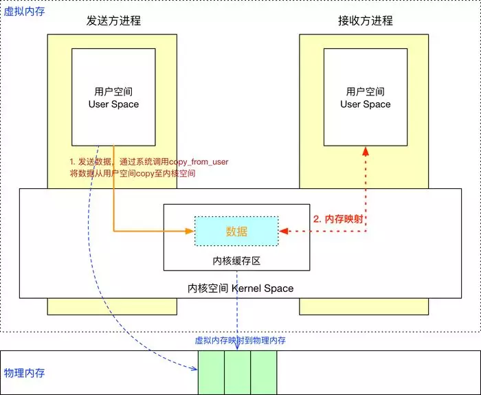
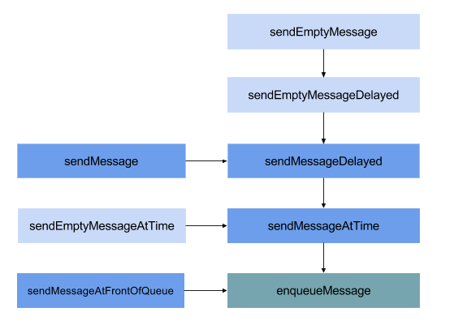

## Binder

### 谈谈你对Binder的理解

Binder是一种进程间通信机制，是Google基于开源的OpenBinder实现，binder是Android中主要的跨进程通信方式。其中，binder驱动和`Service Manager`分别相当于网络协议中的路由器和DNS（域名解析服务器），并基于mmap实现了IPC传输数据时只需一次拷贝。

binder包括BinderProxy、BpBinder等各种Binder实体，以及对binder驱动操作的`ProcessState`、`IPCThreadState`封装，再加上binder驱动内部的结构体、命令处理，整体贯穿Java、Native层，涉及用户态、内核态，往上可以说到Service、AIDL等，往下可以说到mmap、binder驱动设备，是相当庞大、繁琐的一个机制。

我自己来谈的话，一天时间都是不够的，还是问我具体问题吧。

**【面试官】：既然你说到AIDL，那么说一说oneway吧。**

oneway主要有两个特性：异步调用和串行化处理。

异步调用是指应用向binder驱动发送数据后不需要挂起线程等待binder驱动的回复，而是直接结束。像一些系统服务调用应用进程的时候就会使用oneway，比如AMS调用应用进程启动Activity，这样就算应用进程中做了耗时的任务，也不会阻塞系统服务的运行。

串行化处理是指对于一个服务端的AIDL接口而言，所有的oneway方法不会同时执行，binder驱动会将它们串行化处理，排队一个一个调用。

**【面试官】：有了解过相关的binder协议吗？**

了解过，看图会更直观一些，我来画一下图吧，首先是非oneway的情况：


如果是oneway的话，客户端就不需要挂起线程等待：


涉及到的binder命令也有规律，由外部发送给binder驱动的都是`BC_`开头，由binder驱动发往外部的都是`BR_`开头。

**【面试官】：怎么理解客户端线程挂起等待呢？有没有实际占用CPU的调度？**

这里的挂起相当于Thread的sleep，是真正的“休眠”，底层调用的是`waiteventinterruptible()`Linux系统函数。

**【面试官】：你是从哪里了解到`waiteventinterruptible()`函数的呢？**

在学习Handler机制的时候，Handler中最关键的地方就是Looper的阻塞与唤醒，阻塞是调用了`nativePollOnce()`方法，当时对它的底层实现感兴趣，就去了解了一下，也学习到Linux用来实现阻塞/唤醒的select、poll和epoll机制。

**【面试官】：基于mmap又是如何实现一次拷贝的？**

其实原理很简单，我来画一个示意图：



Client与Server处于不同进程，有着不同的虚拟地址规则，所以无法直接通信。而一个页框可以映射给多个页，那么就可以将一块物理内存分别与Client和Server的虚拟内存块进行映射。

如图，Client就只需`copy_from_user`进行一次数据拷贝，Server进程就能读取到数据了。另外，映射的虚拟内存块大小将近1M（1M - 8K），所以，IPC通信传输的数据量也被限制为此值。

**【面试官】：怎么理解页框和页？**

页框是指一块实际的物理内存，页是指程序的一块内存数据单元。内存数据一定是存储在实际的物理内存上，即：页必然对应于一个页框，页数据实际是存储在页框上的。

页框和页一样大，都是内核对内存的分块单位。一个页框可以映射给多个页，也就是说一块实际的物理存储空间可以映射给多个进程的多个虚拟内存空间，这也就是mmap机制依赖的基础规则。

【面试官】：简单说一下binder的整体架构吧

再来画一个简单的示意图吧，这是一个比较典型的、两个应用之间的IPC通信流程图：


Client通过`ServiceManager`或AMS获取到远程binder实体，一般会用**Proxy**做一层封装，比如`ServiceManagerProxy`、AIDL生成的Proxy类。而被封装的远程binder实体是一个**BinderProxy**。

**BpBinder**和**BinderProxy**其实是一个东西：远程binder实体。只不过一个Native层、一个Java层，**BpBinder**内部持有一个binder句柄值handle。

**ProcessState**是进程单例，负责打开binder驱动设备及mmap；**IPCThreadState**为线程单例，负责与binder驱动进行具体的命令通信。

由**Proxy**发起`transact()`调用，会将数据打包到Parcel中，层层向下调用到**BpBinder**，在**BpBinder**中调用**IPCThreadState**的`transact()`方法并传入handle句柄值，**IPCThreadState**再去执行具体的binder命令。

由binder驱动到Server的大概流程就是：Server通过**IPCThreadState**接受到Client的请求后，层层向上，最后回调到**Stub**的`onTransact()`方法。

当然，这不代表所有的IPC流程，比如`ServiceManager`作为一个Server时，便没有上层的封装，也没有借助**IPCThreadState**，而是初始化后通过`binder_loop()`方法直接与binder驱动通信的。

**【面试官】：可以可以，我们再来聊聊别的。**

### 谈谈你对binder驱动的了解

先简单画张图：


对Binder机制来说，它相当于IPC通信中的路由器，负责实现不同进程间的数据交互，是Binder机制的核心；对Linux系统来说，它是一个字符驱动设备，运行在内核空间，向上层提供`/dev/binder`设备节点以及open、mmap、ioctl等系统调用。

**【面试官】：既然你提到了驱动设备，那先说说Linux的驱动设备吧**

Linux把所有的硬件访问都抽象为对文件的读写、设置，这一“抽象”的具体实现就是驱动程序。驱动程序充当硬件和软件之间的枢纽，提供了一套标准化的调用，并将这些调用映射为实际硬件设备相关的操作，对应用程序来说隐藏了设备工作的细节。

**Linux驱动设备分为三类：字符设备、块设备和网络设备：**

**字符设备：**字符设备就是能够像字节流文件一样被访问的设备。对字符设备进行读/写操作时，实际硬件的I/O一般也紧接着发生。字符设备驱动通常会实现open、close、read和write系统调用，比如显示屏、键盘、串口、LCD、LED等。

**块设备：**块设备是指通过传输数据块来访问的设备，比如硬盘、SD卡、U盘、光盘等。

**网络设备：**网络设备是指能够和其它主机交换数据的设备，比如网卡、蓝牙等设备。

字符设备中有一个比较特殊的杂项设备，它可以自动生成设备节点，设备号为10。Android的Ashmem（匿名共享内存）、Binder都属于杂项设备。

**【面试官】：看过binder驱动的open、mmap、ioctl方法的具体实现吗？**

它们分别对应于驱动层源码`binder.c`中的`binder_open()`、`binder_mmap()`、`binder_ioctl()`方法；

`binder_open()`中主要是创建及初始化`binder_proc`，`binder_proc`是用来存放binder相关数据的结构体，每个进程独有一份。

`binder_mmap()`的主要工作是建立应用程序虚拟内存在内核中的一块映射，这样应用程序和内核就拥有了共享的内存空间，为后面的一次拷贝做准备。

`binder_ioctl()`是binder驱动中工作量最大的一个，它承担了binder驱动的大部分业务。因为，binder驱动并不提供常规的`read()`、`write()`等文件操作，全部通过`binder_ioctl()`实现。

**【面试官】：仅`binder_ioctl()`一个方法是怎么实现大部分业务的？**

binder机制将业务细分为不同的命令，调用`binder_ioctl()`时，传入具体的命令来区分业务，比如有读写数据的`BINDER_WRITE_READ`命令、`Service Manager`的注册命令`BINDER_SET_CONTEXT_MGR`等等。

`BINDER_WRITE_READ`命令最为关键，其细分了一些子命令，比如：`BC_TRANSACTION`、`BC_REPLY`等。`BC_TRANSACTION`就是上层最常用的IPC调用命令了，AIDL接口的`transact`方法就是这个命令。

**【面试官】：binder驱动中要实现这些业务功能，必然要用一些数据结构来存放相关数据，比如你上面说`binder_open()`方法时提到的`binder_proc`，说说你对这些结构体的了解吧。**

| 结构体             | 说明                                                         |
| ------------------ | ------------------------------------------------------------ |
| binder_proc        | 描述使用binder的进程，当调用binder_open函数时会创建          |
| binder_thread      | 描述使用binder的线程，当调用binder_ioctl函数时会创建         |
| binder_node        | 描述binder实体节点，对应于一个server，即用户态的BpBinder对象 |
| binder_ref         | 描述对binder实体节点的引用，关联到一个binder_node            |
| binder_buffer      | 描述binder通信过程中存储数据的Buffer                         |
| binder_work        | 描述一个binder任务                                           |
| binder_transaction | 描述一次binder任务相关的数据信息                             |
| binder_ref_death   | 描述binder_node即binder server的死亡信息                     |

其中主要结构体的引用关系如下：


**【面试官】：可以可以，我们再来聊点儿别的。**

> 参考链接：
>
> [谈谈AIDL中的oneway修饰符](https://mp.weixin.qq.com/s/wD3Io-ikS1VCljNkxEb6tQ)
> [谈谈你对binder的理解](https://mp.weixin.qq.com/s/Ef2Qy_xFeI6WU3Q0wf5czA)
> [谈谈你对binder驱动的了解](https://mp.weixin.qq.com/s/LH_JR5Rwh1JL4B6qQkEv9Q)


## Handler

### 谈谈你对Android消息机制的理解

消息机制是Android系统中两大基石之一，其中一个是Binder IPC机制，另一个便是消息机制；Android系统使用大量的消息驱动方式来进行交互，比如，Android中四大组件（Activity、Service、BroadcastReceiver、ContentProvider）的启动过程，都离不开消息机制，Android系统，从某种意义上也可以说成是以消息来驱动。

消息机制在Java层面主要涉及到Handler、Looper、MessageQueue、Message这4个类。

- Message：消息分为硬件产生的消息（如按钮、触摸）和软件生成的消息；Message中持有用于消息处理的Handler；
- MessageQueue：消息队列的主要功能是向消息池插入消息（MessageQueue.enqueueMessage）和取走消息池的消息（MessageQueue.next）；MessageQueue中持有一组待处理的Message单向链表；
- Handler：消息辅助类，主要功能是向消息池发送各种消息事件（Handler.sendMessage）和处理相应的消息事件（Handler.handleMessage）；Handler中持有Looper和MessageQueue；
- Looper：不断循环执行（Looper.loop），按分发机制将消息分发给目标处理者；Looper中持有MessageQueue消息队列。

#### Handler机制如何使用

一个典型的使用场景如下：

```java
class LooperThread extends Thread {
    public Handler mHandler;

    public void run() {
        //步骤1：初始化Looper
        Looper.prepare(); 
		
        //步骤2：初始化Handler
        mHandler = new Handler() { 
            public void handleMessage(Message msg) {
                // 在这里处理不同类型的消息
            }
        };

        //步骤3：开启消息循环
        Looper.loop(); 
    }
}
```
我们再来看一下系统源码中是如何使用Handler的：

```java
// API版本28
// android.app.ActivityThread.java

public static void main(String[] args) {
    //...省略部分无关代码

    //步骤1：初始化主线程Looper
    Looper.prepareMainLooper();

    //...省略部分无关代码

    //步骤2：初始化系统默认Handler 
    if (sMainThreadHandler == null) {
        sMainThreadHandler = thread.getHandler();
    }

    //...省略部分无关代码

    //步骤3：开启主线程消息循环
    Looper.loop();

    throw new RuntimeException("Main thread loop unexpectedly exited");
}
```
通过上面两部分代码的对比，我们发现，其它步骤都是一样的，只有Looper的初始化不同。简单来说，当我们调用默认无参的`prepare()`时，实际调用的是重载方法`prepare(true)`，表示这个Looper允许退出；而系统调用的`prepareMainLooper()`，实际调用的是`prepare(false)`，表示主线程的Looper不允许退出。

#### 步骤1：初始化Looper

我们首先来看一下初始化Looper的逻辑，其中，`prepare(boolean)`的方法声明如下：

```java
// API版本28
// android.os.Looper.java

public static void prepare() {
  prepare(true);
}

private static void prepare(boolean quitAllowed) {
    if (sThreadLocal.get() != null) {
        throw new RuntimeException("Only one Looper may be created per thread");
    }
    sThreadLocal.set(new Looper(quitAllowed));
}

public static void prepareMainLooper() {
  prepare(false);
  synchronized (Looper.class) {
    if (sMainLooper != null) {
      throw new IllegalStateException("The main Looper has already been prepared.");
    }
    sMainLooper = myLooper();
  }
}
```
我们通过源码发现，每个线程只允许执行一次该方法，当多次执行时线程的TLS中已经有了Looper对象，则会抛出异常；而我们创建的Looper对象，保存到了当前线程的TLS区域中。

ThreadLocal：线程本地存储区（Thread Local Storage，简称TLS），每个线程都有自己的私有的本地存储区域，不同线程之间彼此不能访问对方的TLS区域。

TLS的常用操作方法：`ThreadLocal.set(T value)`，将value存储到当前线程的TLS区域，源码如下：

```java
// API版本28
// java.lang.ThreadLocal.java

public void set(T value) {
    Thread t = Thread.currentThread(); //获取当前线程
    ThreadLocalMap map = getMap(t); //查找当前线程的本地存储区，也就是t.threadLocals变量
    if (map != null)
        // 以当前ThreadLocal对象为key，把value存储到TLS中
    	map.set(this, value);
    else
        // 如果当前线程本地存储区未初始化，则创建ThreadLocalMap对象，并把value存储其中
    	createMap(t, value);
}
```

`ThreadLocal.get()`：获取当前线程TLS区域的数据，源码如下：

```java
// API版本28
// java.lang.ThreadLocal.java

public T get() {
    Thread t = Thread.currentThread(); //获取当前线程
    ThreadLocalMap map = getMap(t); //查找当前线程的本地存储区，也就是t.threadLocals变量
    if (map != null) {
    	// 以当前ThreadLocal对象为key，查找存储在TLS中对应的数据
        ThreadLocalMap.Entry e = map.getEntry(this);
        if (e != null) {
            @SuppressWarnings("unchecked")
            T result = (T)e.value;
            return result;
        }
    }

    // 如果TLS为空，则初始化TLS，并调用initialValue()初始化默认值，默认值为null
    return setInitialValue();
}
```

ThreadLocal的get()和set()方法才做的类型都是泛型。其中，在Looper定义的变量为sThreadLocal，源码如下：

```java
// API版本28
// android.os.Looper.java

// sThreadLocal.get() will return null unless you've called prepare().
static final ThreadLocal<Looper> sThreadLocal = new ThreadLocal<Looper>();
```

我们接着Looper的构造方法往下说，源码如下：

```java
// API版本28
// android.os.Looper.java

private Looper(boolean quitAllowed) {
	// 创建MessageQueue对象
    mQueue = new MessageQueue(quitAllowed);
    // 记录当前创建线程
    mThread = Thread.currentThread();
}
```

我们来看一下MessageQueue的构造方法，源码如下：

```java
// API版本28
// android.os.MessageQueue.java

MessageQueue(boolean quitAllowed) {
    mQuitAllowed = quitAllowed;
    // 通过native方法初始化消息队列，其中mPtr是供native层使用的指针引用
    mPtr = nativeInit();
}
```

在MessageQueue中涉及到多个native方法，除了MessageQueue的native方法，native层本身也有一套完整的消息机制，用于处理native的消息，在整个消息机制中，MessageQueue是连接Java层和native层的纽带，换言之，Java层可以向MessageQueue消息队列中添加消息，native层也可以向MessageQueue消息队列中添加消息。

在MessageQueue中的native方法如下：

```java
// API版本28
// android.os.MessageQueue.java

private native static long nativeInit();
private native static void nativeDestroy(long ptr);
private native void nativePollOnce(long ptr, int timeoutMillis); /*non-static for callbacks*/
private native static void nativeWake(long ptr);
private native static boolean nativeIsPolling(long ptr);
private native static void nativeSetFileDescriptorEvents(long ptr, int fd, int events);
```

其中，`nativeInit()`初始化过程的调用链如下：


其中，在构建native层的`Looper.cpp`时，会调用`Looper::rebuildEpollLocked()`方法，源码如下：

```c++
// API版本28
// system/core/libutils/Looper.cpp

void Looper::rebuildEpollLocked() {
    // Close old epoll instance if we have one.
    if (mEpollFd >= 0) {
#if DEBUG_CALLBACKS
        ALOGD("%p ~ rebuildEpollLocked - rebuilding epoll set", this);
#endif
        close(mEpollFd); //关闭旧的epoll实例
    }

    // Allocate the new epoll instance and register the wake pipe.
    mEpollFd = epoll_create(EPOLL_SIZE_HINT); //创建新的epoll实例，并注册wake管道
    LOG_ALWAYS_FATAL_IF(mEpollFd < 0, "Could not create epoll instance: %s", strerror(errno));

    struct epoll_event eventItem;
    // 把未使用的数据区域进行置0操作
    memset(& eventItem, 0, sizeof(epoll_event)); // zero out unused members of data field union
    eventItem.events = EPOLLIN; // 可读事件
    eventItem.data.fd = mWakeEventFd;
    // 将唤醒事件（mWakeEventFd）添加到epoll实例（mEpollFd）
    int result = epoll_ctl(mEpollFd, EPOLL_CTL_ADD, mWakeEventFd, & eventItem);
    LOG_ALWAYS_FATAL_IF(result != 0, "Could not add wake event fd to epoll instance: %s",
                        strerror(errno));

    for (size_t i = 0; i < mRequests.size(); i++) {
        const Request& request = mRequests.valueAt(i);
        struct epoll_event eventItem;
        request.initEventItem(&eventItem);

        // 将request队列的事件，分别添加到epoll实例
        int epollResult = epoll_ctl(mEpollFd, EPOLL_CTL_ADD, request.fd, & eventItem);
        if (epollResult < 0) {
            ALOGE("Error adding epoll events for fd %d while rebuilding epoll set: %s",
                  request.fd, strerror(errno));
        }
    }
}
```

在上述native层源码中，涉及到一个很重要的一个机制：IO多路复用epoll机制。

#### epoll机制

select/poll/epoll都是Linux内核中IO多路复用机制，可以同时监控多个描述符，当某个描述符就绪（读或写就绪），则立刻通知相应程序进行读或写操作。本质上select/poll/epoll都是同步I/O，即读写是阻塞的。

**select缺点：**

- 文件描述符个数受限：单进程能够监控的文件描述符的数量存在最大限制，在Linux上一般为1024，可以通过修改宏定义增大上限，但同样存在效率低的弱势；
- 性能衰减严重：IO随着监控的描述符数量增长，其性能会线性下降。

**poll缺点：**

- select和poll都需要在返回后，通过遍历文件描述符来获取已经就绪的socket。同时连接的大量客户端在同一时刻可能只有很少的处于就绪状态，因此，随着监视的描述符数量的增长，其性能会线性下降。

epoll是在Linux内核2.6中提出的，是select和poll的增强版。相对于select和poll来说，epoll更加灵活，没有描述符数量的限制。epoll使用一个文件描述符管理多个描述符，将用户空间的文件描述符的事件存放到内核的一个事件列表中，这样在用户空间和内核空间的copy只需要1次。epoll机制是Linux中最高效的IO多路复用机制，在一处等待多个文件句柄的IO事件。

**select/poll都只有一个方法，epoll机制操作过程有三个方法：`epoll_create()`、`epoll_ctl()`、`epoll_wait()`。**

##### epoll_create()

```c
int epoll_create(int size)；
```

用于创建一个epoll的句柄，size是指监听的描述符个数，现在内核支持动态扩展，该值的意义仅仅是初次分配的fd个数，后面空间不够时会动态扩容。当创建完epoll句柄后，占用一个fd值。使用完epoll后，必须调用close()关闭，否则可能导致fd被耗尽。

##### epoll_ctl()

```c
int epoll_ctl(int epfd, int op, int fd, struct epoll_event *event)；
```

用于对需要监听的文件描述符（fd）执行op操作，比如将fd加入到epoll句柄。

- epfd：是epoll_create()的返回值；
- op：表示op操作，用三个宏来表示，分别代表添加、删除和修改对fd的监听事件：EPOLL_CTL_ADD(添加)、EPOLL_CTL_DEL(删除)和EPOLL_CTL_MOD（修改）；
- fd：需要监听的文件描述符；
- epoll_event：需要监听的事件。

其中`struct epoll_event`结构体的源码如下：

```c
struct epoll_event {
	__uint32_t events;  /* Epoll事件 */
	epoll_data_t data;  /*用户可用数据*/
};
```

events（表示对应的文件描述符的操作）可取值如下：

- EPOLLIN：可读（包括对端SOCKET正常关闭）；
- EPOLLOUT：可写；
- EPOLLERR：错误；
- EPOLLHUP：中断；
- EPOLLPRI：高优先级的可读（这里应该表示有额外数据到来）；
- EPOLLET：将EPOLL设为边缘触发模式，这是相对于水平触发来说的；
- EPOLLONESHOT：只监听一次事件，当监听完这次事件之后就不再监听该事件。

##### epoll_wait()

```c
int epoll_wait(int epfd, struct epoll_event * events, int maxevents, int timeout);
```

用于等待事件的上报；该函数返回需要处理的事件数目，如返回0表示已经超时。

- epfd：等待epfd上的IO事件，最多返回maxevents个事件；
- events：用来从内核得到事件的集合；
- maxevents：events数量，该maxevents值不能大于创建`epoll_create()`时的size；
- timeout：超时时间（毫秒，0会立即返回）。

在select/poll机制中，进程只有在调用一定的方法后，内核才对所有监视的文件描述符进行扫描，而epoll事先通过`epoll_ctl()`来注册一个文件描述符，一旦基于某个文件描述符就绪时，内核就会采用类似callback的回调机制，迅速激活这个文件描述符，当进程调用`epoll_wait()`时便得到通知（此处去掉了遍历文件描述符，而是通过监听回调的机制。这也正是epoll的魔力所在。）。

##### epoll优势

- 监视的描述符数量不受限制，所支持的fd上限是最大可以打开文件得数目，具体数目可以使用`cat /proc/sys/fs/file-max`命令查看，一般来说，这个数目和系统内存关系很大，以3G内存的手机来说，这个值为20-30万；
- IO性能不会随着监视fd的数量增长而下降。epoll不同于select和poll中的轮询方式，而是通过每个fd定义的回调函数来实现的，只有就绪的fd才会执行回调函数；
- 如果没有大量的空闲或者死亡连接，epoll的效率并不会比select/poll高很多；但当遇到大量的空闲连接的场景下，epoll的效率则大大高于select和poll。

#### 步骤2：初始化Handler

我们再来看一下Handler的初始化方法，源码如下：

```java
// API版本28
// android.os.Handler.java

public Handler() {
    this(null, false);
}

public Handler(Callback callback, boolean async) {
	// 匿名类、内部类或本地类都必须声明为static，否则会警告可能出现内存泄漏
    if (FIND_POTENTIAL_LEAKS) {
        final Class<? extends Handler> klass = getClass();
        if ((klass.isAnonymousClass() || klass.isMemberClass() || klass.isLocalClass()) &&
                (klass.getModifiers() & Modifier.STATIC) == 0) {
            Log.w(TAG, "The following Handler class should be static or leaks might occur: " +
                klass.getCanonicalName());
        }
    }

    // 必须先执行Looper.prepare()。才能获取Looper对象，否则为null。
    mLooper = Looper.myLooper(); //从当前线程的TLS中获取Looper对象
    if (mLooper == null) {
        throw new RuntimeException(
            "Can't create handler inside thread " + Thread.currentThread()
                    + " that has not called Looper.prepare()");
    }
    mQueue = mLooper.mQueue; //把Looper中的消息队列赋值给Handler内部成员变量
    mCallback = callback; //回调方法
    mAsynchronous = async; //设置是否为异步Handler，当该值为true时，通过该Handler发送的所有消息都为异步消息
}
```

通过上面源码，我们发现，在构建Handler时，并没有做一些特殊的操作，只是获取了当前线程的Looper和MessageQueue赋值给了自己内部的成员变量。

#### 步骤3：开启消息循环

我们最后来看一下Handler消息机制的最核心方法，`Looper.loop()`的源码如下：

```java
// API版本28
// android.os.Looper.java

public static void loop() {
    final Looper me = myLooper(); //获取TLS中存储的Looper对象
    if (me == null) {
        throw new RuntimeException("No Looper; Looper.prepare() wasn't called on this thread.");
    }
    final MessageQueue queue = me.mQueue; //获取Looper对象中的消息队列

    // Make sure the identity of this thread is that of the local process,
    // and keep track of what that identity token actually is.
    Binder.clearCallingIdentity();
    // 确保在权限检查时基于本地进程，而不是调用进程。
    final long ident = Binder.clearCallingIdentity();

    //...省略部分无关代码

    for (;;) { //进入loop的主循环方法
    	// 当通过MessageQueue获取消息时，可能会阻塞
        Message msg = queue.next(); // might block
        if (msg == null) { // 当获取的消息为null时，则结束消息循环机制
            // No message indicates that the message queue is quitting.
            return;
        }

        // This must be in a local variable, in case a UI event sets the logger
        final Printer logging = me.mLogging; //默认值为null，可通过setMessageLogging()方法来指定输出，用于debug功能
        if (logging != null) {
            logging.println(">>>>> Dispatching to " + msg.target + " " +
                    msg.callback + ": " + msg.what);
        }

        //...省略部分无关代码

        try {
            msg.target.dispatchMessage(msg); //通过Message中的Handler来分发Message
            dispatchEnd = needEndTime ? SystemClock.uptimeMillis() : 0;
        } finally {
            if (traceTag != 0) {
                Trace.traceEnd(traceTag);
            }
        }
        
        //...省略部分无关代码

        // Make sure that during the course of dispatching the
        // identity of the thread wasn't corrupted.
        // 确保在调度过程中线程的identity未发生变化
        final long newIdent = Binder.clearCallingIdentity();
        if (ident != newIdent) {
            Log.wtf(TAG, "Thread identity changed from 0x"
                    + Long.toHexString(ident) + " to 0x"
                    + Long.toHexString(newIdent) + " while dispatching to "
                    + msg.target.getClass().getName() + " "
                    + msg.callback + " what=" + msg.what);
        }

        //回收Message消息，放入Message中的消息缓存池中
        msg.recycleUnchecked();
    }
}
```

通过上面的源码，我们发现`loop()`方法的主要核心逻辑为：

- 读取MessageQueue的下一条Message消息；
- 通过Message中的target，调用Handler对象中的`dispatchMessage()`来分发消息；
- 最后在Message使用完之后，把Message消息回收到缓存池中，以便重复利用。

接下来，我们来看一下MessageQueue中获取下一条消息时都有什么逻辑，也就是`MessageQueue.next()`的源码：

```java
// API版本28
// android.os.MessageQueue.java

Message next() {
    // Return here if the message loop has already quit and been disposed.
    // This can happen if the application tries to restart a looper after quit
    // which is not supported.
    final long ptr = mPtr;
    if (ptr == 0) { //当消息循环已经退出，则直接返回null
        return null;
    }

    int pendingIdleHandlerCount = -1; // -1 only during first iteration
    int nextPollTimeoutMillis = 0;
    for (;;) {
        if (nextPollTimeoutMillis != 0) {
            Binder.flushPendingCommands();
        }

        //该处调用是Looper线程休眠的核心逻辑；当等待了nextPollTimeoutMillis时长之后，或者消息队列被唤醒，都会从该方法处返回
        //当nextPollTimeoutMillis值为-1时，表示当前消息队列中没有要处理的消息，则会一直休眠下去，直到被唤醒
        //当nextPollTimeoutMillis值为0时，最终会执行到native层的epoll_wait()方法，该方法会立即返回，不会进入休眠
        nativePollOnce(ptr, nextPollTimeoutMillis);

        synchronized (this) {
            // Try to retrieve the next message.  Return if found.
            final long now = SystemClock.uptimeMillis();
            Message prevMsg = null;
            Message msg = mMessages;
            if (msg != null && msg.target == null) {
                // Stalled by a barrier.  Find the next asynchronous message in the queue.
                
                // 特殊消息类型，表示消息队列中有同步屏障存在；此逻辑会找到同步屏障后第一个异步消息
                // 如果没找到异步消息时，则会把nextPollTimeoutMillis赋值为-1，在下次轮询时，消息队列将进入阻塞
                do {
                    prevMsg = msg;
                    msg = msg.next;
                } while (msg != null && !msg.isAsynchronous());
            }
            if (msg != null) {
                if (now < msg.when) {
                    // Next message is not ready.  Set a timeout to wake up when it is ready.
                    // 当消息的触发时间大于当前时间时，则设置下一次轮询时的休眠时长
                    nextPollTimeoutMillis = (int) Math.min(msg.when - now, Integer.MAX_VALUE);
                } else {
                    // Got a message.
                    mBlocked = false;
                    if (prevMsg != null) {
                        prevMsg.next = msg.next;
                    } else {
                        mMessages = msg.next;
                    }

                    // 从消息队列链表中移除获取到的消息
                    msg.next = null;
                    if (DEBUG) Log.v(TAG, "Returning message: " + msg);
                    msg.markInUse();
                    return msg; //成功获取到MessageQueue中的下一条将要执行的消息
                }
            } else {
                // No more messages.
                nextPollTimeoutMillis = -1; // 没有消息，进入无线休眠，直到被唤醒
            }

            // Process the quit message now that all pending messages have been handled.
            if (mQuitting) { //MessageQueue正在退出，则返回null
                dispose();
                return null;
            }

            // If first time idle, then get the number of idlers to run.
            // Idle handles only run if the queue is empty or if the first message
            // in the queue (possibly a barrier) is due to be handled in the future.
            
            // 能执行到这里，说明消息队列在下一次轮询中马上就要进入休眠状态啦
            // 当消息队列为空，或者还没到下一次消息的执行时间时，给pendingIdleHandlerCount重新赋值，准备执行IdleHandler中相关逻辑
            if (pendingIdleHandlerCount < 0
                    && (mMessages == null || now < mMessages.when)) {
                pendingIdleHandlerCount = mIdleHandlers.size();
            }

            // 如果没有IdleHandler需要执行，则标记当前消息队列为阻塞状态，进入下一次轮询，下一次轮询时会阻塞
            if (pendingIdleHandlerCount <= 0) {
                // No idle handlers to run.  Loop and wait some more.
                mBlocked = true;
                continue;
            }

            // 初始化mPendingIdleHandlers
            if (mPendingIdleHandlers == null) {
                mPendingIdleHandlers = new IdleHandler[Math.max(pendingIdleHandlerCount, 4)];
            }
            // 给即将要运行的IdleHandler数组任务赋值，通过mIdleHandlers转换为IdleHandler数组
            mPendingIdleHandlers = mIdleHandlers.toArray(mPendingIdleHandlers);
        }

        // Run the idle handlers.
        // We only ever reach this code block during the first iteration.
        // 当前消息队列处于空闲状态，执行IdleHandler逻辑
        for (int i = 0; i < pendingIdleHandlerCount; i++) {
            final IdleHandler idler = mPendingIdleHandlers[i];
            mPendingIdleHandlers[i] = null; // 获取完之后，释放数组中对IdleHandler的引用

            boolean keep = false;
            try {
            	// 执行IdleHandler空闲逻辑，该方法需要返回一个boolean值
                keep = idler.queueIdle();
            } catch (Throwable t) {
                Log.wtf(TAG, "IdleHandler threw exception", t);
            }

            // 当IdleHandler不需要保存时，keep为false，执行完一次后，从mIdleHandlers移除该任务
            if (!keep) {
                synchronized (this) {
                    mIdleHandlers.remove(idler);
                }
            }
        }

        // Reset the idle handler count to 0 so we do not run them again.
        pendingIdleHandlerCount = 0; //重置pendingIdleHandlerCount为0，以保证该次获取消息时不会重复执行

        // While calling an idle handler, a new message could have been delivered
        // so go back and look again for a pending message without waiting.
        
        // 当IdleHandler执行完时，可能已经到了下一个消息执行的时间，因此，在下一次轮询时无需等待，直接获取下一个消息
        // 当nextPollTimeoutMillis为0时，nativePollOnce()方法底层逻辑会立即返回，不会阻塞休眠
        nextPollTimeoutMillis = 0; 
    }
}
```

我们通过上面的源码分析发现，在调用`nativePollOnce()`方法时，有可能会使当前线程进入阻塞休眠状态，具体是由nextPollTimeoutMillis参数来决定的。`nativePollOnce()`方法的调用链如下：


其中，native层的核心逻辑`Looper::pollOnce()`源码如下：

```c++
// API版本28
// system/core/libutils/Looper.cpp

/**
 * @param  timeoutMillis [超时时长]
 * @param  outFd         [发生事件的文件描述符]
 * @param  outEvents     [当前outFd上发生的事件，包含4类事件：EVENT_INPUT（可读）、EVENT_OUTPUT（可写）、EVENT_ERROR（错误）和EVENT_HANGUP（中断）]
 * @param  outData       [上下文数据]
 */
int Looper::pollOnce(int timeoutMillis, int* outFd, int* outEvents, void** outData) {
    int result = 0;
    for (;;) {
    	// 先处理没有callback方法的response事件
        while (mResponseIndex < mResponses.size()) {
            const Response& response = mResponses.itemAt(mResponseIndex++);
            int ident = response.request.ident;
            if (ident >= 0) { //ident大于0，则表示没有callback，因为POLL_CALLBACK值为-2，该值定义在Looper.h中
                int fd = response.request.fd;
                int events = response.events;
                void* data = response.request.data;
#if DEBUG_POLL_AND_WAKE
                ALOGD("%p ~ pollOnce - returning signalled identifier %d: "
                        "fd=%d, events=0x%x, data=%p",
                        this, ident, fd, events, data);
#endif
                if (outFd != NULL) *outFd = fd;
                if (outEvents != NULL) *outEvents = events;
                if (outData != NULL) *outData = data;
                return ident;
            }
        }

        if (result != 0) {
#if DEBUG_POLL_AND_WAKE
            ALOGD("%p ~ pollOnce - returning result %d", this, result);
#endif
            if (outFd != NULL) *outFd = 0;
            if (outEvents != NULL) *outEvents = 0;
            if (outData != NULL) *outData = NULL;
            return result;
        }

        // 再处理内部轮询
        result = pollInner(timeoutMillis);
    }
}
```

在上述源码中，`pollOnce()`方法的返回值，总共有以下几种：

- POLL_WAKE：表示由`wake()`触发，即pipe写端的write事件触发；
- POLL_CALLBACK：表示某个被监听fd被触发；
- POLL_TIMEOUT：表示等待超时；
- POLL_ERROR：表示等待期间发生了错误。

我们再来看一下`Looper::pollInner()`的源码：

```c++
int Looper::pollInner(int timeoutMillis) {
	//...省略部分无关代码

    // Poll.
    int result = POLL_WAKE;
    mResponses.clear();
    mResponseIndex = 0;

    // We are about to idle.
    mPolling = true; //即将处于idle状态

    struct epoll_event eventItems[EPOLL_MAX_EVENTS]; //fd的最大个数为16
    // 核心函数：等待事件发生或超时，当调用nativeWake()方法，向管道写端写入字符，则该方法会返回。
    int eventCount = epoll_wait(mEpollFd, eventItems, EPOLL_MAX_EVENTS, timeoutMillis);

    // No longer idling.
    mPolling = false; //标识为不再处于idle状态

    // Acquire lock.
    mLock.lock(); //请求锁

    // Rebuild epoll set if needed.
    if (mEpollRebuildRequired) {
        mEpollRebuildRequired = false;
        rebuildEpollLocked(); //epoll重建，直接跳转到Done逻辑
        goto Done;
    }

    // Check for poll error.
    if (eventCount < 0) {
        if (errno == EINTR) {
            goto Done;
        }
        ALOGW("Poll failed with an unexpected error: %s", strerror(errno));
        result = POLL_ERROR; //epoll事件个数小于0，发生错误，直接跳转到Done逻辑
        goto Done;
    }

    // Check for poll timeout.
    if (eventCount == 0) {
#if DEBUG_POLL_AND_WAKE
        ALOGD("%p ~ pollOnce - timeout", this);
#endif
        result = POLL_TIMEOUT; //epoll事件个数等于0，发生超时，直接跳转到Done逻辑
        goto Done;
    }

    // Handle all events.
#if DEBUG_POLL_AND_WAKE
    ALOGD("%p ~ pollOnce - handling events from %d fds", this, eventCount);
#endif

    // 循环遍历，处理所有事件
    for (int i = 0; i < eventCount; i++) {
        int fd = eventItems[i].data.fd;
        uint32_t epollEvents = eventItems[i].events;
        if (fd == mWakeEventFd) {
            if (epollEvents & EPOLLIN) {
                awoken(); //已经唤醒了，则读取并清空管道数据
            } else {
                ALOGW("Ignoring unexpected epoll events 0x%x on wake event fd.", epollEvents);
            }
        } else {
            ssize_t requestIndex = mRequests.indexOfKey(fd);
            if (requestIndex >= 0) {
                int events = 0;
                if (epollEvents & EPOLLIN) events |= EVENT_INPUT;
                if (epollEvents & EPOLLOUT) events |= EVENT_OUTPUT;
                if (epollEvents & EPOLLERR) events |= EVENT_ERROR;
                if (epollEvents & EPOLLHUP) events |= EVENT_HANGUP;

                //处理request，生成对应的response对象，push到响应数组
                pushResponse(events, mRequests.valueAt(requestIndex));
            } else {
                ALOGW("Ignoring unexpected epoll events 0x%x on fd %d that is "
                        "no longer registered.", epollEvents, fd);
            }
        }
    }
Done: ;

    // Invoke pending message callbacks.
    // 再处理native层的Message，调用相应的回调方法
    mNextMessageUptime = LLONG_MAX;
    while (mMessageEnvelopes.size() != 0) {
        nsecs_t now = systemTime(SYSTEM_TIME_MONOTONIC);
        const MessageEnvelope& messageEnvelope = mMessageEnvelopes.itemAt(0);
        if (messageEnvelope.uptime <= now) {
            // Remove the envelope from the list.
            // We keep a strong reference to the handler until the call to handleMessage
            // finishes.  Then we drop it so that the handler can be deleted *before*
            // we reacquire our lock.
            { // obtain handler
                sp<MessageHandler> handler = messageEnvelope.handler;
                Message message = messageEnvelope.message;
                mMessageEnvelopes.removeAt(0);
                mSendingMessage = true;
                mLock.unlock(); //释放锁

#if DEBUG_POLL_AND_WAKE || DEBUG_CALLBACKS
                ALOGD("%p ~ pollOnce - sending message: handler=%p, what=%d",
                        this, handler.get(), message.what);
#endif
                handler->handleMessage(message); //处理native层消息事件
            } // release handler

            mLock.lock(); //请求锁
            mSendingMessage = false;
            result = POLL_CALLBACK; //发生回调
        } else {
            // The last message left at the head of the queue determines the next wakeup time.
            mNextMessageUptime = messageEnvelope.uptime;
            break;
        }
    }

    // Release lock.
    mLock.unlock(); //释放锁

    // Invoke all response callbacks.
    // 处理带有Callback()方法的Response事件，执行Response相应的回调方法
    for (size_t i = 0; i < mResponses.size(); i++) {
        Response& response = mResponses.editItemAt(i);
        if (response.request.ident == POLL_CALLBACK) {
            int fd = response.request.fd;
            int events = response.events;
            void* data = response.request.data;
#if DEBUG_POLL_AND_WAKE || DEBUG_CALLBACKS
            ALOGD("%p ~ pollOnce - invoking fd event callback %p: fd=%d, events=0x%x, data=%p",
                    this, response.request.callback.get(), fd, events, data);
#endif
            // Invoke the callback.  Note that the file descriptor may be closed by
            // the callback (and potentially even reused) before the function returns so
            // we need to be a little careful when removing the file descriptor afterwards.
            
            // 处理请求的回调方法
            int callbackResult = response.request.callback->handleEvent(fd, events, data);
            if (callbackResult == 0) {
                removeFd(fd, response.request.seq); //移除fd
            }

            // Clear the callback reference in the response structure promptly because we
            // will not clear the response vector itself until the next poll.
            response.request.callback.clear(); //清除response引用的回调方法
            result = POLL_CALLBACK; //发生回调
        }
    }
    return result;
}
```

通过上述源码分析，我们发现，`pollInner()`方法主要的逻辑如下：

1. 先调用`epoll_wait()`，这是个阻塞方法，用于等待事件发生或者超时；当调用nativeWake()方法，向管道写端写入字符，则该方法会返回；
2. 对于`epoll_wait()`方法的返回，当且仅当以下3种情况出现：

- POLL_ERROR：发生错误，直接跳转到Done；
- POLL_TIMEOUT：发生超时，直接跳转到Done；
- 检测到管道有事件发生，则再根据情况做相应处理：如果是管道读端产生事件，则直接读取管道的数据；如果是其它事件，则处理request，生成对应的response对象，push到response数组；

3. 进入Done标记位的代码段：

- 先处理native层的Message，调用native层的Handler来处理该Message；
- 再处理Response数组，POLL_CALLBACK类型的事件；

从上面的流程中，我们发现，对于Request先收集，一并放入response数组，而不是马上执行。真正在Done开始执行的时候，是先处理native层Message，再处理Request，说明native层Message的优先级高于Request请求的优先级。

另外，在`pollOnce()`方法中，先处理Response数组中不带Callback的事件，再调用了`pollInner()`方法。

#### 步骤4：消息发送

当我们通过Handler发送消息时，具体的调用链如下：



通过上图，我们发现所有的消息发送方式，最终都调用到了Handler中的私有成员方法`enqueueMessage()`，在该方法内部最终又调用到了`MessageQueue.enqueueMessage()`；

接下来，我们来看一下`MessageQueue.enqueueMessage()`中的源码：

```java
// API版本28
// android.os.MessageQueue.java

boolean enqueueMessage(Message msg, long when) {
	// 每一个普通的Message对象，都必须有一个target
    if (msg.target == null) {
        throw new IllegalArgumentException("Message must have a target.");
    }
    if (msg.isInUse()) {
        throw new IllegalStateException(msg + " This message is already in use.");
    }

    synchronized (this) {
        if (mQuitting) { //当前消息队列正在退出，回收Message到消息缓存池中
            IllegalStateException e = new IllegalStateException(
                    msg.target + " sending message to a Handler on a dead thread");
            Log.w(TAG, e.getMessage(), e);
            msg.recycle();
            return false;
        }

        msg.markInUse();
        msg.when = when;
        Message p = mMessages;
        boolean needWake;
        if (p == null || when == 0 || when < p.when) {
            // New head, wake up the event queue if blocked.
            // 当p为null时，说明当前消息队列中没有消息；
            // 或者当前要插入的消息是队列中最早需要执行的，则把该消息插入到消息队列头部
            msg.next = p;
            mMessages = msg;
            needWake = mBlocked;
        } else {
            // Inserted within the middle of the queue.  Usually we don't have to wake
            // up the event queue unless there is a barrier at the head of the queue
            // and the message is the earliest asynchronous message in the queue.
            
        	// 将消息按照时间顺序插入到消息队列中，一般来说，此时并不需要唤醒事件队列；
        	// 除非，当前消息队列处于阻塞休眠状态，并且消息队列头为同步屏障消息，并且当前要插入的消息为异步消息时，才需要唤醒
            needWake = mBlocked && p.target == null && msg.isAsynchronous();
            Message prev;
            for (;;) {
                prev = p;
                p = p.next;
                if (p == null || when < p.when) {
                    break;
                }
                if (needWake && p.isAsynchronous()) {
                    needWake = false;
                }
            }
            msg.next = p; // invariant: p == prev.next
            prev.next = msg;
        }

        // We can assume mPtr != 0 because mQuitting is false.
        if (needWake) {
            nativeWake(mPtr); //当前消息队列需要唤醒时，调用native层的唤醒方法
        }
    }
    return true;
}
```
通过上面Java层插入消息的源码分析，我们发现：

- 当插入消息时，如果当前消息队列中没有消息，或者当前要插入的消息是队列中最早需要执行的，则把该消息插入到消息队列头部；如果当前消息队列处于阻塞休眠状态的话，则需要唤醒消息队列；
- 其它情况，将消息按照时间顺序插入到消息队列中时，一般来说，此时并不需要唤醒事件队列；除非，当前消息队列处于阻塞休眠状态，并且消息队列头为同步屏障消息，并且当前要插入的消息为异步消息时，才需要唤醒消息队列。

其中，`nativeWake()`唤醒方法的调用链如下：


我们来看一下native层的核心方法`Looper::wake()`的源码：

```c++
// API版本28
// system/core/libutils/Looper.cpp

void Looper::wake() {
#if DEBUG_POLL_AND_WAKE
    ALOGD("%p ~ wake", this);
#endif

    // 向管道mWakeEventFd中写入字符1
    uint64_t inc = 1;
    ssize_t nWrite = TEMP_FAILURE_RETRY(write(mWakeEventFd, &inc, sizeof(uint64_t)));
    if (nWrite != sizeof(uint64_t)) {
        if (errno != EAGAIN) {
            LOG_ALWAYS_FATAL("Could not write wake signal to fd %d: %s",
                    mWakeEventFd, strerror(errno));
        }
    }
}
```

在上述源码中，`TEMP_FAILURE_RETRY`是一个宏定义，当执行write失败后，会不断重复执行，直到执行成功为止；在执行成功后，在阻塞休眠状态的线程，将从`epoll_wait()`处返回，进而唤醒了整个消息队列，继续处理消息。

#### 总结

MessageQueue通过mPtr变量保存了native层的NativeMessageQueue对象的指针，从而使得MessageQueue成为Java层和Native层的枢纽，既能处理上层消息，也能处理native层消息；下面是Java层与Native层的对应图：


在上图中：

- 红色虚线关系：Java层和Native层的MessageQueue通过JNI建立关联，彼此之间能相互调用，搞明白这个互调关系，也就搞明白了Java如何调用C++代码，C++代码又是如何调用Java代码。
- 蓝色虚线关系：Handler/Looper/Message这三大类Java层与Native层并没有任何的真正关联，只是分别在Java层和Native层的handler消息模型中具有相似的功能。都是彼此独立的，各自实现相应的逻辑。
- 在Native层中，WeakMessageHandler继承于MessageHandler类；NativeMessageQueue继承于MessageQueue类。

**另外，消息处理的流程是先处理Native层的Message，再处理Native层的Request，最后处理Java层的Message。理解了该流程，也就明白有时上层信息很少，但响应时间却较长的真正原因。**

**【面试官】：Handler的内存泄漏是怎么回事？如何产生的呢？**

首先，造成Handler内存泄漏的往往是因为如下的代码：

```java
public class XXXActivity extends BaseActivity {
    // ...
    private Handler mHandler = new Handler() {
        @Override
        public void handleMessage(Message msg) {
            // 一些处理
        }
    };
    // ...
}
```
我们知道，匿名内部类会持有外部类的引用，也就是说这里的Handler会持有其外部类XXXActivity的引用。而我们通过Handler调用sendMessage的过程中，会将Message的target设置为当前调用的Handler，也就是说这个Message持有了mHandler的引用。

假设我们通过mHandler发送了一个2分钟后的延时消息，在2分钟还没到的时候，我们关闭了界面。按正常情况来说，此时Activity可以被GC回收，但由于此时Message还处于MessageQueue中，MessageQueue这个对象持有了Message的引用，Message又持有了我们的Handler引用，同时由于Handler又持有了其外部类XXXActivity的引用。这就导致此时XXXActivity仍然是可达的，因此导致XXXActivity无法被GC回收，这就造成了内存泄漏。

因此我们在使用Handler时，最好将其定义为static的，避免其持有外部类的引用导致类似的内存泄漏问题。如果此时还需要用到XXXActivity的一些信息，可以通过WeakReference来使其持有Activity的弱引用，从而可以访问其中的某些信息，又避免了内存泄漏的问题。

**【面试官】：主线程的Looper.loop()在死循环，为什么没有ANR呢？**

首先我们要明白产生ANR的原因，产生ANR的根本原因是：应用程序未在规定的时间内处理AMS指定的任务才会触发ANR。AMS调用到应用端的Binder线程，应用再将任务封装成Message发送到主线程Handler，`Looper.loop()`通过`MessageQueue.next()`拿到这个消息进行处理。如果不能及时处理这个消息消息呢，肯定是因为它前面有耗时的消息处理，或者因为这个任务本身就很耗时。所以，ANR不是因为loop循环，而是因为主线程中有耗时任务。

**【面试官】：主线程的Looper.loop()在死循环，会很消耗资源吗？**

`Looper.loop()`通过`MessageQueue.next()`取当前需要处理的消息，如果当前没有需要处理的消息呢？会调用`nativePollOnce()`方法让线程进入休眠状态，当消息队列没有消息时，无限休眠；当队列的第一个消息还没到需要处理的时间时，则休眠时间为`Message.when - 当前时间`，这样在空闲的时候，主线程也不会消耗额外的资源了。而当有新消息入队时，`enqueueMessage()`方法内部会判断是否需要通过`nativeWake()`方法唤醒主线程来处理新消息。唤醒最终时通过往eventfd发起一个写操作，这样主线程就会收到一个可读事件，进而从休眠状态被唤醒。

**【面试官】：你知道IdleHandler吗？**

IdleHandler是通过`MessageQueue.addIdleHandler()`来添加到MessageQueue中的，前面提到，当`MessageQueue.next()`获取消息时，如果当前没有需要处理的消息，就会进入休眠，而在进入休眠之前呢，就会调用IdleHandler接口的`queueIdle()`方法。这个方法的返回值为true时，则调用后保留，下次队列空闲时还会继续调用；而如果返回值为false，调用之后就被remote了。可以用来做延时加载，而且是在空闲时加载，不像`Handler.postDelayed()`需要指定延时的时间。

**【面试官】：可以可以，我们再来聊点儿别的。**

> 相关知识点：
>
> [Android同步屏障机制](https://juejin.cn/post/6915339994234126349/)
>
> [select/poll/epoll机制对比分析](http://gityuan.com/2015/12/06/linux_epoll/)
>
> [Android消息机制-Handler（Java层）](http://gityuan.com/2015/12/26/handler-message-framework/) 
>
> [Android消息机制-Handler（native层）](http://gityuan.com/2015/12/27/handler-message-native/) 
>
> [你管这破玩意儿叫IO多路复用？](https://mp.weixin.qq.com/s/YdIdoZ_yusVWza1PU7lWaw)

## 四大组件

> API：28
>

### Activity

#### 当调用startActivity之后，都发生了什么？

startActivity主要就是应用进程与system_server进程的AMS通信，AMS是实际来管理Activity组件的，负责处理启动模式，维护Activity栈等工作。startActivity的大概流程就是由应用进程通过IPC调用到AMS，AMS处理完这些工作后再通过IPC回到应用进程，创建Activity的实例，回调Activity的生命周期。

**【面试官】：通过什么实现跨进程的呢？**

都是通过AIDL接口，App进程到system_server进程是通过`IActivityManager.aidl`,systemserver到App进程通过`IApplicationThread.aidl`。

**【面试官】：startActivity时，前后Activity的生命周期是怎样的？**

旧Activity的onPause会先执行，然后新Activity依次执行onCreate、onStart、onResume，随后再执行旧Activity的onStop...

**【面试官】：旧Activity的onPause一定会先执行吗？为什么？**

这主要是由AMS来控制的，它会先后将前一个Activity的onPause事务和新Activity的启动事务发送给App进程，而在App端，由`IApplicationThread.aidl`接收到之后，会入队到ActivityThread.H中的消息队列中，这个也是主线程的消息队列，在队列上自然就实现了先后顺序的控制。

**【面试官】：了解插件化吗？知道怎么启动一个插件中的Activity吗？**

主要需要解决的问题是Activity未在manifest中注册的问题，因为在AMS中会检查Activity是否注册，而这个检查逻辑处于system_server进程，我们是无法hook的。可以在manifest中提前注册一个占位Activity，然后startActivity时进入到system_server进程之前，hook把未注册的Activity改为占位Activity，AMS检测就可以通过，然后再回到App进程后，把这个占位Activity再换成插件Activity。

**【面试官】：可以可以，我们再来聊点儿别的。**