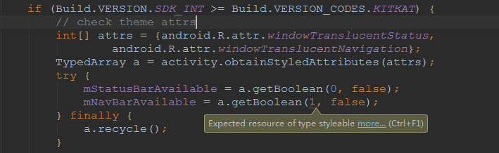

### 问题描述

在apk打release包时，遇到了如下错误信息：

```
Error: Expected resource of type styleable [ResourceType]
                mNavBarAvailable = a.getBoolean(1, false);
```

在代码中，报错的位置为如下代码：



只有当 TypedArray 获取第二个属性以后数据时，才会出现此异常，a.getBoolean(0, false) 这句则不会报错，其实这应该是一个警告，所以才会在调试的时候正常编译，但却在编译签名包的时候失败。

### 解决办法

在使用 TypedArray 的方法处，加上 `@SuppressWarnings("ResourceType")` ，这样即可过滤该警告，正常通过签名编译。