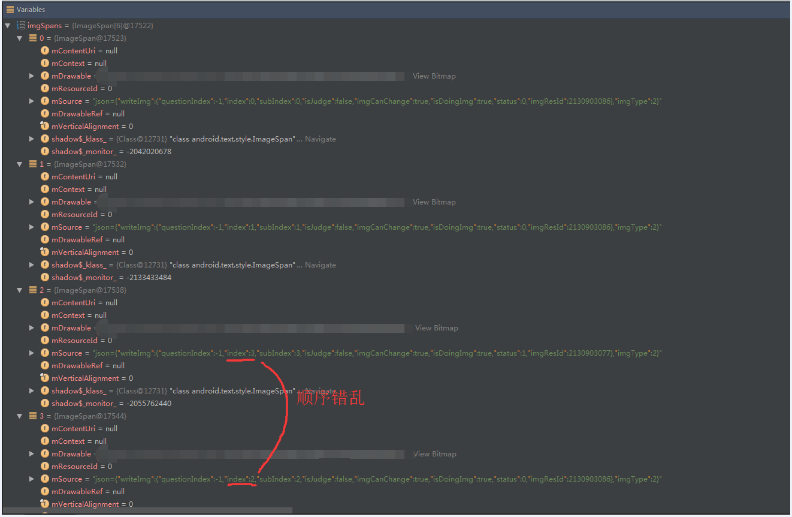
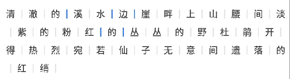

# Android中TextView富文本适配问题

### 问题1

​	先来看下面一段代码：

```
Spanned spanned = Html.fromHtml(text, mImageGetter, tagHandler);
if (spanned instanceof SpannableStringBuilder) {
	mBuilder = (SpannableStringBuilder) spanned;
} else {
	mBuilder = new SpannableStringBuilder(spanned);
}

ImageSpan[] imgSpans = mBuilder.getSpans(0, mBuilder.length(), ImageSpan.class);
......
setText(mBuilder);
setMovementMethod(LinkMovementMethod.getInstance()); //实现TextView中的局部点击事件交互
```

​	我先解释一下：这是在TextView中展示富文本时需要用到的一段代码。简单来说，就是通过Html.fromHtml()方法得到一个Spanned对象，然后再把该对象转换为SpannableStringBuilder的一个对象mBuilder，通过mBuilder的一系列方法去设置各种Span的属性，达到展示富文本的目的。

​	这段代码在API版本<=23时，是完全没有问题，可以正常运行的；但是，当把该代码布置在API版本>23时的设备上时，出现了TextView中图片点击事件错乱的问题！

​	后经过调试发现：在API版本>23的设备上，通过mBuilder.getSpans()获取Span数组时，变成了无序的数组，如下图所示：



​	具体为什么会这样？目前还没有找到具体是什么原因......有知悉该问题的朋友，烦请不吝赐教。多谢！多谢！

​	既然知道了导致该问题的原因，那么解决起来还是相对比较容易的：只需判断当前系统版本是否大于23，如果是大于API23的系统版本时，则对拿到的数组进行重新排序即可。代码如下：

```
if (imgSpans.length > 0 && Build.VERSION.SDK_INT > Build.VERSION_CODES.M) {
    Arrays.sort(imgSpans, new Comparator<ImageSpan>() {
        @Override
        public int compare(ImageSpan lhs, ImageSpan rhs) {
        	// 升序排列
        	return mBuilder.getSpanStart(lhs) - mBuilder.getSpanStart(rhs);
        }
    });
}
```

### 问题2

​	我首先来说一下该问题在项目中的具体需求：在一段纯文本内容的文字中，当点击某一个特定区域时，改变该区域文本的颜色，实现交互效果；如下图所示：



​	为了实现该需求，我需要自定义一个SectionClickableSpan继承自系统的ClickableSpan用来实现点击事件。代码如下：

```
public class SectionClickableSpan extends ClickableSpan {
    /**
     * 用以保存每个点击区域的位置信息holder
     */
    public static class SectionClickHolder {
        /**
         * 当前位置是否可点击;为false时,不可点击
         */
        public boolean isCanChange;
        /**
         * 当前位置索引
         */
        public int sectionIndex = -1;
        /**
         * 用以区分当前位置状态信息
         */
        public int sectionStatus = -1;
        /**
         * 可点击区域的开始索引
         */
        public int start;
        /**
         * 可点击区域的结束索引
         */
        public int end;
        /**
         * 颜色值
         */
        public int color;
    }

    public interface ISectionClickListener {
        /**
         * 当点击时回调该方法
         *
         * @param widget          当前被点击的view
         * @param clickableHolder 当前被点击的holder信息
         */
        void onSectionClick(View widget, SectionClickHolder clickableHolder);
    }

    private SectionClickHolder mSectionClickHolder;
    private ISectionClickListener mSectionClickListener;

    public SectionClickableSpan(SectionClickHolder sectionClickHolder) {
        mSectionClickHolder = sectionClickHolder;
    }

    @Override
    public void onClick(View widget) {
        if (mSectionClickListener != null) {
            mSectionClickListener.onSectionClick(widget, mSectionClickHolder);
        }
    }

    @Override
    public void updateDrawState(TextPaint ds) {
        super.updateDrawState(ds);
        ds.setColor(Color.parseColor("#666666"));
        ds.setUnderlineText(false);
        ds.clearShadowLayer();
    }

    public void setSectionClickListener(ISectionClickListener sectionClickListener) {
        mSectionClickListener = sectionClickListener;
    }

    public SectionClickHolder getSectionClickHolder() {
        return mSectionClickHolder;
    }
}
```

​	然后在点击之后，执行如下操作，实现指定区域颜色的更新。代码如下：

```
......
int color = -1;
if (clickHolder.sectionStatus == QTConstants.SectionImgStatus.SECTION_CHECKED) {
	color = QTConstants.PenColor.BLUE;
} else if (clickHolder.sectionStatus == QTConstants.SectionImgStatus.SECTION_DEF) {
	color = QTConstants.PenColor.GRAY;
}

if (color != -1) {
	// 说明有需要更新的SectionClickableSpan，更新当前位置span颜色值
    ForegroundColorSpan fcs = new ForegroundColorSpan(color);
    mBuilder.setSpan(fcs, clickHolder.start, clickHolder.end, Spanned.SPAN_EXCLUSIVE_EXCLUSIVE);
    setText(mBuilder);
}
```

​	这两段代码在API版本<=23的设备上运行时，没有任何问题；但是在适配到API版本>23的设备时，碰到了如下问题：

- ​	一. TextView中ClickableSpan响应点击事件混乱；


- ​	二. TextView中富文本初始化时，ClickableSpan颜色信息混乱；


- ​	三. 每次点击ClickableSpan时，颜色信息更新混乱；

  ​

  第一个问题和上面的**问题1**其实是同一个问题，解决起来相对比较简单，也是同样的套路。代码如下：

```
SectionClickableSpan[] sectionClickableSpans = mBuilder.getSpans(0, mBuilder.length(), SectionClickableSpan.class);

if (sectionClickableSpans.length > 0 && Build.VERSION.SDK_INT > Build.VERSION_CODES.M) {
    Arrays.sort(sectionClickableSpans, new Comparator<SectionClickableSpan>() {
        @Override
        public int compare(SectionClickableSpan lhs, SectionClickableSpan rhs) {
        	// 升序排列
            return lhs.getSectionClickHolder().start - rhs.getSectionClickHolder().start;
        }
    });
}
```

​	至于第二个问题，着实纠结了很久，网上也没有找到类似问题的相关描述。后经过仔细分析之后发现，可以从SectionClickableSpan中的updateDrawState()方法着手，最终，解决了初始化颜色混乱的问题。代码如下：

```
@Override
public void updateDrawState(TextPaint ds) {
    super.updateDrawState(ds);
    /*
        在api23版本之上时，TextView中span的颜色会出现错乱问题；具体原因不明。
        该mSectionClickHolder.color用以解决该问题。
    */
    if (mSectionClickHolder != null && mSectionClickHolder.color != 0) {
    	ds.setColor(mSectionClickHolder.color);
    } else {
        // error color
        ds.setColor(Color.parseColor("#666666"));
    }
    ds.setUnderlineText(false);
    ds.clearShadowLayer();
}
```

​	至于为什么会造成第二个问题的产生，一直也没有找到具体的原因；要想彻底搞明白，就得去对比一下两个版本的源码啦，这个还是暂时先放一边吧。如果有朋友搞明白了这个问题，烦请不吝赐教！在此，万分感谢！

​	接下来就集中精力解决第三个问题。经过debug不断调试，发现如下现象：当API版本>23时，在TextView中的同一个位置重复设置ForegroundColorSpan颜色时，需要先把之前存在的ForegroundColorSpan清除掉才可以。修改后的代码如下：

```
int color = -1;
if (clickHolder.sectionStatus == QTConstants.SectionImgStatus.SECTION_CHECKED) {
	color = QTConstants.PenColor.BLUE;
} else if (clickHolder.sectionStatus == QTConstants.SectionImgStatus.SECTION_DEF) {
	color = QTConstants.PenColor.GRAY;
}

// 每次点击更新颜色值
clickHolder.color = color;

if (color != -1) {
    /*
        在api23以上的版本中，重复在同一位置设置背景span样式时，会导致颜色显示错乱。具体原因不明
        每次设置背景时，移除该位置之前所有的背景span
    */
    ForegroundColorSpan[] foregroundColorSpans = mBuilder.getSpans(clickHolder.start, 				clickHolder.end, ForegroundColorSpan.class);
    if (foregroundColorSpans != null && foregroundColorSpans.length > 0) {
        for (ForegroundColorSpan foregroundColorSpan : foregroundColorSpans) {
        	mBuilder.removeSpan(foregroundColorSpan);
        }
    }
    
    ForegroundColorSpan foregroundColorSpan = new ForegroundColorSpan(color);
    mBuilder.setSpan(foregroundColorSpan, clickHolder.start, clickHolder.end, 					Spanned.SPAN_EXCLUSIVE_EXCLUSIVE);
    setText(mBuilder);
}
```

​	至此，在API版本>23时，TextView中的富文本适配问题已经算是解决了。至于该问题背后的深层次原因，留待后续再来深究各版本源码的差异！

​	以此记录，方便查阅！