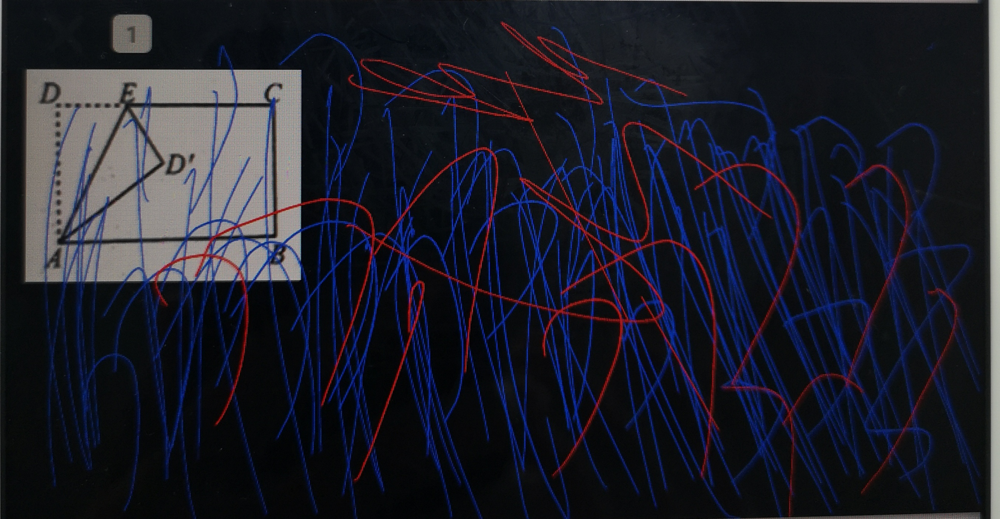

### 一、问题描述

在开发`题型组件3.0`的过程中，一直存在一个非常**"难以捉摸"**的bug......尽管其间尝试了各种办法，但是，一直也没有很好地杜绝该问题：

- **在某些不确定的情况下，题型组件的手写区域会出现背景变黑的情况......**

黑底情况大致效果如下：



为什么说**“难以捉摸”**？首先，该问题复现起来比较困难，非常难以复现；当你自以为解决了该问题时，它又在某个不经意的时刻，露出了它那黑色鬼魅般的微笑！看着一脸懵逼的你在那不知所措......

说到底，还是没有真正找到该问题产生的根本原因！

最近一段时间，该问题又出现了好几次，确实比较棘手；趁着有点富裕时间，准备跟它死磕一下！所以，痛定思痛；决心花大力气来尝试彻底根治黑底的问题！！！

### 二、问题追踪

冷静！冷静！冷静！遇到这种难啃的骨头，一定要保持一个冷静分析的头脑；不然，很容易溺毙在源码的汪洋大海之中不知所踪！！！

#### 2.1 尝试复现

**想要解决问题，首先得先有问题！**

那么，首先就是想办法复现该问题！最好能必现！即使不能必现，要是能大概率出现也是极好的！

和曾经遇到过黑底的小伙伴的沟通后，发现：

- 题型组件在列表中展示时，出现黑底的几率比较大！
- 在单独界面展示时，貌似很少出现或者好像就没出现过？

只能求助测试组的梦影妹子啦！在其花费了很大的力气之后，帮我造了一份必现黑底的作业！再次感谢！辛苦啦！(手都写酸啦......)

#### 2.2 尝试定位问题

在刚发现该问题时，一度怀疑该问题产生的原因是，覆盖在手写区域上的手写控件造成的（其实并不是......手写控件一直背着这口锅负重前行）；最终经过一系列的尝试后，通过关闭手写控件的硬件加速选项，确实黑屏问题的几率大大降低啦！基本上很少会再出现啦！

自此，一直认为：该问题产生的原因是：因为应用本身在内存不足时，手写控件丢失了透明度信息，导致背景变黑啦......（手写控件默默地擦干了屈辱的泪水，继续负重前行......）

所以，这次直接就奔着手写控件去啦！网上的关于这方面的信息少之又少，中间尝试了各种方式：好像解决啦？好像又复现啦？一直在痛苦的深渊中挣扎......

会不会是Android系统不同API版本之间的差异呢？这是一个不错的尝试方向！经过测试发现：

- 在Android5.0（API版本21）中，黑底的情况基本必现；在6.0、7.0和8.0版本中，该问题则没有复现......
- 貌似出现黑底的情况，都是出现在列表中滑动时；

既然确认了只会在Android5.0上出现黑底的情况，那么产生问题的范围就进一步缩小啦！！！接下来，尝试找出不同版本间有哪些差异，看能不能解决该问题！

省略痛苦挣扎的过程一万个字......

后来在一次跑步的过程中，不经意间想起：之前有同事老于提醒说，“好像同样有手写区域的题干部分就从来没有变黑过！！！”哎，你还别说，还真是这样呢......一语惊醒梦中人的感觉！又有新的尝试方向啦！

题干区域的布局信息如下：

```
<?xml version="1.0" encoding="utf-8"?>
<FrameLayout
    xmlns:android="http://schemas.android.com/apk/res/android"
    android:layout_width="match_parent"
    android:layout_height="wrap_content"
    android:paddingLeft="@dimen/qt_dp_10"
    android:paddingRight="@dimen/qt_dp_10">

    <ViewStub
        android:id="@id/qt_web_view_vs"
        android:layout_width="match_parent"
        android:layout_height="match_parent"
        android:layout="@layout/qt_stem_webview"/>

    <ViewStub
        android:id="@id/qt_text_view_vs"
        android:layout_width="match_parent"
        android:layout_height="match_parent"
        android:layout="@layout/qt_stem_textview"/>

    <ImageView
        android:id="@+id/qt_stem_img"
        android:layout_width="wrap_content"
        android:layout_height="wrap_content"/>

    <com.zhitongyunle.xh_handwriting.HandWritingView
        android:id="@+id/qt_stem_HandWritingView"
        android:layout_width="match_parent"
        android:layout_height="match_parent"/>
</FrameLayout>
```

学生回答手写区域布局信息如下：

```
<FrameLayout
            android:id="@id/qt_write_root_fl"
            android:layout_width="match_parent"
            android:layout_height="wrap_content"
            android:background="@drawable/qt_handwriting_repeat_bg">

            <com.zhitongyunle.xh_handwriting.HandWritingView
                android:id="@+id/qt_hand_writing_hwv"
                android:layout_width="match_parent"
                android:layout_height="match_parent"
                android:minHeight="@dimen/qt_completion_sub_min_height"/>

            <!--省略部分代码-->
          
 </FrameLayout>
```

有啥区别么？好像都是一模一样的吧！你要非要说区别的话：无非就是，在学生回答的手写区域，设置了一个类似于“作业本”显示效果的背景而已！这有影响么？（你还别说，还真有可能有影响......）

学生回答手写区域的“作业本”效果，background信息如下：

```
<?xml version="1.0" encoding="utf-8"?>
<bitmap
    xmlns:android="http://schemas.android.com/apk/res/android"
    android:src="@mipmap/qt_ic_handwriting_bg"
    android:tileMode="repeat"/>
```

不就是一个简单的bitmap标签么？设置一个图片为背景，再设置一个显示模式为“重复”而已！这种用法存在有什么问题么？这种用法之前也一直在用呀，怎么问题会出在这里呢？

但是，当我尝试把这个背景去掉之后，神奇的一幕出现啦！

**一直变黑的手写回答区域，居然没有再出现啦！！！！！！**

难道是错觉？接下来，为了验证这个问题，又反复验证了很多遍！确实不是错觉！！！问题就是出在这里。

### 三、解决方案

既然问题是因为这个原因产生的！那么，为了实现类似于“作业本”的显示效果，就不能用之前的实现方式啦；只能换另外一种实现方式啦！

解决方案如下：

- **自定义FrameLayout来画出类似于“作业本”的显示效果即可；**

### 四、反思与总结

**手写控件，对不起！！！！！！**

现在回过头来看，好像问题很简单啊！不是解决起来很容易嘛！确实是这样，好多问题，真正解决并不需要很多的代码；但是寻找幕后真凶的过程比较艰辛！

定位bug跟警察破案的过程，从某种层面来讲，有异曲同工之处：

- **细心、耐心和洞察力非常重要！**

当你离墙很近的时候，视野将会变得非常窄；这时不如退后两步，你的眼前将是海阔天空！！！