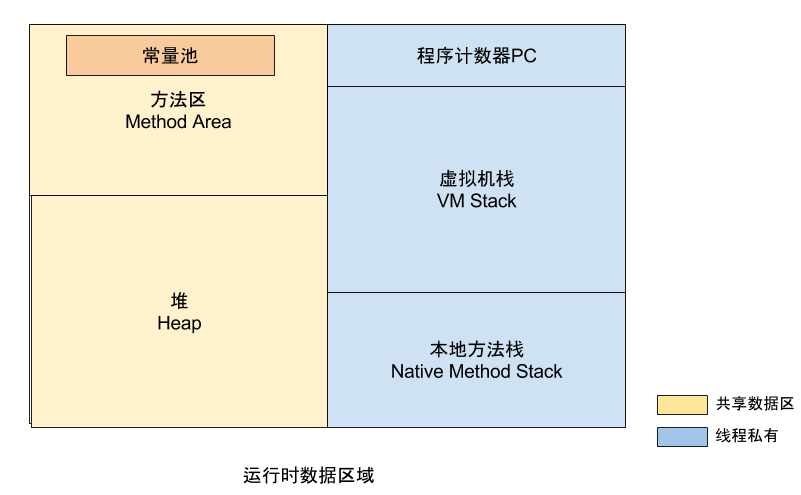

> 参考资料
>
> http://gityuan.com/2016/01/09/java-memory/
>
> https://blog.csdn.net/zq602316498/article/details/38926607#commentBox
>
> https://blog.csdn.net/xtayfjpk/article/details/41924283

## 一、内存模型

Java内存模型，往往是指Java程序在运行时内存的模型，而Java代码是运行在Java虚拟机之上的，由Java虚拟机通过解释执行(解释器)或编译执行(即时编译器)来完成，故Java内存模型，也就是指Java虚拟机的运行时内存模型。

作为Java开发人员来说，并不需要像C/C++开发人员，需要时刻注意内存的释放，而是全权交给虚拟机去管理，那么有就必要了解虚拟机的运行时内存是如何构成的。运行时内存模型，分为线程私有和共享数据区两大类，其中线程私有的数据区包含程序计数器、虚拟机栈、本地方法区，所有线程共享的数据区包含Java堆、方法区，在方法区内有一个常量池。

（1）线程私有区：

- 程序计数器，记录正在执行的虚拟机字节码的地址；
- 虚拟机栈：方法执行的内存区，每个方法执行时会在虚拟机栈中创建栈帧；
- 本地方法栈：虚拟机的Native方法执行的内存区；

（2）线程共享区：

- Java堆：对象分配内存的区域；

- 方法区：存放类信息、常量、静态变量、编译器编译后的代码等数据；

  ​	-- 常量池：存放编译器生成的各种字面量和符号引用，是方法区的一部分。

对于大多数的程序员来说，Java内存比较流行的说法便是堆和栈，这其实是非常粗略的一种划分，这种划分的”堆”对应内存模型的Java堆，”栈”是指虚拟机栈，然而Java内存模型远比这更复杂，想深入了解Java的内存，还是有必要明白整个内存模型。 

## 二、详细模型

运行时内存分为五大块区域（常量池属于方法区，算作一块区域），前面简要介绍了每个区域的功能，那接下来再详细说明每个区域的内容，Java内存总体结构图如下： 

### 2.1 程序计数器PC

程序计数器PC，当前线程所执行的字节码行号指示器。每个线程都有自己计数器，是私有内存空间，该区域是整个内存中较小的一块。

当线程正在执行一个Java方法时，PC计数器记录的是正在执行的虚拟机字节码的地址；当线程正在执行的一个Native方法时，PC计数器则为空（Undefined）。

### 2.2 虚拟机栈

虚拟机栈，生命周期与线程相同，是Java方法执行的内存模型。每个方法(不包含native方法)执行的同时都会创建一个栈帧结构，方法执行过程，对应着虚拟机栈的入栈到出栈的过程。 

**栈帧(Stack Frame)结构** 

栈帧(Stack Frame)是用于支持虚拟机进行方法调用和方法执行的数据结构，它是虚拟机运行时数据区的虚拟机栈(Virtual Machine Stack)的栈元素。栈帧存储了方法的局部变量表，操作数栈，动态连接和方法返回地址等信息。第一个方法从调用开始到执行完成，就对应着一个栈帧在虚拟机栈中从入栈到出栈的过程。 

每一个栈帧都包括了局部变量表，操作数栈，动态连接，方法返回地址和一些额外的附加信息。在编译代码的时候，栈帧中需要多大的局部变量表，多深的操作数栈都已经完全确定了，并且写入到了方法表的Code属性中，因此一个栈帧需要分配多少内存，不会受到程序运行期变量数据的影响，而仅仅取决于具体虚拟机的实现。  

一个线程中的方法调用链可能会很长，很多方法都同时处理执行状态。对于执行引擎来讲，活动线程中，只有虚拟机栈顶的栈帧才是有效的，称为当前栈帧(Current Stack Frame)，这个栈帧所关联的方法称为当前方法(Current Method)。执行引用所运行的所有字节码指令都只针对当前栈帧进行操作。 

##### 2.2.1 局部变量表

局部变量表是一组变量值存储空间，用于存放方法参数和方法内部定义的局部变量。在Java程序编译为Class文件时，就在方法表的Code属性的max_locals数据项中确定了该方法需要分配的最大局部变量表的容量。    

在方法执行时，虚拟机是使用局部变量表完成参数变量列表的传递过程，如果是实例方法，那么局部变量表中的每0位索引的Slot默认是用于传递方法所属对象实例的引用，在方法中可以通过关键字“this”来访问这个隐含的参数，其余参数则按照参数列表的顺序来排列，占用从1开始的局部变量Slot，参数表分配完毕后，再根据方法体内部定义的变量顺序和作用域来分配其余的Slot。局部变量表中的Slot是可重用的，方法体中定义的变量，其作用域并不一定会覆盖整个方法，如果当前字节码PC计算器的值已经超出了某个变量的作用域，那么这个变量对应的Slot就可以交给其它变量使用。    

局部变量不像类成员变量那样存在“准备阶段”。类成员变量有两次赋初始值的过程，一次在准备阶段，赋予系统初始值；另外一次在初始化阶段，赋予程序员定义的值。因此即使在初始化阶段程序员没有为类成员变量赋值也没有关系，类成员变量仍然具有一个确定的初始值。但局部变量就不一样了，如果一个局部变量定义了但没有赋初始值是不能使用的。 

##### 2.2.2 操作栈

操作数栈（Operand Stack）也常称为操作栈，是一个后入先出栈。在Class 文件的Code 属性的 max_stacks 指定了执行过程中最大的栈深度。Java 虚拟机的解释执行引擎称为”**基于栈的执行引擎**“，这里的栈就是指操作数栈。

方法执行中进行算术运算或者是调用其他的方法进行参数传递的时候是通过操作数栈进行的。

在概念模型中，两个栈帧是相互独立的。但是大多数虚拟机的实现都会进行优化，令两个栈帧出现一部分重叠。令下面的部分操作数栈与上面的局部变量表重叠在一块，这样在方法调用的时候可以共用一部分数据，无需进行额外的参数复制传递。

##### 2.2.3 方法返回地址

当一个方法开始执行以后，只有两种方法可以退出当前方法：

- 当执行遇到返回指令，会将返回值传递给上层的方法调用者，这种退出的方式称为正常完成出口（Normal Method Invocation Completion），一般来说，调用者的PC计数器可以作为返回地址。
- 当执行遇到异常，并且当前方法体内没有得到处理，就会导致方法退出，此时是没有返回值的，称为异常完成出口（Abrupt Method Invocation Completion），返回地址要通过异常处理器表来确定。

当方法返回时，可能进行3个操作：

- 恢复上层方法的局部变量表和操作数栈
- 把返回值压入调用者调用者栈帧的操作数栈
- 调整 PC 计数器的值以指向方法调用指令后面的一条指令

##### 2.2.4 动态连接

每个栈帧都包含一个执行运行时常量池中该栈帧所属方法的引用，持有这个引用是为了支持方法调用过程中的**动态连接**（Dynamic Linking）。

Class 文件中存放了大量的符号引用，字节码中的方法调用指令就是以常量池中指向方法的符号引用作为参数。这些符号引用一部分会在类加载阶段或第一次使用时转化为直接引用，这种转化称为**静态解析**。另一部分将在每一次运行期间转化为直接引用，这部分称为**动态连接**。

##### 2.2.5 额外附加信息

虚拟机规范允许具体的虚拟机实现增加一些规范里没有描述的信息到栈帧中，例如与高度相关的信息，这部分信息完全取决于具体的虚拟机实现。在实际开发中，一般会把动态连接，方法返回地址与其它附加信息全部归为一类，称为栈帧信息。 

**异常(Exception)** 

Java虚拟机规范规定该区域有两种异常：

- StackOverFlowError：当线程请求栈深度超出虚拟机栈所允许的深度时抛出
- OutOfMemoryError：当Java虚拟机动态扩展到无法申请足够内存时抛出

### 2.3 本地方法栈

本地方法栈则为虚拟机使用到的Native方法提供内存空间，而前面讲的虚拟机栈式为Java方法提供内存空间。有些虚拟机的实现直接把本地方法栈和虚拟机栈合二为一，比如非常典型的Sun HotSpot虚拟机。 

**异常(Exception)** 

Java虚拟机规范规定该区域可抛出StackOverFlowError和OutOfMemoryError。 

### 2.4 Java堆

Java堆，是Java虚拟机管理的最大的一块内存，也是GC的主战场，里面存放的是几乎所有的对象实例和数组数据。JIT编译器有栈上分配、标量替换等优化技术的实现导致部分对象实例数据不存在Java堆，而是栈内存。

- 从内存回收角度，Java堆被分为新生代和老年代；这样划分的好处是为了更快的回收内存；
- 从内存分配角度，Java堆可以划分出线程私有的分配缓冲区(Thread Local Allocation Buffer,TLAB)；这样划分的好处是为了更快的分配内存；

对象创建的过程是在堆上分配着实例对象，那么对象实例的具体结构如下：

对于填充数据不是一定存在的，仅仅是为了字节对齐。HotSpot VM的自动内存管理要求对象起始地址必须是8字节的整数倍。对象头本身是8的倍数，当对象的实例数据不是8的倍数，便需要填充数据来保证8字节的对齐。该功能类似于高速缓存行的对齐。

另外，关于在堆上内存分配是并发进行的，虚拟机采用CAS加失败重试保证原子操作，或者是采用每个线程预先分配TLAB内存.

**异常(Exception)** 

Java虚拟机规范规定该区域可抛出OutOfMemoryError。

### 2.5 方法区

方法区主要存放的是已被虚拟机加载的类信息、常量、静态变量、编译器编译后的代码等数据。GC在该区域出现的比较少。 

**异常(Exception)** 

Java虚拟机规范规定该区域可抛出OutOfMemoryError。 

### 2.6 运行时常量池

运行时常量池也是方法区的一部分，用于存放编译器生成的各种字面量和符号引用。运行时常量池除了编译期产生的Class文件的常量池，还可以在运行期间，将新的常量加入常量池，比较常见的是String类的intern()方法。

- 字面量：与Java语言层面的常量概念相近，包含文本字符串、声明为final的常量值等。
- 符号引用：编译语言层面的概念，包括以下3类：
  - 类和接口的全限定名
  - 字段的名称和描述符
  - 方法的名称和描述符

但是该区域不会抛出OutOfMemoryError异常。