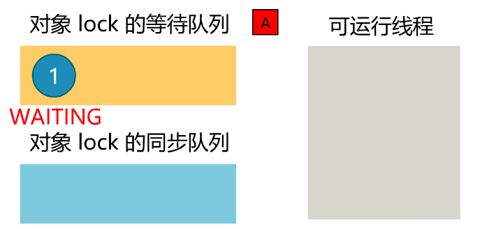

# Thread线程状态及转换

首先我们得明白，当我们说一个线程的状态时，说的是什么？

没错，就是一个变量值而已。

哪个变量？

Thread类中的一个变量：

```java
private volatile int threadStatus = 0;
```

这个值是个整数，不方便理解，可以通过映射关系（VM.toThreadState），转换成一个枚举类。

```java
public enum State {
    NEW,
    RUNNABLE,
    BLOCKED,
    WAITING,
    TIMED_WAITING,
    TERMINATED;
}
```

所以，我们就盯着threadStatus这个值的变化就好了。

就是这么简单。

## NEW

现在我们还没有任何Thread类的对象呢，也就不存在线程状态一说。一切的起点，要从把一个Thread类的对象创建出来，开始说起。

```java
Thread t = new Thread();
```

当然，你后面可以接很多参数。

```java
Thread t = new Thread(r, "name1");
```

你也可以new一个继承了Thread的子类。

```java
Thread t = new MyThread();
```

你说线程池怎么不new就可以有线程了呢？人家内部也是new出来的。

```java
public class Executors {
  static class DefaultThreadFactory implements ThreadFactory {
  public Thread newThread(Runnable r) {
          Thread t = new Thread(...);
          ...
          return t;
      }
  }
}
```

总之，一切的开始，都要调用Thread类的构造方法。

而这个构造方法，最终都会调用Thread类的init()方法。

```java
private void init(ThreadGroup g, Runnable target, String name, long stackSize, AccessControlContext acc, boolean inheritThreadLocals) {
  ...
  this.grout = g;
  this.name = name;
  ...
  tid = nextThreadID();
}
```

这个init()方法，仅仅是给该Thread类的对象中的属性，附上值，除此之外啥都没干。

它没有给threadStatus再次赋值，所以它的值仍然是其默认值。

而这个值对应的状态，就是STATE.NEW，非要翻译成中文的话，就叫初始态吧。

因此说了这么多，其实就分析出了，新建一个Thread类的对象，就是创建了一个新的线程，此时这个线程的状态，是**NEW（初始态）**。


后续的分析，将弱化threadStatus这个整数值了，就直接说改变了其线程状态，大家知道其实就只是改变了threadStatus的值而已。

## RUNNABLE

你说，刚刚处于NEW状态的线程，对应操作系统里线程的什么状态呢？

一看你就没仔细看我上面的分析。

```java
Thread t = new Thread();
```

只是做了些表面功夫，在Java语言层面将自己的一个对象中的属性附上值罢了，根本没碰到操作系统级别的东西呢。

所以这个NEW状态，不论往深了说还是往浅了说，还真就只是个无聊的枚举值而已。

下面精彩的故事才刚刚开始。

躺在堆内存中无所事事的Thread对象，在调用了start()方法后，才显现生机。

```java
t.start();
```

这个方法一调用，那可不得了了，最终会调用到一个讨厌的native方法里。

```java
private native void start0();
```

看来改变状态，并不是一句简单的`threadStatus = xxx`这么简单，而是有本地方法对其进行了修改。

九曲十八弯跟进jvm源码之后，调用到了这个方法。

```java
hotspot/src/os/linux/vm/os_linux.cpp
pthread_create(...);
```

大名鼎鼎的unix创建线程的方法，pthread_create()。

此时，在操作系统内核中，才有了一个真正的线程，被创建出来。

而linux操作系统，是没有所谓的刚创建但没启动的线程这种说法的，创建即刻开始运行。

虽然无法从源码发现线程状态的变化，但通过debug的方式，我们看到调用了Thread.start()方法之后，线程的状态变成了RUNNABLE，运行态。

那我们的状态图又丰富了起来。


通过这部分分析，我们知道了如下几点：

- 在Java调用start()后，操作系统中才真正出现了一个线程，并且立刻运行。
- Java中的线程，和操作系统内核中的线程，是一对一的关系。
- 调用start()后，线程状态变为RUNNABLE，这是由native方法里的某部分代码造成的。

### RUNNING和READY

CPU一个核心，同一时刻，只能运行一个线程。

具体执行哪个线程，要看操作系统的调度机制。

所以，上面的RUNNABLE状态，准确说是，得到了可以随时准备运行的机会的状态。

而处于这个状态中的线程，也分为了正在CPU中运行的线程，和一堆处于就绪中等待CPU分配时间片来运行的线程。


处于就绪中的线程，会存储在一个就绪队列中，等待着被操作系统的调度机制选中，进入CPU中运行。

当然，要注意，这里的RUNNING和READY状态，是我们自己为了方便描述而造出来的。

**无论是Java语言，还是操作系统，都不区分这两种状态，在Java中统统叫RUNNABLE。**

## TERMINATED

当一个线程执行完毕（或者调用已经不建议的stop()方法），线程的状态就变为TERMINATED。


此时，这个线程已经无法死灰复燃了，如果你此时再强行执行start()方法，将会报出错误。

```java
java.lang.IllegalThreadStateException
```

很简单，因为start()方法的第一行就是这么直戳了当地写的。

```java
public synchronized void start() {
    if (threadStatus != 0)
        throw new IllegalThreadStateException();
    ...
}
```

这时，那位说了，那如果此时强行把threadStatus改成0，会怎么样呢？你可以试试哟。

## BLOCKED

上面把最常见，最简单的线程生命周期讲完了。

**初始 -- 运行 -- 终止**

没有发生任何的障碍。

接下来，就稍稍复杂一点了，我们让线程碰到些障碍。

首先创建一个锁对象lock。

```java
public static final Object lock = new Object();
```

一个线程，执行一个synchronized块，锁对象是lock，且一直持有这把锁不放。

```java
new Thread(() -> {
    synchronized (lock) {
        while(true) {}
    }
}).start();
```

另一个线程，也同样执行一个锁对象为lock的synchronized块。

```java
new Thread(() -> {
    synchronized (lock) {
       ...
    }
}).start();
```

那么，在进入synchronized块时，因为无法拿到锁，会使线程状态变为BLOCKED。

同样，对于synchronized修饰的方法，也是如此。

当该线程获取到了锁后，便可以进入synchronized块，此时线程的状态变为RUNNABLE。

因此我们得出如下转换关系。


当然，这只是线程状态的改变，线程还发生了一些实质性的变化。

我们不考虑虚拟机对synchronized的极致优化。

当执行到synchronized块或方法，获取不到锁时，线程会进入一个**该锁对象的同步队列**。

当持有锁的这个线程，释放了锁之后，会**唤醒**该锁对象同步队列中的所有线程，这些线程会**继续尝试抢锁**。如此往复。

比如，有一个锁对象A，线程1此时持有这把锁。线程2、3、4分别尝试抢这把锁失败。


线程1释放锁，线程2、3、4重新变为RUNNABLE，继续抢锁，假如此时线程3抢到了锁。


如此往复。

## WAITING

这部分是最复杂的，同时也是面试中考点最多的，将分成三部分讲解。听我说完后你会发现，这三部分有很多相同的地方，不再是孤立的知识点。

### wait/notify

我们在刚刚的synchronized块中加点东西。

```java
new Thread(() -> {
    synchronized (lock) {
       ...
       lock.wait();
       ...
    }
}).start();
```

当这个lock.wait()方法一调用，会发生三件事。

- 释放锁对象lock。（隐含着必须先获取到这个锁才行）
- 线程状态变成WAITING。
- 线程进入lock对象的**等待队列**。


什么时候这个线程被 唤醒，从等待队列中移出，并从WAITING状态返回RUNNABLE状态呢？

必须由另一个线程，调用同一个锁对象的notify/notifyAll方法。

```Java
new Thread(() -> {
    synchronized (lock) {
       ...
       lock.notify(); 
       ...
    }
}).start();
```



只不过notify是只唤醒一个线程，而notifyAll是唤醒所有等待队列中的线程。

但需要注意，被唤醒后的线程，从等待队列移出，状态变为RUNNABLE，但仍然需要抢锁，抢锁成功了，才可以从wait方法返回，继续执行。

如果失败了，就和上一部分的BLOCKED流程一样了。


所以我们的整个流程图，现在变成了这个样子。


### join

主线程这样写。

```java
public static void main(String[] args) {
  thread t = new Thread(...);
  t.start();
  t.join();
  ...
}
```

当执行到t.join()的时候，主线程会变成WAITING状态，直到线程t执行完毕，主线程才会变回RUNNABLE状态，继续往下执行。

看起来，就像是主线程的执行过程中，另一个线程插队加入（join），而且要等到其结束后主线程才继续。

因此我们的状态图，又多了两项。


那join又是怎么神奇地实现这一切呢？也是想wait一样放到等待队列么？

打开Thread.join()的源码，你会发现它非常简单。

```java 
// Thread.java
// 无参的 join 有用的信息就这些，省略了额外分支
public synchronized void join() {
  while (isAlive()) {
      wait();
  }
}
```

也就是说，它的本质仍然是执行了wait()方法，而锁对象就是Thread t对象本身。

那从RUNNABLE到WAITING，就和执行了wait()方法完全一样了。

那从WAITING回到RUNNABLE是怎么实现的呢？

主线程调用了wait，需要另一个线程notify才行，难道需要这个子线程t在结束之前，调用一下t.notifyAll()么？

答案是否定的，那就只有一种可能，线程t结束后，由jvm自动调用t.notifyAll()，不用我们程序显式写出。

没错，就是这样。

怎么证明这一点呢？道听途说可不行，老子今天非要扒开jvm的外套。

果然，找到了如下代码。

```java
hotspot/src/share/vm/runtime/thread.cpp
void JavaThread::exit(...) {
  ...
  ensure_join(this);
  ...
}
static void ensure_join(JavaThread* thread) {
  ...
  lock.notify_all(thread);
  ...
}
```

我们看到，虚拟机在一个线程的方法执行完毕后，执行了个ensure_join方法，看名字就知道是专门为join而设计的。

而继续跟进会发现一段关键代码，lock.notify_all，这便是一个线程结束后，会自动调用自己的notifyAll方法的证明。

所以，其实join就是wait，线程结束就是notifyAll。现在，是不是更清晰了。


### park/unpark

有了上面wait和notify的机制，下面就好理解了。

一个线程调用如下方法：

```java
LockSupport.park()
```

该线程的状态会从RUNNABLE变成WAITING。

另一个线程调用

```java
LockSupport.unpark(Thread 刚刚的线程)
```

刚刚的线程会从WAITING回到RUNNABLE。

但从线程状态的流转来看，与wait和notify相同。

从实现机制上看，他们甚至更为简单。

- park和unpark无需事先获取锁，或者说跟锁压根无关。
- 没有什么等待队列一说，unpark会精确唤醒某一个确定的线程。
- park和unpark没有顺序要求，可以先调用unpark

关于第三点，就涉及到park的原理了，这里我只简单说明。

线程有一个计数器，初始值为0

**调用park就是：**

如果这个值为0，就将线程挂起，状态改为WAITING。如果这个值为1，则将这个值改为0，其余的什么都不做。

**调用unpark就是：**

将这个值改为1

然后我用三个例子，你就基本明白了。

```java 
// 例子1
LockSupport.unpark(Thread.currentThread()); // 1
LockSupport.park(); // 0
System.out.println("可以运行到这");
// 例子2
LockSupport.unpark(Thread.currentThread()); // 1
LockSupport.unpark(Thread.currentThread()); // 1
LockSupport.park(); // 0
System.out.println("可以运行到这");
// 例子3
LockSupport.unpark(Thread.currentThread()); // 1
LockSupport.unpark(Thread.currentThread()); // 1
LockSupport.park(); // 0
LockSupport.park(); // WAITING
System.out.println("不可以运行到这");
```

park的使用非常简单，同时也是JDK中锁实现的底层。它的JVM及操作系统层面的原理很复杂。

现在我们的状态图，又可以更新了。


## TIMED_WAITING

这部分就再简单不过了，将上面导致线程变成WAITING状态的那些方法，都增加了一个超时参数，就变成了将线程变成TIMED_WAITING状态的方法了，我们直接更新流程图。


这些方法的唯一区别就是，从TIMED_WAITING返回RUNNABLE，不但可以通过之前的方式，还可以通过到了超时时间，返回RUNNABLE状态。

就这样。

还有，大家看。

- wait需要先获取锁，再释放锁，然后等待被notify。
- join就是wait的封装。
- park需要等待unpark来唤醒，或者提前被unpark发放了唤醒许可。

那有没有一个方法，仅仅让线程挂起，只能通过等待超时时间到了再被唤醒呢？

这个方法就是：

```java
Thread.sleep(long)
```

我们把它补充在图里，这一部分就全了。


再把它加到全局图中。


## 后记

Java线程的状态，有六种：

```java
NEW
RUNNABLE
BLOCKED
WAITING
TIMED_WAITING
TERMINATED
```

而经典的线程五态模型，有五种状态：

```java
创建
就绪
执行
阻塞
终止
```

不同实现者，可能有合并和拆分。

比如：Java将五态模型中的就绪和执行，都统一成RUNNABLE，将阻塞（即不可能得到CPU运行机会的状态）细分为了BLOCKED、WAITING、TIMED_WAITING，这里我们不去评价好坏。

也就是说，BLOCKED、WAITING、TIMED_WAITING这几个状态，线程都不可能得到CPU的运行权，你叫它挂起、阻塞、睡眠、等待，都可以，很多文章，你也会看到这几个词没那么较真地来回用。

再说两个你可能困惑的问题。

**调用jdk的Lock接口中的lock，如果获取不到锁，线程将挂起，此时线程的状态是什么呢？**

有多少同学觉得应该和synchronized获取不到锁的效果一样，是变成BLOCKED状态？

不过如果你仔细看我上面的文章，有一句话提到了，jdk中锁的实现，是基于AQS的，而AQS的底层，是用park和unpark来挂起和唤醒线程，所以应该是变为WAITING或TIMED_WAITING状态。

**调用阻塞IO方法，线程变成什么状态？**

比如socket编程时，调用如accept()、read()这种阻塞方法时，线程处于什么状态呢？

答案是处于RUNNABLE状态，但实际上这个线程时得不到运行权的，因为在操作系统层面处于阻塞态，需要等到IO就绪，才能变为就绪态。

但是在Java层面，JVM认为等待IO与等待CPU执行权，都是一样的，人家就是这么认为的。这里我仍然不讨论其好坏，你觉得这么认为不爽，可以自己设计一门语言，那你想怎么认为，别人也拿你没办法。

比如要我设计语言，我就任务可被CPU调度执行的线程，处于死亡态。这样我的这门语言一定会有个经典的面试题：为什么闪客把可运行的线程定义为死亡态呢？


> 针对原文中出现的个别错别字进行了订正。
>
> [Java线程的状态及转换](https://mp.weixin.qq.com/s/6kAMFCXT46mWfxRdega1vA)

