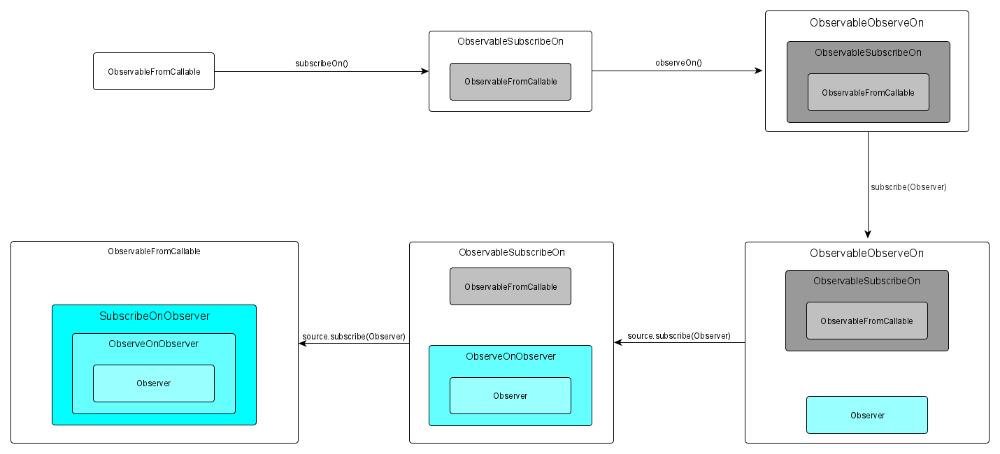

>implementation 'io.reactivex.rxjava3:rxandroid:3.0.0'
> implementation 'io.reactivex.rxjava3:rxjava:3.0.0'

## RxJava和RxAndroid的区别

​	**RxAndroid必须依赖RxJava而一起使用！**

​	`RxAndroid`主要是为了在Android应用程序中使用起RxJava来，变得简单而轻松。 更具体地说，它提供了一个在Android主线程或任何给定的Looper上进行调度的`Scheduler`，详见`RxAndroid`中的`AndroidSchedulers`。

​	简单来说，在Android应用程序中，`RxAndroid`提供了一些更便捷的`Scheduler`。在Android平台下，两个库一起依赖即可！非Android平台，只依赖`RxJava`即可！

​	**注意：RxJava和RxAndroid版本必须对应才行，不然会报错！例如：RxJava3.x和RxAndroid3.x一起引用。**

## RxJava1.0、RxJava2.0、RxJava3.0有什么区别

### RxJava2.0相比于RxJava1.0

- 添加背压的策略Flowable
- 添加Observer的变体consumer
- ActionN 和 FuncN 改名（Action0 改名成Action，Action1改名成Consumer，而Action2改名成了BiConsumer，而Action3 - Action9都不再使用了，ActionN变成了Consumer<Object[]> 。Func改名成Function，Func2改名成BiFunction，Func3 - Func9 改名成 Function3 - Function9，FuncN 由 Function<Object[], R> 取代。）
- Observable.OnSubscribe 变成 ObservableOnSubscribe
- ObservableOnSubscribe 中使用 ObservableEmitter 发射数据给 Observer，在RxJava中使用Subscriber发射数据。
- Subscription 改名为 Disposable

### RxJava3.0相比于RxJava2.0

- 提供Java 8 lambda友好的API
- 删除Maybe.toSingle(T)
- 删除Flowable.subscribe(4 args)
- 删除Observable.subscribe(4 args)
- 删除Single.toCompletable()

## 综述

​	RxJava的版本从发布到现在，已经经历了好多个版本。虽然源码在不断的修改，但是，RxJava的主体架构还是没有变化，为什么呢？可以说是RxJava架构决定了它的特性，比如代码逻辑的简洁以及操作符带来极强的扩展能力，这些在RxJava迭代了这么多个版本之后，这些特性，没有减少，反而大大的增强了。这个特性，就是响应式编程，那么接下来，就来讲讲RxJava为什么会有这种特性，以及带来其特性不变的本质是啥！

​	本篇主要讲解RxJava的架构思想，不会涉及到大量的源码分析。

## RxJava不变的是什么

​	不知道你有没有这样一种焦虑，RxJava每次大的版本更新，总会让人感觉，之前刚看的源码，都前功尽弃了，源码一更新，又得重新去学习才行。有时候让人不得不感叹：“求求你不要再更新了！老子学不动了！！！”

​	但是，不知道你是否这样想过，框架虽然一直在更新，但底层有没有不变的东西，今天很高兴告诉你，RxJava框架有，那么这个不变的东西是什么呢？两个字：**架构**！没错，RxJava虽然迭代了几个版本，但是其底层的架构还是没有怎么变动，为什么呢？因为其设计之初的特性就决定了它的架构不会有多大的变化；

​	RxJava的特性有哪些呢？简单明了的代码逻辑，强大的操作符，而这些特性正是响应式编程的思想；就好比一栋房子，其特性有抗震、防风，那么，其底层的架构就必然是按着抗震和防风的特性去建造，而一旦建造成功，其具有的特性，不会跟着房子的装修而变化；那么，RxJava也是同样的道理：每次版本更新都相当于是对房子进行的装修而已！

​	那么你想知道是什么架构来实现这种特性的吗？

​	别急，下面我们先来讲一讲RxJava涉及到的设计模式，为什么设计模式这么重要呢？因为设计模式是架构的基础，我们怎么设计才能让这个架构具有某种特性，这个和设计模式分不开的。

## RxJava的设计模式

### 观察者模式

​	观察者模式，或许是我们最熟悉的设计模式，为什么呢？因为我们在Android代码里会经常使用到它；它就是View的点击事件；为什么说View的点击事件是观察者模式呢？下面我们先来看看观察者模式的定义：

> 定义对象间的一种一对多的依赖关系，当一个对象的状态发生改变时，所有依赖于它的对象都能得到通知。

​	简单来说，就是被观察者与观察者之间存在着一对多的关系，一个被观察者可以被多个观察者注册变化监听，当被观察者变化时，会通知到观察者；而View的点击事件这里只是简单的一对一的关系，但是其实是可以实现一对多的关系。

​	观察者模式的本质是当被观察者变化时，会通知到观察者，当View被点击的时候，会通过回调监听通知到观察者，而观察者和被观察者之间存在订阅关系的时候，观察者才会被通知到；而View的点击事件，是通过设置监听方法来实现订阅的，这就是我们最熟悉的观察者模式。

​	RxJava的观察者模式，是扩展的观察者模式，为啥要叫扩展呢？因为，它 和普通的观察者模式不太一样，扩展的观察者模式，不止一个通知观察者的方法，它有好几个，下面我们来看看它的实现原理吧！

#### RxJava的观察者模式

​	在RxJava里面有几个重要的角色，我们需要先弄明白：

- Observable：俗称被订阅者，被订阅者是事件的来源，接收订阅者（Observer）的订阅，然后通过发射器（Emitter）发射数据给订阅者。

- Observer：俗称订阅者，注册过程传给被订阅者，订阅者监听开始订阅，监听订阅过程中会把Disposable传给订阅者，然后在被订阅者中的发射器（Emitter）发射数据给订阅者（Observer）。

- Emitter：俗称发射器，在发射器中会接收下游的订阅者（Observer），然后在发射器相应的方法把数据传给订阅者（Observer）。

- Consumer：俗称消费器，这是RxJava2.0才出来的，在RxJava1.0中用Action来表示，消费器其实就是Observer的一种变体，Observer的每一个方法都会对应一个Consumer，比如Observer的onNext()、onError()、onComplete()、onSubscribe都会对应一个Consumer。

- onSubscribe()：当被观察者和观察者订阅成功时回调该方法，RxJava2.0新增；

- onNext()：常规事件，可以传递各种各样的数据；

- onComplete()：结束事件，当观察者接收到结束事件后，就不会再接收后续被观察者发送来的事件；

- onError()：异常事件，当被观察者发送异常事件后，那么其他的事件就不会再继续发送了；

- Disposable：是释放器，通常有两种方式会返回Disposable，一个是在Observer的onSubscribe()方法回调回来，第二个是在调用Observable中的subscribe()重载订阅方法，传Consumer的时候会返回。

  下面我们一起用示例代码来讲一下RxJava的观察者模式：

  首先定义一个观察者Observer：

  ```java
  public abstract class Observer<T> {
  
      // 和被观察者订阅后，会回调这个方法；
      public abstract void onSubscribe(Emitter emitter);
  
      // 传递常规事件，用于传递数据
      public abstract void onNext(T t);
  
      // 传递异常事件
      public abstract void onError(Throwable e);
  
      // 传递结束事件
      public abstract void onComplete();
  }
  ```

  Observer类的方法很简单，都是回调；这里有一个新的接口Emitter，这个Emitter俗称发射器，主要用于发射事件；

  ```java
  public interface Emitter<T> {
  
      void onNext(T value);
  
      void onError(Throwable error);
  
      void onComplete();
  }
  ```

  实现逻辑就是通过包装Observer，里面最终是通过Observer来进行调用的，来看看这个类有哪些方法：

  ```java
  public class CreateEmitter<T> implements Emitter<T> {
  
      final Observer<T> observer;
  
      CreateEmitter(Observer<T> observer) {
          this.observer = observer;
      }
  
      @Override
      public void onNext(T t) {
          observer.onNext(t);
      }
  
      @Override
      public void onError(Throwable error) {
          observer.onError(error);
      }
  
      @Override
      public void onComplete() {
          observer.onComplete();
      }
  }
  ```

  下面我们来看一下被观察者Observable是怎么实现的：

  ```java
  public abstract class Observable<T> {
  
      // 实现订阅的逻辑
      public void subscribe(Observer<T> observer){
          // 通过将传进来的observer包装成CreateEmitter，用于回调
          CreateEmitter<T> emitter = new CreateEmitter<T>(observer);
          // 回调订阅成功的方法
          observer.onSubscribe(emitter);
  
          // 回调发射器emitter
          subscribe(emitter);
      }
  
      // 订阅成功后，进行回调
      public abstract void subscribe(Emitter<T> emitter);
  
  }
  ```

  这个类的逻辑很简单，就两步：第一步，进行订阅；第二步，回调Emitter对象，用于发射事件；

  那么，我们来看看具体怎么使用：

  ```java
  private void observer() {
      // 第一步，创建被观察者
      Observable<String> observable = new Observable<String>() {
              @Override
              public void subscribe(Emitter<String> emitter) {
                  emitter.onNext("第一次");
  
                  emitter.onNext("第二次");
  
                  emitter.onNext("第三次");
  
                  emitter.onComplete();
              }
          };
  
      // 第二步，创建观察者
      Observer<String> observer = new Observer<String>() {
              @Override
              public void onSubscribe(Emitter emitter) {
                  Log.i("TAG", " onSubscribe ");
              }
  
              @Override
              public void onNext(String s) {
                  Log.i("TAG", " onNext s:" + s);
              }
  
              @Override
              public void onError(Throwable e) {
                  Log.i("TAG", " onError e:" + e.toString());
              }
  
              @Override
              public void onComplete() {
                  Log.i("TAG", " onComplete ");
              }
          };
  
      // 第三步，被观察者订阅观察者
      observable.subscribe(observer);
  }
  ```

  这里的使用逻辑很简单，总共分为三步：

  - 第一步：创建被观察者Observable
  - 第二步：创建观察者Observer
  - 第三步：被观察者Observable订阅观察者Observer

  当订阅成功之后，被观察者的subscribe()方法里面，就可以通过发射器发射各种事件，最终在观察者的方法里进行回调；

  ​	RxJava也是观察者和被观察者订阅的过程，只是被观察者有变化的时候，是通过发射器来发射各种事件的，这样就不局限于一种事件了；

我们再来看一下RxJava的简单用法：

```java
		// 第一步：创建被观察者
        Observable<String> observable = Observable
                .create(new ObservableOnSubscribe<String>() {
                    @Override
                    public void subscribe(@NonNull ObservableEmitter<String> emitter) throws Throwable {
                        // 产生事件的地方，通过发射器发送事件
                        emitter.onNext("第一次");
                        emitter.onNext("第二次");
                        emitter.onNext("第三次");
                        emitter.onComplete();
                    }
                });

        // 第二步：创建观察者
        Observer<String> observer = new Observer<String>() {
            @Override
            public void onSubscribe(@NonNull Disposable d) {
                System.out.println("订阅成功");
            }

            @Override
            public void onNext(@NonNull String s) {
                // 常规事件，可以传递各种各样的数据
                System.out.println("s = " + s);
            }

            @Override
            public void onError(@NonNull Throwable e) {
                // 异常事件，当被观察者发送异常事件后，那么其他的事件就不会再继续发送了
                System.out.println("e = " + e);
            }

            @Override
            public void onComplete() {
                // 结束事件，当观察者接收到结束事件后，就不会再接收后续被观察者发送来的事件
                System.out.println("onComplete()");
            }
        };

        // 第三步：被观察者订阅观察者
        observable.subscribe(observer);
```

​	上面是RxJava的简单示例（如果只是这样使用，RxJava并不具备线程切换的魔力），真实场景下也不会这么去用，这里只是通过一个简单示例来说明RxJava的观察者设计模式。

### 装饰者模式

什么是装饰者模式？

要理解这个模式其实不难，我们从“装饰”这两个字就可以看出，这个模式用于装饰用的，至于怎么装饰，且听我细细道来；

比如说我现在有一个手机，我怎么在不改变这个手机原有的结构，而让其具有防摔的功能，当然你也可以说我的手机是诺基亚，从几楼往下丢，手机都不带磕碰的，但是现实是，我们使用的手机，并不是那么的抗摔；

那么我要怎么让其具有更强的抗摔能力呢？

相信答案你已经很清楚了，就是套手机壳，贴膜，而这两个动作，是在没有改变手机原有的结构上，让其具有了抗摔的功能，而这个过程可以称为装饰，而装饰者模式的原理也是如此；

> 在不改变其原有结构的基础上，为其添加额外的功能，是作为其原有结构的包装，这个过程称为装饰；

那么在代码里是怎么体现出来的呢？

同理，假如我们要在一个类上添加新功能，而不修改其原有的逻辑，那么我们这时候就可以使用装饰者模式进行封装，具体怎么做，我们下面来看看；

还是以上面为例子，定义一个外观的接口Appearance，有一个抽象的方法，结构structure;

```java
public interface Appearance {

    void structure();
}
```

然后再定义一个手机类Phone实现这个接口，这个手机的结构有玻璃后盖，金属边框等属性，如下：

```java
public class Phone implements Appearance {

   @Override
   public void structure() {
       // 手机属性：玻璃后盖，金属边框
       Log.i("TAG", "手机的属性：玻璃后盖，金属边框");
   }

}
```

好了，接下来我们要让这个手机变得更坚固，但是又不能改变手机原有的结构，那么我们要怎么做呢？

如果不能修改其原有的结构，那么我可以通过装饰来对手机进行包装，先定义一个手机的包装类，用来包装手机，命名为PhoneDecorator，实现了Appearance接口，在这里通过构造方法传进来的外观类Appearance，调用了外观类的structure方法，保证其原有的功能实现；

简单来说，这个类的作用，就是为了实现原有类的功能；

```java
public abstract class PhoneDecorator implements Appearance {

   protected Appearance appearance;

   public PhoneDecorator(Appearance appearance) {
       this.appearance = appearance;
   }

   @Override
   public void structure() {
       appearance.structure();
   }
}
```

那么接下来就是包装类的具体实现了，定义一个套手机壳功能的类PhoneShell，功能实现就是在原有功能的基础上，给手机套上手机壳，来看看具体实现吧；

```java
public class PhoneShell extends PhoneDecorator{

   public PhoneShell(Appearance appearance) {
       super(appearance);
   }

   @Override
   public void structure() {
       super.structure();

       Log.i("TAG", "给手机套上手机壳");
   }
}
```

这里的实现很简单，继承手机的包装类，在structure里面去实现“套上手机壳”的操作；

那么套手机壳的类有了，还差一个贴膜的类，和手机壳一样，我们也来定义一个贴膜的包装类PhoneCover，看看具体实现；

```java
public class PhoneCover extends PhoneDecorator{

   public PhoneCover(Appearance appearance) {
       super(appearance);
   }

   @Override
   public void structure() {
       super.structure();

       Log.i("TAG", "给手机贴上钢化膜");
   }
}
```

这里的实现和上面的套手机壳的操作一样，那么到这里两个包装类都写好了，我们来看看怎么调用吧；

```java
private void decorator() {

       // 创建一个手机
       Phone phone = new Phone();

       // 给手机套上手机壳
       PhoneShell phoneShell = new PhoneShell(phone);

       // 给手机贴上钢化膜
       PhoneCover phoneCover = new PhoneCover(phoneShell);

       // 最终的手机结构
       phoneCover.structure();

}
```

使用起来很简单，将需要包装的类，作为构造参数，传入到包装类里面，就可以让这个类具有包装的功能，比如这里，将手机Phone传入到手机壳PhoneShell的类里面，那么手机就有套上手机壳的功能了；

同理，再将套上手机壳的手机PhoneShell类，传入到贴膜的类PhoneCover里面，那么这个手机就具有了贴膜的功能，最后再调用一下结构的方法structure，那么就可以看到这个手机已经被套上手机壳，并且贴上膜了；

```java
I/TAG: 手机的属性：玻璃后盖，金属边框
I/TAG: 给手机套上手机壳
I/TAG: 给手机贴上钢化膜
```

最终包装后的结构如下：


到这里你有没有发现，装饰者模式对于功能的扩展并不是使用继承的方式，为什么呢？

因为，继承随着功能的增加，会导致子类越来越膨胀，而装饰者模式的双方可以随意扩展，不会相互耦合；

#### RxJava的装饰者模式

RxJava的装饰者主要是用于实现被观察者Observable和观察者Observer的包装，为什么要进行包装呢？

从上面我们可以知道，装饰者模式，是在基础功能上，不修改其原有的逻辑，进行扩展；

那么为什么RxJava的被观察者需要这种特性呢？

假如，我想实现这样一个功能，在子线程获取数据，然后切换到主线程进行数据的赋值，正常情况下我们会这样做，先在子线程获取数据，然后再通过Handler的post方法，切到主线程；

但是如果我想在子线程获取到数据后，然后再对数据做一下转化处理，最后再回调给主线程呢？

如果按照常规的实现逻辑，这样的代码就会很混乱，作为一名有追求的工程师，我们是无法忍受这样的写法的；

那么有没有什么方式可以变的优雅一些呢？答案是：有的；

RxJava通过装饰者模式+观察者模式设计出了链式调用的效果，这样代码逻辑清晰，也方便维护；

比如下面这样的链式调用逻辑：

```java
Observable
        .fromCallable(new Callable<String>() {
            @Override
            public String call() throws Exception {
                SystemClock.sleep(2000); //模拟耗时操作
                return "fromCallable";
            }
        })
        .subscribeOn(Schedulers.io()) //IO线程处理数据
        .observeOn(AndroidSchedulers.mainThread()) //Android主线程回调
        .subscribe(new Observer<String>() {
            @Override
            public void onSubscribe(@NonNull Disposable d) {
                
            }

            @Override
            public void onNext(@NonNull String s) {

            }

            @Override
            public void onError(@NonNull Throwable e) {

            }

            @Override
            public void onComplete() {

            }
        });
```

这样的链式调用逻辑是不是很清晰！

下面我们来看看RxJava的装饰者模式具体是怎么实现的；




## map、flatMap操作符的区别

​	**map是通过原始数据类型返回另外一种数据类型，而flatMap是通过原始数据类型返回另外一种被观察者。**

​	我们看一下flatMap下面的用法：

```kotlin
		val createObservable = Observable.just(1, 2, 3, 4, 5, 6, 7, 8, 9)
        val flatMapObservable: Observable<String> = createObservable.flatMap(object :
            io.reactivex.rxjava3.functions.Function<Int, ObservableSource<String>> {
            @Throws(Throwable::class)
            override fun apply(s: Int): ObservableSource<String> {
                return if (s == 2) {
                    // 延时发送数据
                    Observable.fromCallable {
                        s.toString() + "_delay"
                    }.delay(500, TimeUnit.MILLISECONDS)
                } else {
                    Observable.fromCallable {
                        s.toString()
                    }
                }
            }
        })

        flatMapObservable
            .subscribeOn(Schedulers.io())
            .observeOn(AndroidSchedulers.mainThread())
            .subscribe(object : Observer<String> {
                override fun onSubscribe(d: Disposable) {
                    log("onSubscribe:" + d.javaClass.name)
                }

                override fun onNext(string: String) {
                    log("onNext: $string")
                }

                override fun onError(e: Throwable) {
                    log("onError: " + e.message)
                }

                override fun onComplete() {
                    log("onComplete()")
                }
            })
```

​	在上面flatMap操作过程中为了演示flatMap和concatMap的区别，在数据为2的时候返回的Observable延迟500毫秒，我们看到的结果如下：

```java
2021-01-22 16:44:31.247 28190-28190/com.xh.demo_rxjava I/RxJava: onNext: 1
2021-01-22 16:44:31.247 28190-28190/com.xh.demo_rxjava I/RxJava: onNext: 3
2021-01-22 16:44:31.247 28190-28190/com.xh.demo_rxjava I/RxJava: onNext: 4
2021-01-22 16:44:31.247 28190-28190/com.xh.demo_rxjava I/RxJava: onNext: 5
2021-01-22 16:44:31.247 28190-28190/com.xh.demo_rxjava I/RxJava: onNext: 6
2021-01-22 16:44:31.247 28190-28190/com.xh.demo_rxjava I/RxJava: onNext: 7
2021-01-22 16:44:31.247 28190-28190/com.xh.demo_rxjava I/RxJava: onNext: 8
2021-01-22 16:44:31.247 28190-28190/com.xh.demo_rxjava I/RxJava: onNext: 9
2021-01-22 16:44:31.675 28190-28190/com.xh.demo_rxjava I/RxJava: onNext: 2_delay
2021-01-22 16:44:31.675 28190-28190/com.xh.demo_rxjava I/RxJava: onComplete()
```

​	我们发现数据为2的事件，到最后才收到。那如果换成concatMap，结果是按照发射数据的顺序来返回的。

​	**concatMap和flatMap的功能是一样的， 将一个发射数据的Observable变换为多个Observables，然后将它们发射的数据放进一个单独的Observable。只不过最后合并ObservablesflatMap采用的merge，而concatMap采用的是连接(concat)。**
​	**总之一句一话,他们的区别在于：concatMap是有序的，flatMap是无序的，concatMap最终输出的顺序与原序列保持一致，而flatMap则不一定，有可能出现交错。**

