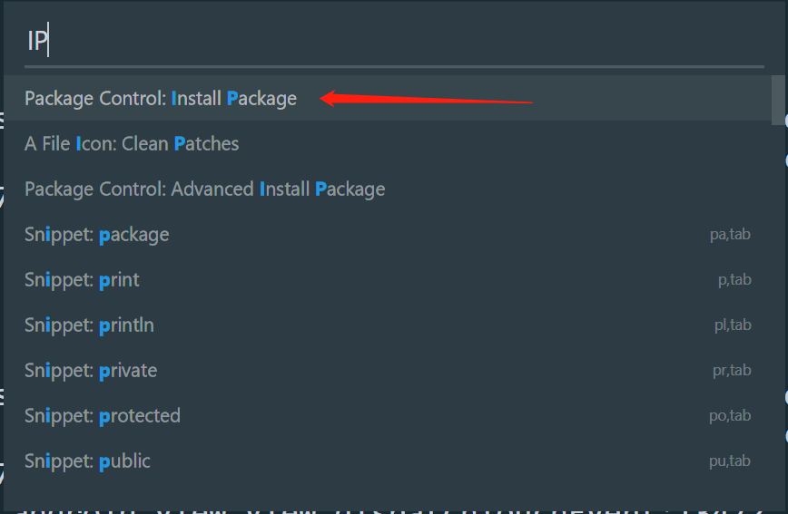

以Windows系统为例，首先，打开Sublime，使用快捷键`Ctrl+Shift+P`打开命令搜索框，输入"IP"，点击下图条目：



在打开的搜索框中，搜索 Pretty JSON 安装。注意有的sublime搜索不到，因此需要手动安装。我就遇到了搜素不到的情况...

## 手动安装插件

首先找到电脑sublime软件的插件位置，Sublime Text→ Preference（首选项） → Browse Packages （浏览插件）。在插件目录下，使用`git clone`下载软件，输入如下命令：

```java
git clone https://github.com/dzhibas/SublimePrettyJson.git
```

下载完成之后，重启Sublime。使用快捷键`Ctrl+Alt+J`即可格式化json字符串。


> 参考链接：
>
> [Sublime如何将Json数据格式化](https://www.jianshu.com/p/79175b10a6da)


