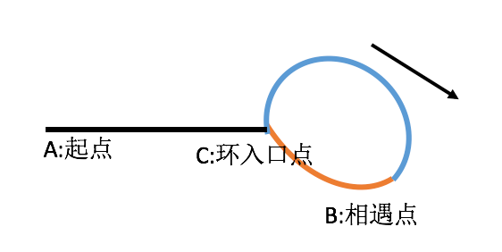

## 问题描述

如何判断一个链表是否有环？如果有则返回入环节点，否则返回null。

```java
1->2->3->4->5->6
            ↑  ↓
            8<-7
```

例如上面的链表就有环，入环节点为5

## 解题思路

### 判断链表是否有环

通常判断链表是否有环，会采用快慢指针的方法，其实道理很简单，就像两个人赛跑，一个人跑得快，一个人跑得慢。如果赛道是直的，那么，跑的快的人到达终点时，跑的慢的人还没到；如果赛道是环形的，则跑的快的人和跑的慢的人总会在某一个时刻相遇。

代码实现：

```java
/**
 * Definition for singly-linked list.
 * class ListNode {
 *     int val;
 *     ListNode next;
 *     ListNode(int x) {
 *         val = x;
 *         next = null;
 *     }
 * }
 */
public class Solution {
    public boolean hasCycle(ListNode head) {
        if(head == null){
        	return false;
        }

        //快慢指针都从链表的头部开始
        ListNode slow = head;
        ListNode fast = head;
        while(fast.next != null && fast.next.next != null){
        	// 慢指针每次走一步；快指针每次走两步
        	slow = slow.next;
        	fast = fast.next.next;

        	// 快慢指针相遇，说明链表有环
        	if(slow == fast){
        		return true;
        	}
        }

        // 走到这里，说明快指针已经走到链表尾部了，还没有和慢指针相遇，说明该链表没有环
        return false;
    }
}
```

### 找到入环节点

常见的解题思路是：在确定链表有环之后，慢指针重新指向链表头，快指针留在相遇处；然后快慢指针再以每次移动一个节点的速度前进，最终它们会在入环节点相遇。

为什么这么做就可以保证两个指针在入环节点相遇呢？请先看下图：



如图，设整个链表长度为`L`，环长度为`R`，且距离具有方向性；

例如：`CB`是`C点`顺时针到`B点`的距离，`BC`是`B点`顺时针到`C点`的距离，`CB != BC`。

当证明链表有环时，`fast快指针`和`slow慢指针`都顺时针走到了`B点`，则此时：

- slow走的距离：`AC + CB`；
- fast走的距离：`AC + k * R + CB`；其中，`k`表示快指针走了多少个环长度，取值为（1,2,3...）；该处`k`的取值在有环的情况下，不可能为0，因为快指针比慢指针步长更长；

由于fast每次走两个节点，slow每次走一个节点，所以有如下公式：

- `2(AC + CB) = AC + k * R + CB`；
- `AC + CB = k * R`；
- `AC + CB = (k - 1) * R + R`；
- `AC = (k - 1) * R + R - CB`；
- `AC = (k - 1) * R + BC`；

从最终的表达式可以看出来，`AC`的距离等于绕若干圈后再加上`BC`的距离，也就是说慢指针从`A`点出发以速度1前进、快指针从`B`点出发以速度1前进，则慢指针到达`C`点时，快指针也必然到达。

代码实现：

```java
/**
 * Definition for singly-linked list.
 * class ListNode {
 *     int val;
 *     ListNode next;
 *     ListNode(int x) {
 *         val = x;
 *         next = null;
 *     }
 * }
 */
public class Solution {
	/**
	 * [判断给定链表是否有环？如果有则返回入环节点，否则返回null。]
	 * @param  head [链表头]
	 * @return      [有环链表返回入环节点；无环链表返回null]
	 */
    public ListNode entryNodeOfLoop(ListNode head) {
        if(head == null){
        	return null;
        }

        //快慢指针都从链表的头部开始
        ListNode slow = head;
        ListNode fast = head;
        while(fast.next != null){
            if(fast.next.next != null){
                // 慢指针每次走一步；快指针每次走两步
                slow = slow.next;
                fast = fast.next.next;

                // 快慢指针相遇，说明链表有环，跳出当前循环
                if(slow == fast){
                    break;
                } 
            } else {
                // 该处逻辑是处理当无环链表中就2个节点时，判断有误的问题
                return null;
            }
        }

        // 快指针已经走到链表尾部了，还没有和慢指针相遇，说明该链表没有环
        if(fast == null || fast.next == null){
        	return null;
        }
        
        // 走到这里，说明该链表为有环链表，寻找入环节点
        // 重置慢指针，从链表头开始
        slow = head;

        // 当slow和fast重新相遇时，相遇节点就是入环节点
        while(slow != fast){
        	slow = slow.next;
        	fast = fast.next;
        }

        // 返回入环节点
        return slow;
    }
}
```

> 参考链接：
>
> [判断列表是否有环及返回入环节点](https://segmentfault.com/a/1190000015308120)
> 
> [环形链表](https://leetcode-cn.com/problems/linked-list-cycle/)
>
> [环形链表入环节点](https://leetcode-cn.com/problems/linked-list-cycle-ii/submissions/)
>